# mb-framepacing

[](https://github.com/Unarmed1000/mb-framepacing/actions/workflows/ci.yml)

**An animation error metric, measured on the real display output.** mb-framepacing calculates, frame by frame, how far a game's
or real-time application's **animation timer** is from **what was actually seen on screen**: the application writes its
animation time into every frame, a capture records when each frame really appeared, and the difference is the **animation
error**.

> [!IMPORTANT]
> **mb-framepacing is a cooperative tool (for now).** It only measures applications that take part: every frame, the
> application writes **its own frame index and its animation timer** into the image as a marker (a small QR code), using
> the C++ library in [`marker/cpp/`](marker/cpp).
>
> mb-framepacing then compares **the animation time the application wrote into each frame** with **the time that frame
> actually appeared in the capture**. Where the two disagree, motion on screen stutters. Without the marker there is nothing
> to compare, so this needs the application's source code and a small change to its renderer. It cannot measure an
> unmodified game or app that you cannot rebuild.

**Get started:** install on [Windows](doc/install/windows.md) · [Ubuntu](doc/install/ubuntu.md) ·
[macOS (Homebrew)](doc/install/macos.md), add the marker with [Integrating the marker](doc/integrating.md), then measure with
[Using mb-framepacing](doc/usage.md).

## Why this exists

A game can report a steady "60 fps" and still feel choppy. Two things decide whether motion looks smooth:

1. **When a frame reaches the screen** (frame pacing): frames should arrive at an even rhythm, for example every 16.7 ms at 60 Hz.
2. **What moment the frame shows** (the animation time): each frame is rendered for a point in time, "the world at 12.345 s".
   The distance moved on screen between two frames should match the time that passed on screen between them.

When these disagree, the eye sees stutter even though the frame counter looks fine. A frame that arrives one refresh late but was
animated as if it were on time jumps too little; the next one jumps too much. That mismatch is the **animation error**, and it is
invisible to in-game counters, because the game only knows when it _submitted_ a frame, not when the display _showed_ it.

mb-framepacing measures it from the outside, on the real video signal. For every two frames shown one after the other:

> **animation error** = how far the **animation timer** (written by the application) advanced − how much time actually passed
> between the two frames **in the capture**

| The game reports                     | The capture shows                            | mb-framepacing reports                          |
| ------------------------------------ | -------------------------------------------- | ----------------------------------------------- |
| frame 1000 animated for t = 10.000 s | frame 1000 first on screen at 0.000 s        |                                                 |
| frame 1001 animated for t = 10.017 s | frame 1001 first on screen at 0.033 s (late) | animation error **−16.7 ms** (moved too little) |
| frame 1002 animated for t = 10.033 s | frame 1002 first on screen at 0.050 s        | animation error 0 ms                            |

Animation error is the main result. Along the way it also reports frames that were rendered but never shown, frames shown twice
as long, torn frames, and the overall drift between the game's clock and the display.

**Background:** Gamers Nexus explain animation error and why frame rate alone hides it in
[The Problem with GPU Benchmarks: Animation Error Methodology White Paper](https://gamersnexus.net/gpus-gn-extras-cpus/problem-gpu-benchmarks-reality-vs-numbers-animation-error-methodology-white)
([video](https://www.youtube.com/watch?v=qDnXe6N8h_c)). mb-framepacing uses the same definition and sign as
[PresentMon](https://github.com/GameTechDev/PresentMon)'s `MsAnimationError`
([CSV columns](https://github.com/GameTechDev/PresentMon/blob/main/README-ConsoleApplication.md#csv-columns),
[Intel PresentMon](https://game.intel.com/story/intel-presentmon/)); positive: shown too soon, negative: shown too late.
The difference is where the numbers come from. The application writes its exact animation time into each frame, instead of it
being estimated. The display time comes from the captured video signal, instead of software flip events, and is precise to one
capture period.

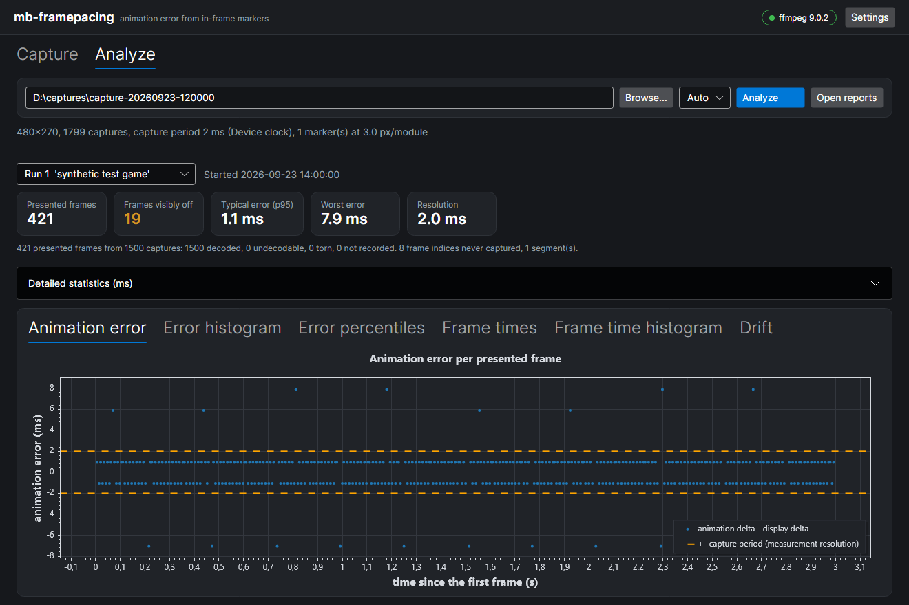

## How it works

There are two halves, and both are needed:

- **Inside your application:** the C++20 marker library ([`marker/cpp/`](marker/cpp)). Every frame, it turns "frame index + animation time +
  run id" into a set of pixel aligned black and white rectangles that your renderer draws on top of the finished image. No
  dependencies, no allocations per frame, any graphics API.
- **On the recording side:** the `mb-framepacing` tools ([`measure/`](measure), command line and GUI). They record the display
  signal with their own clock, read the marker back from every recorded frame and compare the animation time the frame
  carries with the time it actually appeared in the capture.

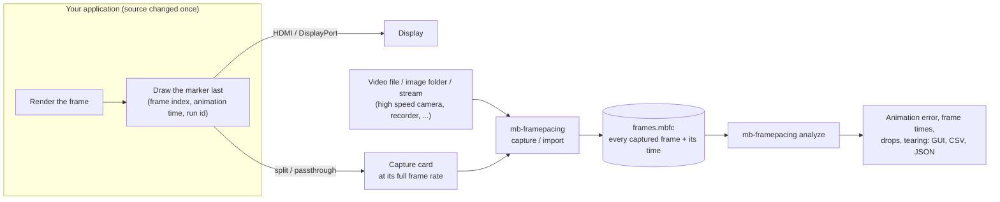

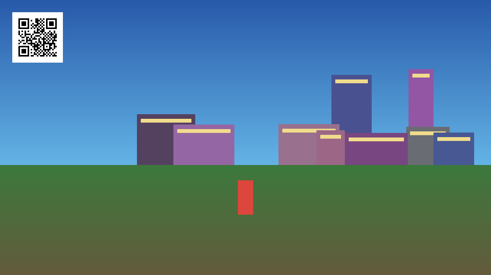

## The process

### 1. Once: build the marker into your application

Link the library and draw the marker as the very last thing in every frame, after post effects and UI, in pure black and white:

```cpp
#include <mb/framemarker/FrameMarker.hpp>
namespace FM = MB::FrameMarker;

std::array<FM::Quad, FM::MaxQuadCount()> quads;
const std::size_t count = FM::GenerateQuads({frameIndex, animationTicks, runId, FM::MarkerKind::Frame}, options, origin, quads);
for (std::size_t i = 0; i < count; ++i)
  FillRect(quads[i], quads[i].Dark ? Black : White);   // your renderer: a rectangle, two triangles, ...
```

`frameIndex` counts rendered frames, `animationTicks` is the time the frame was animated for (100 ns ticks). Choosing the size and
position, and the start/end markers, are covered in **[Integrating the marker](doc/integrating.md)**.

### 2. Every test: record, run, analyse

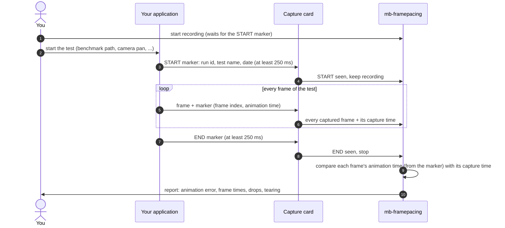

1. Connect the application's display output through a capture card (it passes the signal on to your monitor). The recording
   can run on the same PC or a second one.
2. Start the recording: **Start capture** in the GUI, or `mb-framepacing capture --wait-for-start --stop-at-end --analyze`.
3. Run the test in your application. It shows the **start** marker, then the normal frame markers, then the **end** marker.
4. The recording stops by itself at the end marker and the analysis opens. Record with other equipment instead (a lossless video,
   a high speed camera's image sequence)? Use `mb-framepacing import` or the GUI's video/image/stream sources.

The start and end markers bracket exactly the part you want measured. The start marker also carries a test name and the wall
clock time, so every report knows what it measured:

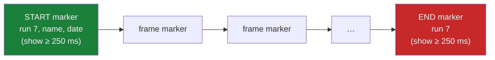

| Start (with name and time)                   | Frame                                        | End                                      |
| -------------------------------------------- | -------------------------------------------- | ---------------------------------------- |
| 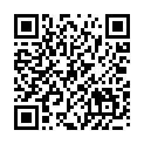 | 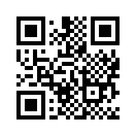 | 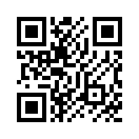 |

For tearing checks, draw the same marker at the top, middle and bottom of the frame; when they disagree, the capture shows parts
of two frames:

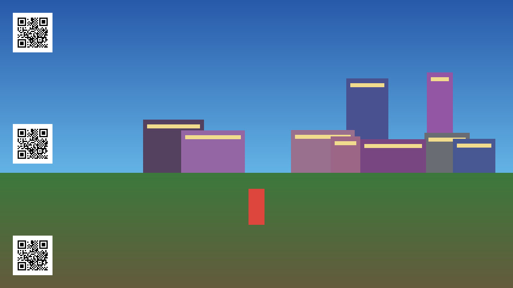

The exact format, sizing rules and placement are in [`doc/marker-format.md`](doc/marker-format.md).

## Getting started

| Step                               | Guide                                                                                                                      |
| ---------------------------------- | -------------------------------------------------------------------------------------------------------------------------- |
| 1. Install and build, per platform | **[Windows](doc/install/windows.md)** · **[Ubuntu](doc/install/ubuntu.md)** · **[macOS (Homebrew)](doc/install/macos.md)** |
| 2. Put the marker into your app    | **[Integrating the marker](doc/integrating.md)** (C++ library, size, position, start/end markers)                          |
| 3. Take a measurement and read it  | **[Using mb-framepacing](doc/usage.md)** (test game, capture card, video/image import, results, troubleshooting)           |

The platform guides cover ffmpeg, building the tools and putting them on your PATH, capture card devices and permissions, and
building the C++ library. The short version is below.

### The GUI

Run `mb-framepacing-gui`. The first time, a short setup dialog helps you get ffmpeg and choose where captures go.

| Capture                                                          | Setup                                                   |
| ---------------------------------------------------------------- | ------------------------------------------------------- |
| 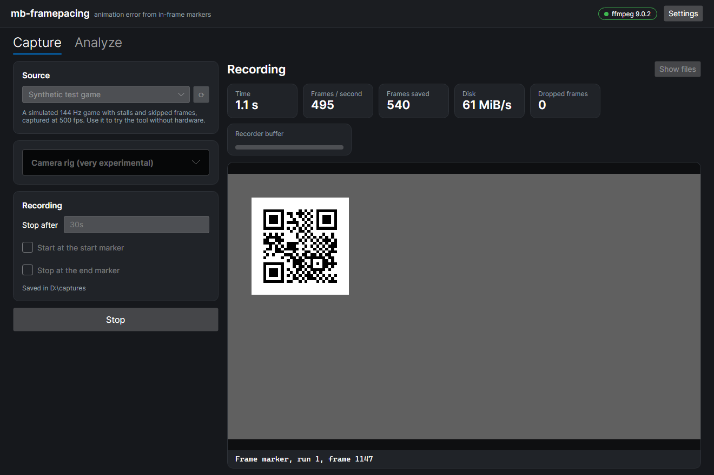 | 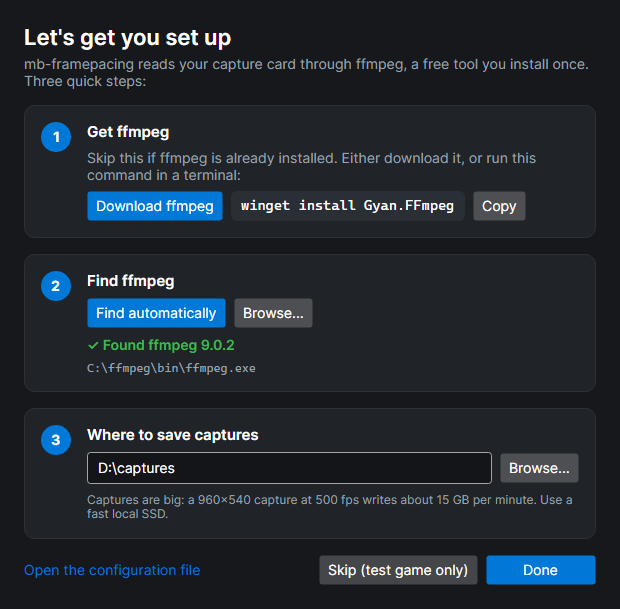 |

- **Capture:** pick a capture card, a video file, an image folder or a stream, and press **Start capture**. Pick _Synthetic test
  game_ to try everything without any hardware.
- **Analyze:** opens by itself after a capture, with the headline numbers, detailed statistics and charts. **Open reports** shows
  the CSV and JSON files for your own tooling.
- `mb-framepacing-gui --demo` captures and analyses the synthetic test game straight away.

### Reading the results

Besides the per-frame charts over time, the Analyze page shows how the values are distributed. The examples below are the
synthetic test game (about 144 fps with injected stalls and skipped frames) captured at 500 fps. The count axes are
logarithmic, so a handful of bad frames stays visible next to hundreds of good ones.

| Animation error distribution                                       | Frame time distribution                                            |
| ------------------------------------------------------------------ | ------------------------------------------------------------------ |
| 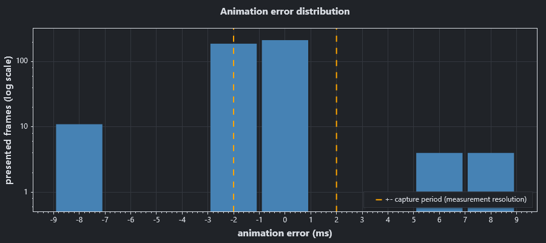 | 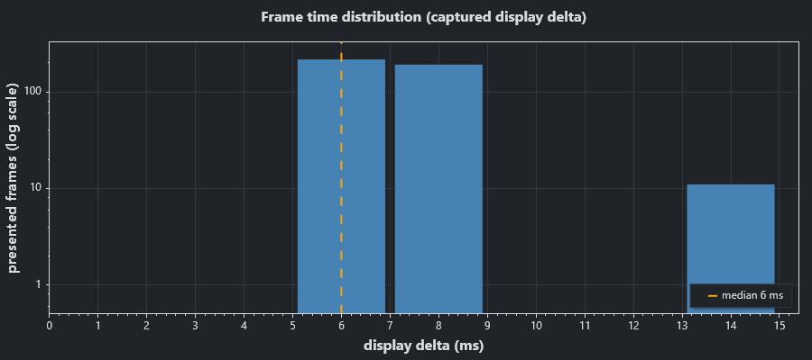 |

- **Animation error distribution:** how often each error occurred. Each bar is one capture period wide, because that is the
  measurement resolution. Everything between the dashed lines is within ±1 capture period and cannot be told apart from 0. Bars
  further out are real errors: positive = shown too soon (moved too far), negative = shown too late (moved too little).
- **Frame time distribution:** how long frames stayed on screen. Even pacing is one tall bar. Separate bars further right (often at
  multiples of the refresh period) are frames that stayed on screen too long.
- **Animation error by percentile:** every frame's absolute error, sorted. The flat part is the typical frame; the rise on the
  right shows how bad the worst 5 % and 1 % are, and makes two runs easy to compare.

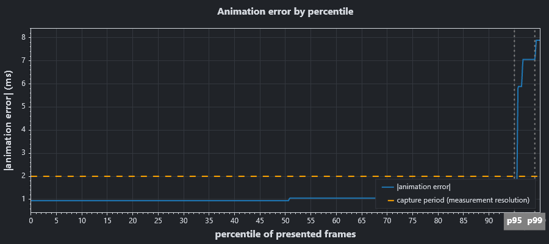

The histograms are also in `summary.json` (`runs[].histograms`), so you can plot or compare them with your own tools.

### The command line

```sh
mb-framepacing selftest                                   # check this machine, no hardware needed
mb-framepacing config --init --set-ffmpeg /path/to/ffmpeg # once, if ffmpeg is not found automatically
mb-framepacing devices --modes                            # list capture cards and their modes
mb-framepacing capture -d "Cam Link 4K" --mode 1920x1080@240 --scale 960x540 --wait-for-start --stop-at-end --analyze
mb-framepacing import recording.mkv --analyze             # a video file (its own timestamps are used)
mb-framepacing import frames/ --fps 1000 --analyze        # a folder of images at a known frame rate
mb-framepacing import frames/ --timestamps times.csv      # ... or with exact times per image (fileName,timeMs)
mb-framepacing import rtsp://camera/stream -t 30s         # a live network stream
mb-framepacing analyze <capture folder>                   # (re)analyse
```

`mb-framepacing <command> --help` lists every option. Results go to `<capture folder>/analysis/`: `summary.json`,
`captures.csv` (one row per captured frame) and `run-<id>-frames.csv` (one row per presented application frame).

### What you need

| For              | You need                                                                                         |
| ---------------- | ------------------------------------------------------------------------------------------------ |
| Recording        | ffmpeg 5.1+ (installed separately), and a capture card, a video file, image frames or a stream   |
| Live capture     | An HDMI/DP capture card that passes the signal through unchanged (1080p 240 Hz cards are common) |
| Disk             | A fast SSD: 960×540 writes about 0.5 MB per frame (use `--scale` or `--roi` to reduce it)        |
| Your application | Its source code, built with the C++20 marker library (any engine, any graphics API)              |

### How fast can it record?

There is no built-in frame rate limit: mb-framepacing records whatever the source delivers.

- **Capture cards:** the card's own modes decide (`mb-framepacing devices --modes`). 1080p at 240 fps is common, some cards go
  higher at lower resolutions. The live path is then limited by the card's USB/PCIe link, ffmpeg's decoding and scaling, and the
  disk: every stored frame is width × height bytes (grey), so 960×540 at 500 fps is about 250 MiB/s. When the disk falls behind,
  frames are counted as dropped, never silently lost.
- **Video files and image folders:** any rate. They are read as fast as the disk allows and nothing is dropped; the times come
  from the file (or from `--fps` / a timestamp file), so a 1000 fps or faster high speed camera recording works.
- **Faster is more precise:** results are exact to one capture period, so 240 fps resolves about ±4.2 ms, 500 fps ±2 ms,
  1000 fps ±1 ms.

`mb-framepacing selftest --fps <rate>` checks what this machine sustains. On the development PC (NVMe SSD), 960×540 at
2000 fps (about 980 MiB/s) ran with no drops and every frame matched.

## Configuration

`mb-framepacing.json` stores where ffmpeg is and where captures go; the GUI and the command line share it. Create it with
`mb-framepacing config --init` or the GUI's setup dialog.

| Location                                                                                                                            | Used when          |
| ----------------------------------------------------------------------------------------------------------------------------------- | ------------------ |
| `--config <file>`                                                                                                                   | always, when given |
| next to the executable                                                                                                              | portable installs  |
| `%APPDATA%\mb-framepacing\` (Windows), `~/Library/Application Support/mb-framepacing/` (macOS), `~/.config/mb-framepacing/` (Linux) | otherwise          |

ffmpeg is looked up in this order: `--ffmpeg`, the `MB_FFMPEG` environment variable, `ffmpegPath` in the configuration, PATH,
then the usual install folders (winget, Chocolatey, Scoop, Homebrew, apt, snap). It is never bundled: the tools run your own
`ffmpeg`.

## Building from source

Step-by-step instructions per platform, including putting the tools on your PATH, are in the [platform guides](#getting-started).
This is the developer summary. Requirements: the .NET 10 SDK, CMake 4.0+ with a C++20 compiler (MSVC 19.4x / Visual Studio 2026, GCC 12+, Clang 16+ or
AppleClang 15+), Python 3, and Node.js for formatting the docs.

```sh
# .NET: libraries, command line tool, GUI and tests (mb-quality from the mb-tools collection, or plain dotnet)
mb-quality -r --all .
dotnet test mb-framepacing.slnx

# C++ marker library (presets: windows, linux, linux-clang, macos); the tests fetch GoogleTest
cd marker/cpp && cmake --preset windows && cmake --build --preset windows && ctest --preset windows

# Self-contained single-file executables for this machine (or --rid linux-x64, osx-arm64, ...)
python measure/build_standalone.py

# Docs: formatting (Prettier) and the images in doc/images (rendered offscreen)
npm install && npm run format
dotnet run --project measure/tools/DocImages
```

The marker libraries are versioned in [`marker/VERSION`](marker/VERSION) and the tools in [`measure/VERSION`](measure/VERSION). The pieces fit together like this:

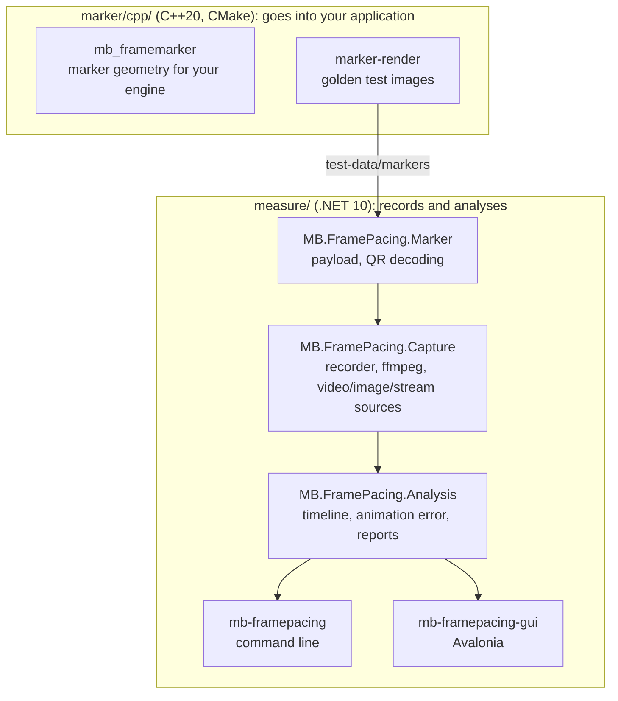

| Path                      | Contents                                                                      |
| ------------------------- | ----------------------------------------------------------------------------- |
| `marker/`                 | **Goes into your application**: the marker libraries and their version        |
| `marker/cpp/`             | The C++20 marker library, `marker-render` (golden images), GoogleTest tests   |
| `measure/`                | **Measures it**: the recording and analysis tools and their version           |
| `measure/libs/`           | Marker, Capture and Analysis libraries with their NUnit tests                 |
| `measure/app/`            | `mb-framepacing` (command line) and `mb-framepacing-gui` (Avalonia)           |
| `measure/tools/DocImages` | Renders `doc/images` (GUI screenshots offscreen, marker examples)             |
| `doc/`                    | Platform guides, usage guide, integration guide, marker specification, images |
| `test-data/markers/`      | Golden marker images written by the C++ library and decoded by the C# tests   |
| `licenses/`               | Licenses of every third-party component                                       |

## License

Two licenses, by path (see [`LICENSE`](LICENSE)): the frame marker libraries that applications embed (`marker/`), the
marker format specification, the integration guide and the golden marker images are BSD 3-Clause. Everything else,
including the measurement tools, is PolyForm Perimeter 1.0.1: free to use, change and share for any purpose, including
inside companies, but not to provide others a product that competes with it. Third-party components and their licenses
are listed in [`licenses/README.md`](licenses/README.md).

## Disclaimer

This is a highly experimental project, developed with AI assistance. Expect rough edges and breaking changes, and verify the
results before you rely on them.
