# mb-framepacing

[](https://github.com/Unarmed1000/mb-framepacing/actions/workflows/ci.yml)

**Animation error: stutter, quantified.**

Measured on the real display output, mb-framepacing calculates, frame by frame, how far a game's or real-time application's
**animation timer** is from **what was actually seen on screen**: the application writes its animation time into every frame, a
capture records when each frame really appeared, and the difference is the **animation error**.

> [!TIP]
> **New to stutter, frame pacing and animation error?** Watch
> **[▶ Frame pacing, explained](https://unarmed1000.github.io/mb-framepacing-explained/)** from the companion repository
> [mb-framepacing-explained](https://github.com/Unarmed1000/mb-framepacing-explained): two blind tests, then slides with the
> videos playing live next to timing diagrams.

## How it works

What comes out is a report of every frame: how far its animation was off (the animation error), how long it stayed on screen,
which frames were late, and more. This one is the perfect storm, a test clip with both causes of stutter at once: a naive timer
that is off by up to 5 ms either way, and slow frames that miss a refresh ([Reading the results](#reading-the-results) explains
every panel).

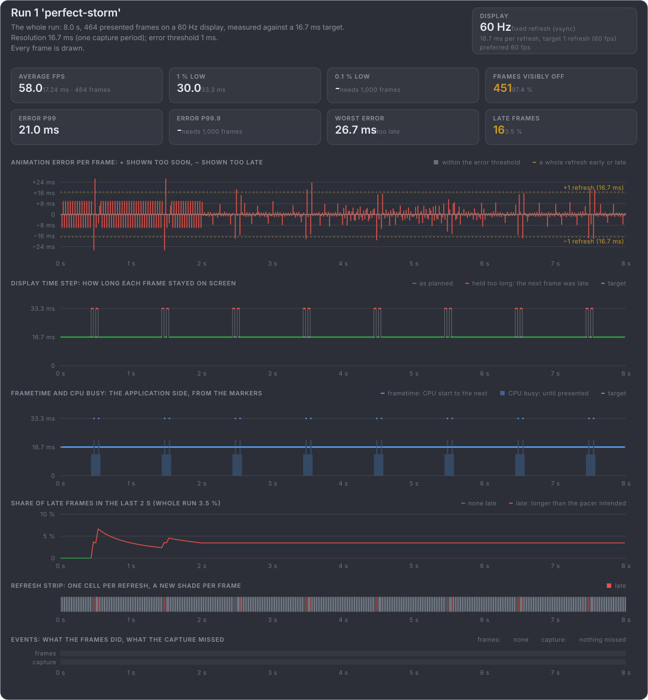

**See every number on screen.** A [playback report](measure/doc/usage.md#the-playback-page) plays the recording next to its report:
play it, slow it down, step it a frame at a time, and a playhead on every panel shows where the frame on screen is. Click a spike
in the report and the video jumps to that frame. It is one HTML file you open from the disk and can send on, with the recording in
its folder (`mb-framepacing import recording.mkv --playback`, or the GUI's **Save playback page**).


There are two halves, and both are needed:

- **Inside your application:** the SDK's marker module: C++20 ([`sdk/cpp/`](sdk/cpp)), C# ([`sdk/csharp/marker/`](sdk/csharp/marker)) or
  the [Unity package](sdk/doc/unity.md). Every frame, it turns "frame index + animation time + run id" into pixel aligned black and white
  triangles (or rectangles) that your renderer draws on top of the finished image. No dependencies, no allocations per frame, any
  graphics API.
- **On the recording side:** the `mb-framepacing` tools ([`measure/`](measure), command line and GUI). They read a recording of
  the display signal (OBS Studio recording a capture card at the display's refresh rate), read the marker back from every
  recorded frame and compare the animation time the frame carries with the time it actually appeared in the recording.

> [!IMPORTANT]
> **mb-framepacing is a cooperative tool (for now).** It only measures applications that take part: every frame, the
> application writes **its own frame index and its animation timer** into the image as a marker (a small QR code), using
> one of the marker libraries below.
>
> mb-framepacing then compares **the animation time the application wrote into each frame** with **the time that frame
> actually appeared in the capture**. Where the two disagree, motion on screen stutters. Without the marker there is nothing
> to compare, so this needs the application's source code and a small change to its renderer. It cannot measure an
> unmodified game or app that you cannot rebuild.

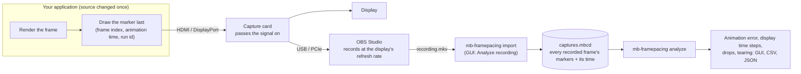
```mermaid
flowchart LR
    subgraph app["Your application (source changed once)"]
        A[Render the frame] --> B["Draw the marker last<br/>(frame index, animation time, run id)"]
    end
    B -->|HDMI / DisplayPort| D["Capture card<br/>passes the signal on"]
    D --> C[Display]
    D -->|USB / PCIe| O["OBS Studio<br/>records at the display's refresh rate"]
    O -->|recording.mkv| E["mb-framepacing import<br/>(GUI: Analyze recording)"]
    E --> F[("captures.mbcd<br/>every recorded frame's markers + its time")]
    F --> G["mb-framepacing analyze"]
    G --> H["Animation error, display time steps,<br/>drops, tearing: GUI, CSV, JSON"]
```

The marker in a real application: the FramePacing sample of the author's **unofficial**
[gtec-demo-framework](https://github.com/Unarmed1000/gtec-demo-framework), with the marker top-left and, next to it, the values the
last marker carried. The sample is there for
[Vulkan](https://github.com/Unarmed1000/gtec-demo-framework/tree/master/DemoApps/Vulkan/FramePacing),
[OpenGL ES 3](https://github.com/Unarmed1000/gtec-demo-framework/tree/master/DemoApps/GLES3/FramePacing) and
[OpenGL ES 2](https://github.com/Unarmed1000/gtec-demo-framework/tree/master/DemoApps/GLES2/FramePacing)
([integrating.md](sdk/doc/integrating.md) has more):

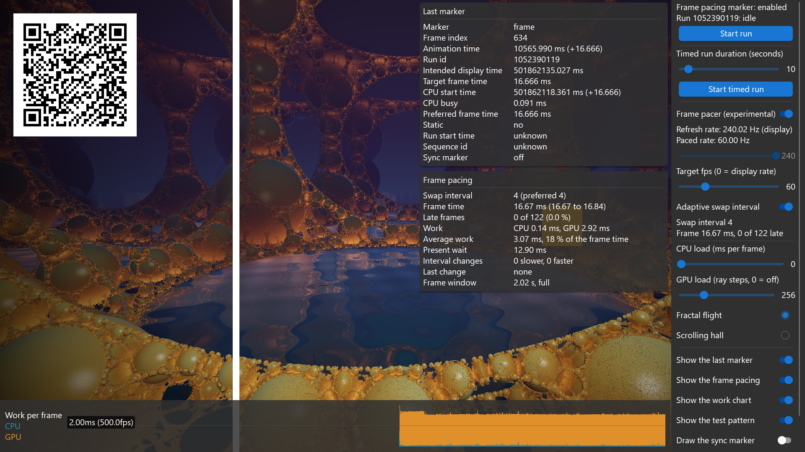

## The typical workflow

### 1. Once: build the marker into your application

Link the library and draw the marker as the very last thing in every frame, after post effects and UI, in pure black and white.
It writes pixel aligned triangles straight into your vertex buffer, without allocating:

```cpp
#include <mb/framepacing/marker/FrameMarker.hpp>
#include <mb/framepacing/marker/geometry/ModuleMatrix.hpp>
#include <mb/framepacing/marker/geometry/Vertex.hpp>
namespace FM = MB::FramePacing::Marker;

std::array<FM::Vertex, FM::MaxTriangleVertexCount()> vertices;   // once
FM::ModuleMatrix matrix;
FM::GenerateModules({FM::MarkerKind::Frame, runId, frameIndex, FM::MarkerFlags::NoFlags, animationTime}, matrix);    // encode once
const std::size_t count = FM::ModulesToTriangles(matrix, options, origin, vertices);        // draw it
DrawTriangles(vertices.data(), count);   // your renderer: (X, Y) in pixels, color (Luma, Luma, Luma)
```

`frameIndex` counts rendered frames, `animationTime` is the time the frame was animated for (an `MB::FramePacing::TimeSpan`).

- **C++:** see **[Integrating the marker](sdk/doc/integrating.md)** for adding the library with CMake (a release archive, git,
  `add_subdirectory` or `find_package`), choosing the size and position, and the start and end markers.
- **C#:** the marker module [`sdk/csharp/marker`](sdk/csharp/marker/README.md) has the same API (`MarkerGenerator.TryGenerateModules`, `FrameMarker.ModulesToTriangles`).
- **Unity:** the **[Unity package](sdk/doc/unity.md)** adds an overlay component that does all of this for you.
- **Every field:** **[Filling the marker fields](sdk/doc/marker-fields.md)** says where each value comes from, when it changes and what
  the analysis does with it, with examples for typical frame pacers.
- **Python:** [`sdk/python`](sdk/python/README.md) (`mb_framepacing.marker`), which also draws into pixel buffers.

[`sdk/README.md`](sdk/README.md) compares the libraries; each has its own README with a quick start and its API.

The SDK's marker modules put the marker into your application. All of them draw exactly the same pixels; the C++ and C# modules
allocate nothing per frame:

| Your application                 | Marker module                                                                                                                          | Guide                                            |
| -------------------------------- | -------------------------------------------------------------------------------------------------------------------------------------- | ------------------------------------------------ |
| C++ (any engine or graphics API) | [`sdk/cpp`](sdk/cpp/README.md): `mb_framepacing::marker`, C++20, CMake, no dependencies                                                | [Integrating the marker](sdk/doc/integrating.md) |
| C# / .NET                        | [`sdk/csharp/marker`](sdk/csharp/marker/README.md): `MB.FramePacing.Marker`, .NET Standard 2.1, no dependencies besides the SDK's core | [Integrating the marker](sdk/doc/integrating.md) |
| Unity 2021.3+                    | Unity package `com.manabattery.framepacing`: the C# module plus a drop-in overlay component                                            | [Unity](sdk/doc/unity.md)                        |
| Python 3.12+                     | [`sdk/python`](sdk/python/README.md): `mb_framepacing.marker`, standard library only                                                   | [Python library](sdk/python/README.md)           |

### 2. Every test: record, run, analyse

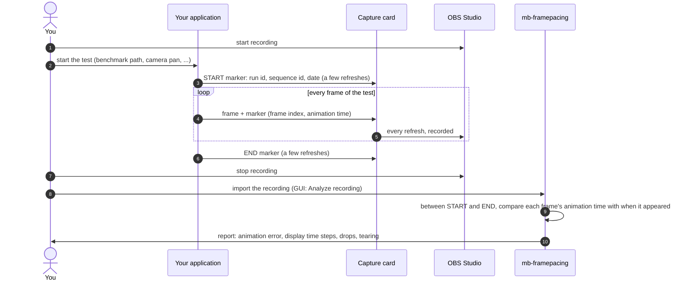
```mermaid
sequenceDiagram
    autonumber
    actor You
    participant App as Your application
    participant Card as Capture card
    participant OBS as OBS Studio
    participant Tool as mb-framepacing
    You->>OBS: start recording
    You->>App: start the test (benchmark path, camera pan, ...)
    App->>Card: START marker: run id, sequence id, date (a few refreshes)
    loop every frame of the test
        App->>Card: frame + marker (frame index, animation time)
        Card->>OBS: every refresh, recorded
    end
    App->>Card: END marker (a few refreshes)
    You->>OBS: stop recording
    You->>Tool: import the recording (GUI: Analyze recording)
    Tool->>Tool: between START and END, compare each frame's animation time with when it appeared
    Tool->>You: report: animation error, display time steps, drops, tearing
```

1. Connect the application's display output through a capture card (it passes the signal on to your monitor), and record the card
   with OBS Studio at the display's refresh rate: [Measure with OBS and a capture card](measure/doc/usage.md#2-measure-with-obs-and-a-capture-card)
   has the settings (proposed, not yet verified with a recording).
2. Run the test in your application. It shows the **start** marker, then the normal frame markers, then the **end** marker.
3. Import the recording: **Analyze recording** in the GUI (source **Video file...**), or
   `mb-framepacing import recording.mkv --display-hz 240 --wait-for-start --stop-at-end --analyze`. The run between the markers is
   measured, and the analysis opens.
4. Other recordings work too: any lossless video or image sequence (`import`).

The start and end markers bracket exactly the part you want measured. The start marker also carries a sequence id (a UUID, or a
short text tag) and the wall clock time, so every report knows what it measured:

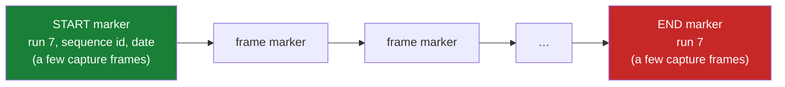
```mermaid
flowchart LR
    S["START marker<br/>run 7, sequence id, date<br/>(a few capture frames)"] --> F1[frame marker] --> F2[frame marker] --> F3[" … "] --> E["END marker<br/>run 7<br/>(a few capture frames)"]
    style S fill:#1a7f37,color:#fff
    style E fill:#c62828,color:#fff
```

| Start (with sequence id and time)                    | Frame                                                | End                                              |
| ---------------------------------------------------- | ---------------------------------------------------- | ------------------------------------------------ |
|  |  |  |

For tearing checks, also draw the small **sync marker** at the bottom left. It carries the run id and frame index; when it disagrees with
the main marker, the capture shows parts of two frames:

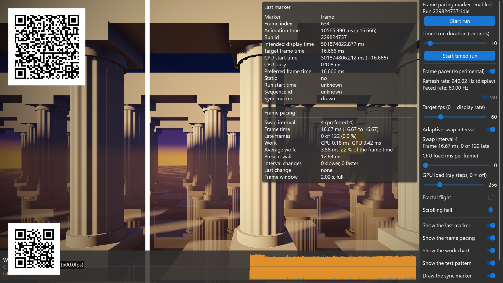

The exact format, sizing rules and placement are in [`sdk/doc/marker-format.md`](sdk/doc/marker-format.md).

## Why this exists

A game can report a steady "60 fps" and still feel choppy. Two things decide whether motion looks smooth:

1. **When a frame reaches the screen** (frame pacing): frames should arrive at an even rhythm, for example every 16.7 ms at 60 Hz.
2. **What moment the frame shows** (the animation time): each frame is rendered for a point in time, "the world at 12.345 s".
   The distance moved on screen between two frames should match the time that passed on screen between them.

When these disagree, the eye sees stutter even though the frame counter looks fine. A frame that arrives one refresh late but was
animated as if it were on time jumps too little; the next one jumps too much. That mismatch is the **animation error**, and it is
invisible to in-game counters, because the game only knows when it _submitted_ a frame, not when the display _showed_ it.

It happens in two ways, which Gamers Nexus compare to a flipbook:

- **Uneven pacing:** evenly drawn pages flipped at an uneven tempo. The animation time advances evenly, but frames reach the
  screen unevenly, for example a frame over its budget that shows a refresh late (a hitch).
- **Uneven animation time:** unevenly drawn pages flipped at a steady tempo. Frames reach the screen evenly, but the animation
  time advances unevenly, for example when the engine's delta time jitters.

mb-framepacing measures it from the outside, on the real video signal. For every two frames shown one after the other:

> **animation error** = how far the **animation timer** (written by the application) advanced − how much time actually passed
> between the two frames **in the capture**

| The game reports                     | The capture shows                            | mb-framepacing reports                          |
| ------------------------------------ | -------------------------------------------- | ----------------------------------------------- |
| frame 1000 animated for t = 10.000 s | frame 1000 first on screen at 0.000 s        |                                                 |
| frame 1001 animated for t = 10.017 s | frame 1001 first on screen at 0.033 s (late) | animation error **−16.7 ms** (moved too little) |
| frame 1002 animated for t = 10.033 s | frame 1002 first on screen at 0.050 s        | animation error 0 ms                            |

Animation error is the main result. Along the way it also reports frames that were rendered but never shown, frames shown twice
as long, torn frames, and the overall drift between the game's clock and the display.

**Background:** Gamers Nexus explain animation error and why frame rate alone hides it in
[The Problem with GPU Benchmarks: Animation Error Methodology White Paper](https://gamersnexus.net/gpus-gn-extras-cpus/problem-gpu-benchmarks-reality-vs-numbers-animation-error-methodology-white)
([video](https://www.youtube.com/watch?v=qDnXe6N8h_c)). mb-framepacing uses the same definition and sign as
[PresentMon](https://github.com/GameTechDev/PresentMon)'s `MsAnimationError`
([CSV columns](https://github.com/GameTechDev/PresentMon/blob/main/README-ConsoleApplication.md#csv-columns),
[Intel PresentMon](https://game.intel.com/story/intel-presentmon/)); positive: shown too soon, negative: shown too late.
The difference is where the numbers come from. The application writes its exact animation time into each frame, instead of it
being estimated. The display time comes from the captured video signal, instead of software flip events, and is precise to one
capture period. **[Vocabulary](sdk/doc/vocabulary.md)** lists where each term appears in the CSV and the charts;
[mb-framepacing-explained](https://github.com/Unarmed1000/mb-framepacing-explained) explains the terms, with their other names,
diagrams and sources.

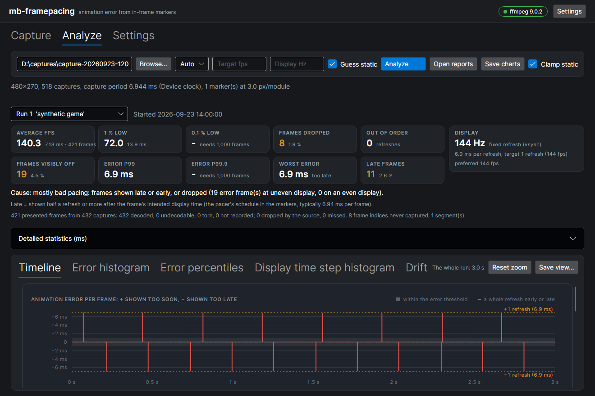

## Getting started

| Step                               | Guide                                                                                                                                                            |
| ---------------------------------- | ---------------------------------------------------------------------------------------------------------------------------------------------------------------- |
| 1. Install and build, per platform | **[Windows](measure/doc/install/windows.md)** · **[Ubuntu](measure/doc/install/ubuntu.md)** · **[macOS (Homebrew)](measure/doc/install/macos.md)**               |
| 2. Put the marker into your app    | **[Integrating the marker](sdk/doc/integrating.md)** (C++ library, size, position, start/end markers), **[Filling the marker fields](sdk/doc/marker-fields.md)** |
| 3. Take a measurement and read it  | **[Using mb-framepacing](measure/doc/usage.md)** (OBS and a capture card, video/image import, results, troubleshooting)                                          |

The platform guides cover ffmpeg, building the tools and putting them on your PATH, and building the C++ library. The short version is below. Possible next steps (HDR capture among them) are on the [roadmap](doc/roadmap.md): options, not promises.

### The GUI

Run `mb-framepacing-gui`. If ffmpeg is not found, a short setup dialog helps you get it and choose where captures go
(**Settings → Set up...** opens it at any time).

| Capture                                                                                | Setup                                                           |
| -------------------------------------------------------------------------------------- | --------------------------------------------------------------- |
| 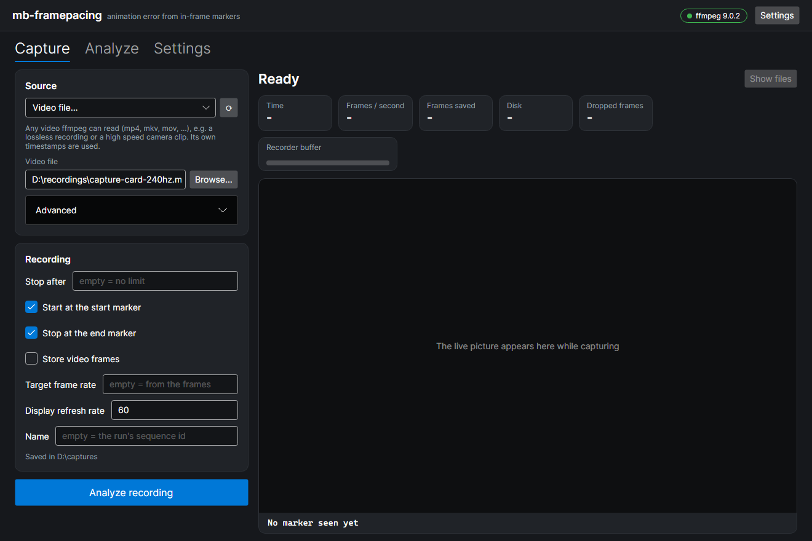 | 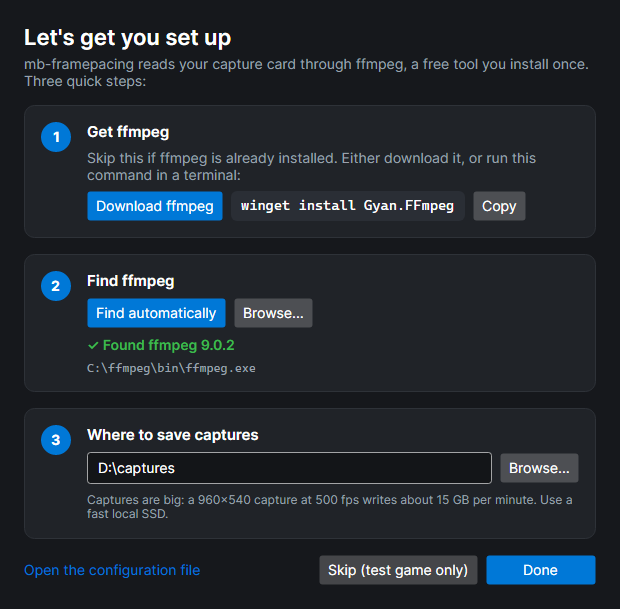 |

- **Capture:** pick a recording (a video file or an image folder) and press **Analyze recording**.
- **Analyze:** opens by itself after a capture, with the headline numbers, detailed statistics and charts. **Open reports** shows
  the CSV and JSON files for your own tooling.

### Reading the results

The examples below come from the 60 Hz test clips in [`measure/test-data/videos`](measure/test-data/videos), imported as a
recording of a capture card would be.

A capture card captures at the display's refresh rate, so every capture is one refresh. The analysis relies on that: the refresh
period is the capture period, and display time steps are whole refreshes, measured exactly. The animation error (the marker's animation
time step against the display time step) is then exact too, to the 100 ns tick. The report's animation error panel marks every
whole refresh an error reaches with a dashed amber line (±16.7 ms at 60 Hz, ±20 ms at 50 Hz): an error that size is a frame shown a
whole refresh early or late. The display rate you expect (`--display-hz`, **Display refresh rate**) is checked against the
capture's rate.

**Late frames** are shown later than the application meant. When its frame pacer writes the **intended display time** into the
marker, a frame is late when it appears half a refresh or more after that time, which also catches frames that stay late after a
hitch; the animation error then splits into **pacing error** (shown off the plan) and **prediction error** (animated for another
moment than planned). With only a **target frame time** in the marker, or only a **preferred frame time** (the rate the game wants:
a game that wants 30 fps on a 60 Hz display is measured against two refreshes), or a target frame rate given to the tools
(`--target-fps`, **Target frame rate** in the GUI, for example 30 for a game locked to 30 fps on a 60 Hz display), a frame is late
when it appears half a refresh or more beyond its target. Without any of them the target is the display's native refresh rate. Under the headline numbers, **Cause** tells which
of the two causes of animation error dominates: frames with an error where the display time step jumps are **bad pacing** (late,
early or dropped frames); frames with an error while the display time step stays even are **delta time jitter** (uneven animation
steps).

The GUI draws the report's cards itself, as wide as the window. The **Timeline** tab shows the report's animation error, display
time step, frametime, late share and refresh strip panels on one time axis (the events panel and the target and preferred frame
time lines are in the report card only, as **Save charts** writes it): the
mouse wheel zooms around the pointer, a sideways wheel or swipe (or Shift with the wheel), dragging and the scrollbar scroll left and
right, and **Reset zoom** (or a double-click) shows the whole run again; the scales stay the whole run's, so the axes do not jump while
you look around. Hovering shows the frame under the pointer (its display time step, animation error, lateness, frametime and CPU
busy). The distribution tabs follow the section the Timeline shows, and **Save view...** saves the card on screen, as it is zoomed, as
SVG or PNG. Every zoom draws in a few milliseconds whatever the capture's length, ten hours included: each pixel column's numbers
come from data prepared once per run. Zoomed in, the Timeline is a sliding window, drawn a screen wider on either side, so scrolling
only moves it; the next window is drawn in the background before you reach its edge.

The same panels as a report (below) of a test clip, a busy stretch at the full rate:

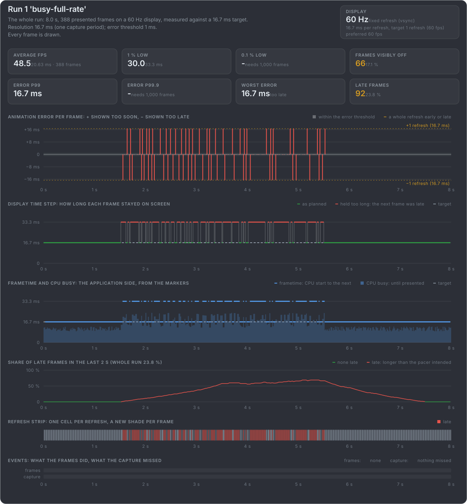

Every panel says in its title what it shows, and its key on the right names each colour, listing only what the section shows.

- **Animation error:** a bar per frame, up when it was shown too soon, down when shown too late; a frame without error draws
  nothing. Everything inside the shaded band counts as no error.
- **Display time step:** how long each frame stayed on screen, as a step until the next frame, on a grid of whole refreshes. It is red
  when the frame was held too long because the next one was late, orange when frames the application rendered after it never reached
  the display (dropped), pink when an older frame came back out of order while it was the newest, and dashed grey where a capture gap
  leaves the step unknown. An error bar over a red step is
  bad pacing; an error bar while the steps stay flat is delta time jitter.
- **Frametime and CPU busy** (when the markers carry the CPU start time and CPU busy): the application side on the same grid, each
  frame's frametime (its CPU start to the next frame's) as a blue step and its CPU busy (until it was presented) as a faint bar.
- **Share of late frames in the last 2 s:** the frames of the 2 s before each frame that were late, or on screen longer than the
  application prefers (its preferred frame time in the markers; else the target frame rate given to the tools, else one refresh). Red
  where one was late; amber where they only stayed longer than preferred, as the pacer intended (a pacer running slower than the game
  wants); green where every frame ran as the game wants, so a 30 fps lock or an idle screen at 1 fps stays green. A static frame's
  time on screen and frames presented on demand are never amber.
- **Refresh strip:** one cell per refresh, shaded by the frame on screen, late frames in red, static frames in violet; orange where a
  dropped frame was due (the display repeated the frame before), pink where an older frame came back out of order, grey where a capture
  card's captures could not be decoded or were not recorded; what happened to the frames and the capture is in the events panel
  under it. Zoom in to
  see hold patterns such as 3-then-1.
- **Static stretches** (frames whose markers say nothing animates while they are on screen, such as an idle screen): a violet band behind every panel. The
  display time step and frametime scales leave their idle waits out, so a second of idle screen does not squash the rest; those values
  get a mark at the top edge.

The start of its busy stretch as a frame timeline (`render --timeline`): each frame's CPU work from its CPU start time for its CPU
busy, when it was presented, and what every refresh showed:

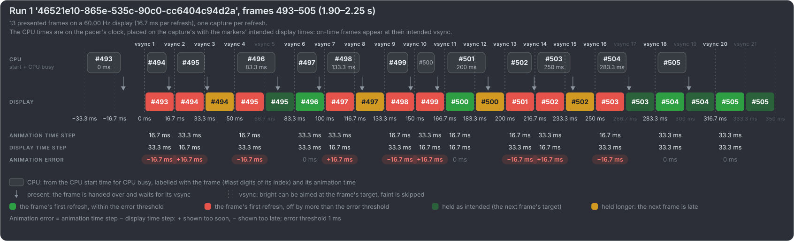

When a few frames are far off everything else (a hitch of hundreds of milliseconds among errors of a few), the error and display
time step scales cover the rest, and each frame beyond the scale gets a mark at the edge with its value; zoom out to see it whole.

The other tabs show how the values are distributed (`render` writes them as `run-<id>-<card>.svg` too). The count axes are
logarithmic, so a handful of bad frames stays visible next to hundreds of good ones. The examples are test clips: a naive 5 ms timer's
errors, and the display time steps of a game adapting its rate.

| Animation error distribution                                               | Display time step distribution                                                           |
| -------------------------------------------------------------------------- | ---------------------------------------------------------------------------------------- |
| 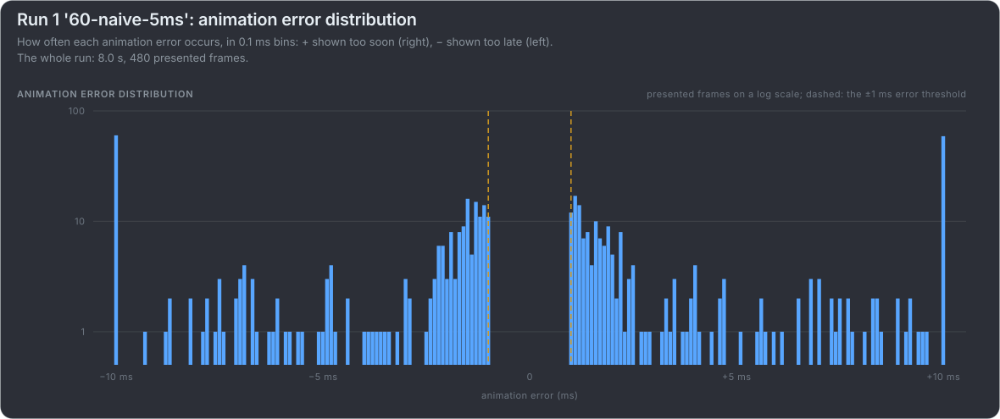 |  |

- **Animation error distribution:** how often each error occurred, in 0.1 ms bars for every capture source. Everything between the
  dashed lines (the error threshold, ±1 ms unless `--error-threshold-ms` changes it) counts as no error. Bars further out are real
  errors: positive = shown too soon (moved too far), negative = shown too late (moved too little).
- **Display time step distribution:** how long frames stayed on screen (PresentMon's `MsBetweenDisplayChange`; overlays often call
  this "frame time"). Even pacing is one tall bar. Separate bars further right (often at
  multiples of the refresh period) are frames that stayed on screen too long.
- **Animation error by percentile:** every frame's absolute error, sorted. The flat part is the typical frame; the rise on the
  right shows how bad the worst 5 % and 1 % are, and makes two runs easy to compare.

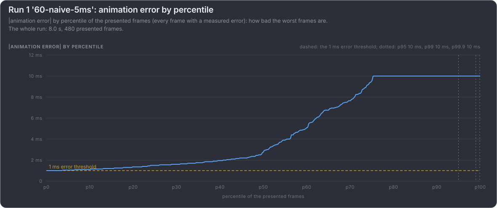

The charts can also be written as SVG cards next to the reports (`run-<id>-report.svg`, `-error-histogram.svg`,
`-error-percentiles.svg`, `-display-time-step-histogram.svg`, `-drift.svg`): `--charts` on the command line, **Save charts** in the
GUI (`render --png` makes PNGs of them). The
histograms and the pacing numbers are also in `summary.json` (`runs[].histograms`, `runs[].pacing`; the error per frame and
percent error in `runs[].statistics`), and late frames carry `Late`
in the `flags` column of `run-<id>-frames.csv`, so you can plot or compare them with your own tools: the files are specified in
[sdk/doc/analysis-output-format.md](sdk/doc/analysis-output-format.md), and the SDK's [data modules](sdk/README.md#the-data-module) read them.

**The report** is the run as one SVG card, in the style of
[mb-framepacing-explained](https://github.com/Unarmed1000/mb-framepacing-explained)'s charts: the headline numbers, the animation
error, the display time step and the frametime with the target and preferred frame time as dashed lines, the late share, the
refresh strip, and the events: what the frames did (dropped, out of order, torn) and what the capture missed, in two lanes. `--charts` and **Save charts** write it for the whole run
(`run-<id>-report.svg`); `mb-framepacing render` draws it from an analysis (no capture needed) for the whole run or any section
(`--from`/`--to`, in seconds on the Timeline's axis), the worst moments (`--details`), and as PNG too (`--png`, through Edge or
Chrome). A section of a few seconds shows every frame and refresh; a long run shows each pixel column's frames, the whole range faint
and the middle 90 % solid.

Every item of the card can be left out (`--hide late-share,refresh-strip`) or kept alone (`--only animation-error`); `--help`
lists the ids. `--show animation-time-step` adds the animation time step over the display time step, and a card for a document can
have its own title (`--title`), a refresh strip of only the first seconds (`--strip-seconds`), no tiles without a value
(`--hide-empty`) and more tiles per row (`--tiles-per-row`); `--no-static-clamp` lets idle stretches' values set the value scales
(by default they stop at the edge, as the GUI's **Clamp static** check box does). Next to the report, `render` draws the distributions as cards in the same style (`run-<id>-<card>.svg`): the
animation error and display time step histograms (0.1 ms bins, counts on a log scale), the |animation error| by percentile and the
cumulative drift; `--cards` picks them (`--cards none` for the report only).

The test clips (`measure/test-data/videos`, made by mb-framepacing-explained) as reports. The busy stretch at the full rate is the example
above: the frames that miss a refresh are late, and each is off by a whole refresh. Its companion adapts its rate as an adaptive
pacer does: late frames at first, then 30 fps (two refreshes per frame, as its markers' target frame time says, while their preferred
frame time stays 60 fps) for a while, then 60 again:

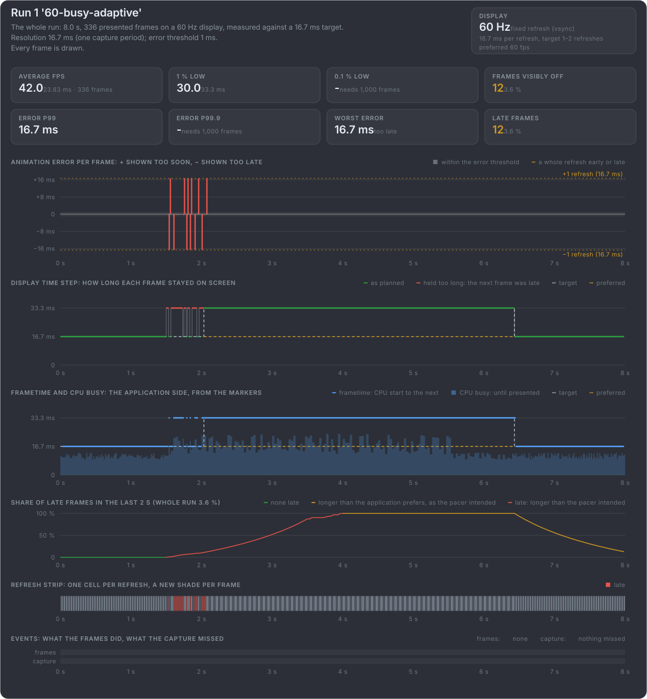

A naive delta time timer: every frame is shown on time, but the timer is off by up to 5 ms either way, so the animation steps
are off by up to 10 ms and nearly every frame is off (delta time jitter, not bad pacing):

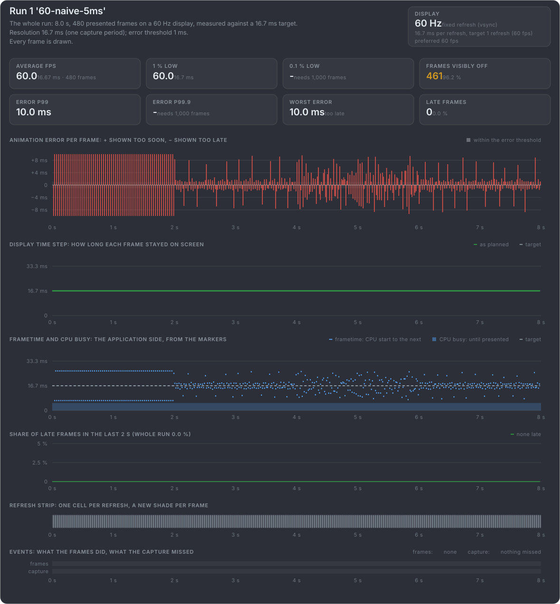

### The command line

```sh
# Once
mb-framepacing selftest                                     # check this machine, no hardware needed
mb-framepacing config --init --set-ffmpeg /path/to/ffmpeg   # only if ffmpeg is not found automatically
mb-framepacing marker-size --source 3840x2160 --stored 960x540   # the module size your application should draw

# Every test: import the OBS recording of the capture card; the run between its markers is measured
mb-framepacing import recording.mkv --display-hz 60 --wait-for-start --stop-at-end --analyze
mb-framepacing import recording.mkv --display-hz 60 --target-fps 30 --name "menu scroll" --analyze

# Other recordings
mb-framepacing import clip.mp4 --analyze                    # any video file (its own timestamps are used)
mb-framepacing import frames/ --fps 1000 --analyze          # a folder of images at a known frame rate
mb-framepacing import frames/ --timestamps times.csv        # ... or with each image's time (fileName,timeTicks)

# The results
mb-framepacing analyze <capture folder>                     # analyse again
mb-framepacing analyze <capture folder> --target-fps 30     # ... with late frames judged against 30 fps
mb-framepacing name <capture folder> "menu scroll"          # name it; analyse again to use the name
mb-framepacing render <capture folder> --from 120 --to 125 --png   # the report of 5 s of the run, SVG and PNG
mb-framepacing render <capture folder> --playback           # the report next to the recording, with a player (HTML)
```

`mb-framepacing <command> --help` lists every option. Results go to `<capture folder>/analysis/`: `summary.json`,
`captures.csv` (one row per captured frame), `run-<id>-frames.csv` (one row per presented application frame) and, with `--charts`,
the report and the distribution cards as SVG (`run-<id>-report.svg`, `run-<id>-error-histogram.svg`, ...). `render --png` writes
PNGs. `--playback` (on `import`, `analyze` and `render`, and the GUI's **Save playback page**) writes a
[playback report](measure/doc/usage.md#the-playback-page) in a folder of its own (`analysis/playback/run-<id>/index.html`): one HTML
page that plays the imported recording next to its report, with a playhead on the report where the frame on screen is.

### What you need

| For              | You need                                                                                                                                                                    |
| ---------------- | --------------------------------------------------------------------------------------------------------------------------------------------------------------------------- |
| Recording        | ffmpeg 5.1+ (installed separately), and a recording: a video file (OBS recording a capture card) or image frames                                                            |
| Capture card     | An HDMI/DP capture card that passes the signal through and captures at the display's refresh rate (1080p 240 Hz cards are common)                                           |
| Disk             | Little: the capture data is 192 bytes per captured frame (about 170 MB for an hour at 240 Hz). Stored frames (`--keep-frames`) need a fast SSD: 0.5 MB per frame at 960×540 |
| Your application | Its source code, built with the C++20 or C# marker library, or the Unity package                                                                                            |

### How fast can it record?

There is no built-in frame rate limit. A recording (a video file or an image folder) is read as fast as the disk allows and nothing
is dropped; the times come from the file (or from `--fps` / a timestamp file).

**Precision:** a capture card captures at the display's refresh rate, and so does its recording, so display time steps are whole
refreshes and exact.

### Experimental features

Some features are experimental, hidden unless you ask for them, and described in their own guides:

- [Live capture](measure/doc/live-capture.md): recording a capture card or a network stream with mb-framepacing itself.
- [Camera capture](measure/doc/camera.md): a high speed camera filming the screen.
- [The frame pacer](sdk/doc/pacer.md): a C++ module that paces a frame loop and fills the marker's pacing fields.

## Configuration

`mb-framepacing.json` stores where ffmpeg is, where captures go and whether a playback report makes a playable copy of a
recording browsers cannot play (`playbackTranscode`); the GUI and the command line share it. Create it with `mb-framepacing config --init` or the
GUI's setup dialog.

Saved settings are safe and versioned:

- **Safe saves:** the configuration file and the GUI's remembered settings are written to a temporary file,
  flushed to the disk and then renamed over the old file. A crash or power cut leaves the old or the new version, never a
  broken file.
- **Backups:** the `backup` folder next to the file keeps `<file>.bak`, the version the last save replaced (hand edits included)
  or the deleted file, and `<file>.v<N>.bak`, the last file in format version N whenever a save changes the format. To undo a
  change, copy a backup back. Errors about a file that can not be read name its backup, and the GUI falls back to the backup of
  its settings by itself.
- **Format version:** every settings file has a `formatVersion`. A file written by a newer version of the tools is refused with
  a request to update, instead of being misread or overwritten.

| Location                                                                                                                            | Used when          |
| ----------------------------------------------------------------------------------------------------------------------------------- | ------------------ |
| `--config <file>`                                                                                                                   | always, when given |
| next to the executable                                                                                                              | portable installs  |
| `%APPDATA%\mb-framepacing\` (Windows), `~/Library/Application Support/mb-framepacing/` (macOS), `~/.config/mb-framepacing/` (Linux) | otherwise          |

ffmpeg is looked up in this order: `--ffmpeg`, the `MB_FFMPEG` environment variable, `ffmpegPath` in the configuration, PATH,
then the usual install folders (winget, Chocolatey, Scoop, Homebrew, apt, snap). It is never bundled: the tools run your own
`ffmpeg`.

## Building from source

Step-by-step instructions per platform, including putting the tools on your PATH, are in the [platform guides](#getting-started).
This is the developer summary. Requirements: the .NET 10 SDK, CMake 4.0+ with a C++20 compiler (MSVC 19.5x / Visual Studio 2026, GCC 12+, Clang 16+ or
AppleClang 15+), Python 3, and Node.js for formatting the docs.

```sh
# .NET: libraries, command line tool, GUI and tests
mb-quality -r --all .
dotnet test mb-framepacing.slnx

# C++ library: every module; the tests fetch GoogleTest
# Presets: windows, linux, linux-clang, linux-sanitize, macos
cd sdk/cpp && cmake --preset windows && cmake --build --preset windows && ctest --preset windows
python sdk/cpp/tests/consumer/check_consumers.py   # the documented CMake integrations

# Python library (marker and data, against the golden data)
python -m unittest discover -s sdk/python -t sdk/python

# Unity package: assemble and validate; check it in a real Unity editor (batch mode, needs a Unity license)
python sdk/unity/build_upm.py --output dist/upm --check
python sdk/unity/check_in_unity.py

# Self-contained single-file executables for this machine (or --rid linux-x64, osx-arm64, ...)
python measure/build_standalone.py

# Python scripts: lint, format and type check (ruff, basedpyright; pinned in pyproject.toml and uv.lock, https://docs.astral.sh/uv/)
uv sync                                                  # once: .venv with the dev tools, on Python 3.12 (.python-version)
uv run ruff check . && uv run ruff format --check . && uv run basedpyright

# Docs: formatting (Prettier) and the images in measure/doc/images (rendered offscreen)
npm install && npm run format
dotnet run --project measure/tools/DocImages
```

The SDK is versioned in [`sdk/VERSION`](sdk/VERSION) (every module and language) and the tools in [`measure/VERSION`](measure/VERSION);
[Releasing](doc/releasing.md) describes both release streams. The pieces fit together like this:

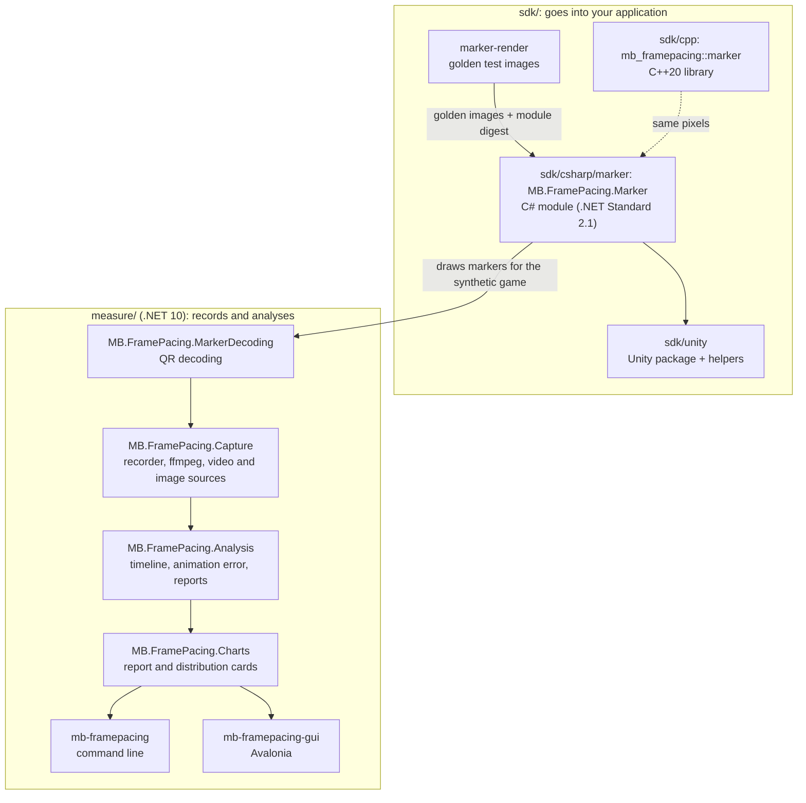
```mermaid
flowchart TB
    subgraph marker["sdk/: goes into your application"]
        L["sdk/cpp: mb_framepacing::marker<br/>C++20 library"]
        R["marker-render<br/>golden test images"]
        CS["sdk/csharp/marker: MB.FramePacing.Marker<br/>C# module (.NET Standard 2.1)"]
        U["sdk/unity<br/>Unity package + helpers"]
    end
    subgraph dotnet["measure/ (.NET 10): records and analyses"]
        M["MB.FramePacing.MarkerDecoding<br/>QR decoding"]
        CAP["MB.FramePacing.Capture<br/>recorder, ffmpeg, video and image sources"]
        AN["MB.FramePacing.Analysis<br/>timeline, animation error, reports"]
        CH["MB.FramePacing.Charts<br/>report and distribution cards"]
        CLI["mb-framepacing<br/>command line"]
        GUI["mb-framepacing-gui<br/>Avalonia"]
    end
    R -- "golden images + module digest" --> CS
    L -.->|same pixels| CS
    CS --> U
    CS -- "draws markers for the synthetic game" --> M
    M --> CAP --> AN --> CH --> CLI
    CH --> GUI
```

| Path                        | Contents                                                                                                                      |
| --------------------------- | ----------------------------------------------------------------------------------------------------------------------------- |
| [`sdk/`](sdk/README.md)     | **BSD 3-Clause**: everything applications embed or use to read the results; its README says where to start                    |
| `sdk/VERSION`               | The SDK's version: every module, every language                                                                               |
| `sdk/cpp/`                  | The C++20 library: one CMake project, a module per folder (`core/`, `marker/`, `data/`), its Conan recipe                     |
| `sdk/csharp/`               | The C# modules `MB.FramePacing` (core) and `MB.FramePacing.Marker` (.NET Standard 2.1, C# 9), `MB.FramePacing.Data` (.NET 10) |
| `sdk/python/`               | The Python package `mb_framepacing` (`marker` and `data`; standard library only) and its unittest tests                       |
| `sdk/unity/`                | The Unity package's helpers, samples and build scripts (`build_upm.py`, `check_in_unity.py`)                                  |
| `sdk/shaders/`              | Reference shaders that draw the marker as one quad                                                                            |
| `sdk/doc/`                  | Marker specification, integration, marker field and Unity guides, vocabulary, data formats, encoding performance              |
| `sdk/test-data/`            | Golden marker images (checked by every marker module) and the data modules' golden data                                       |
| `measure/`                  | **Measures it**: the recording and analysis tools and their version                                                           |
| `measure/libs/`             | MarkerDecoding, Capture, Analysis and Charts libraries with their NUnit tests                                                 |
| `measure/app/`              | `mb-framepacing` (command line) and `mb-framepacing-gui` (Avalonia)                                                           |
| `measure/tools/Benchmarks`  | BenchmarkDotNet benchmarks of the tools' libraries                                                                            |
| `measure/tools/DocImages`   | Renders `measure/doc/images` (GUI screenshots offscreen, marker examples)                                                     |
| `measure/doc/`              | Platform and usage guides, images                                                                                             |
| `measure/test-data/videos/` | 60 Hz test clips with manifests                                                                                               |
| `doc/`                      | Release guide and roadmap                                                                                                     |
| `tools/`                    | Repository scripts: checks, golden data                                                                                       |
| `licenses/`                 | Licenses of every third-party component                                                                                       |

## License

Two licenses, by path (see [`LICENSE`](LICENSE)): everything under `sdk/` is BSD 3-Clause: the frame marker libraries that
applications embed, the marker format specification, the integration guides and the golden marker images, and the data
libraries, the formats they read and their golden data. Everything else,
including the measurement tools, is PolyForm Perimeter 1.0.1: free to use, change and share for any purpose, including
inside companies, but not to provide others a product that competes with it. Every source file names its license on an
`SPDX-License-Identifier` line (`BSD-3-Clause`, or `LicenseRef-PolyForm-Perimeter-1.0.1`), and every code file its copyright
holder on an `SPDX-FileCopyrightText` line (`Copyright (C) 2026 Mana Battery ApS`): the SPDX short form, instead of the license
text in every file. Third-party components and their licenses are listed in [`licenses/README.md`](licenses/README.md).

## Disclaimer

This is a highly experimental project, developed with AI assistance. Expect rough edges and breaking changes, and verify the
results before you rely on them.
