# mb-framepacing

[](https://github.com/Unarmed1000/mb-framepacing/actions/workflows/ci.yml)

**An animation error metric, measured on the real display output.** mb-framepacing calculates, frame by frame, how far a game's
or real-time application's **animation timer** is from **what was actually seen on screen**: the application writes its
animation time into every frame, a capture records when each frame really appeared, and the difference is the **animation
error**.

> [!IMPORTANT]
> **mb-framepacing is a cooperative tool (for now).** It only measures applications that take part: every frame, the
> application writes **its own frame index and its animation timer** into the image as a marker (a small QR code), using
> one of the marker libraries below.
>
> mb-framepacing then compares **the animation time the application wrote into each frame** with **the time that frame
> actually appeared in the capture**. Where the two disagree, motion on screen stutters. Without the marker there is nothing
> to compare, so this needs the application's source code and a small change to its renderer. It cannot measure an
> unmodified game or app that you cannot rebuild.

The marker libraries put the marker into your application. All of them draw exactly the same pixels; the C++ and C# libraries
allocate nothing per frame:

| Your application                 | Marker library                                                                               | Guide                                        |
| -------------------------------- | -------------------------------------------------------------------------------------------- | -------------------------------------------- |
| C++ (any engine or graphics API) | [`marker/cpp`](marker/cpp): C++20, CMake, no dependencies                                    | [Integrating the marker](doc/integrating.md) |
| C# / .NET                        | [`marker/csharp`](marker/csharp): `MB.FrameMarker`, .NET Standard 2.1, no dependencies       | [Integrating the marker](doc/integrating.md) |
| Unity 2021.3+                    | Unity package `com.manabattery.framemarker`: the C# library plus a drop-in overlay component | [Unity](doc/unity.md)                        |
| Python 3.11+                     | [`marker/python`](marker/python): `mb_framemarker`, standard library only                    | [Python library](marker/python/README.md)    |

**Get started:** install on [Windows](doc/install/windows.md) · [Ubuntu](doc/install/ubuntu.md) ·
[macOS (Homebrew)](doc/install/macos.md), add the marker with [Integrating the marker](doc/integrating.md) (C++ or C#) or the
[Unity package](doc/unity.md), then measure with [Using mb-framepacing](doc/usage.md).

## Why this exists

A game can report a steady "60 fps" and still feel choppy. Two things decide whether motion looks smooth:

1. **When a frame reaches the screen** (frame pacing): frames should arrive at an even rhythm, for example every 16.7 ms at 60 Hz.
2. **What moment the frame shows** (the animation time): each frame is rendered for a point in time, "the world at 12.345 s".
   The distance moved on screen between two frames should match the time that passed on screen between them.

When these disagree, the eye sees stutter even though the frame counter looks fine. A frame that arrives one refresh late but was
animated as if it were on time jumps too little; the next one jumps too much. That mismatch is the **animation error**, and it is
invisible to in-game counters, because the game only knows when it _submitted_ a frame, not when the display _showed_ it.

It happens in two ways, which Gamers Nexus compare to a flipbook:

- **Uneven pacing:** evenly drawn pages flipped at an uneven tempo. The animation time advances evenly, but frames reach the
  screen unevenly, for example a frame over its budget that shows a refresh late (a hitch).
- **Uneven animation time:** unevenly drawn pages flipped at a steady tempo. Frames reach the screen evenly, but the animation
  time advances unevenly, for example when the engine's delta time jitters.

mb-framepacing measures it from the outside, on the real video signal. For every two frames shown one after the other:

> **animation error** = how far the **animation timer** (written by the application) advanced − how much time actually passed
> between the two frames **in the capture**

| The game reports                     | The capture shows                            | mb-framepacing reports                          |
| ------------------------------------ | -------------------------------------------- | ----------------------------------------------- |
| frame 1000 animated for t = 10.000 s | frame 1000 first on screen at 0.000 s        |                                                 |
| frame 1001 animated for t = 10.017 s | frame 1001 first on screen at 0.033 s (late) | animation error **−16.7 ms** (moved too little) |
| frame 1002 animated for t = 10.033 s | frame 1002 first on screen at 0.050 s        | animation error 0 ms                            |

Animation error is the main result. Along the way it also reports frames that were rendered but never shown, frames shown twice
as long, torn frames, and the overall drift between the game's clock and the display.

**Background:** Gamers Nexus explain animation error and why frame rate alone hides it in
[The Problem with GPU Benchmarks: Animation Error Methodology White Paper](https://gamersnexus.net/gpus-gn-extras-cpus/problem-gpu-benchmarks-reality-vs-numbers-animation-error-methodology-white)
([video](https://www.youtube.com/watch?v=qDnXe6N8h_c)). mb-framepacing uses the same definition and sign as
[PresentMon](https://github.com/GameTechDev/PresentMon)'s `MsAnimationError`
([CSV columns](https://github.com/GameTechDev/PresentMon/blob/main/README-ConsoleApplication.md#csv-columns),
[Intel PresentMon](https://game.intel.com/story/intel-presentmon/)); positive: shown too soon, negative: shown too late.
The difference is where the numbers come from. The application writes its exact animation time into each frame, instead of it
being estimated. The display time comes from the captured video signal, instead of software flip events, and is precise to one
capture period. **[Vocabulary](doc/vocabulary.md)** lists where each term appears in the CSV and the charts;
[mb-framepacing-explained](https://github.com/Unarmed1000/mb-framepacing-explained) explains the terms, with their other names,
diagrams and sources.

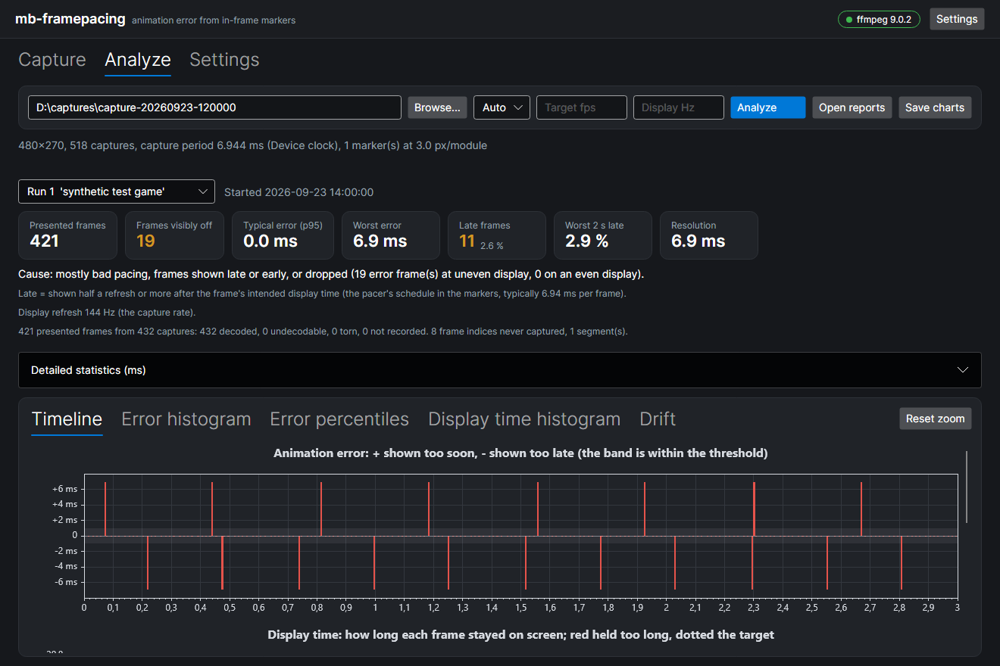

## How it works

There are two halves, and both are needed:

- **Inside your application:** a marker library: C++20 ([`marker/cpp/`](marker/cpp)), C# ([`marker/csharp/`](marker/csharp)) or
  the [Unity package](doc/unity.md). Every frame, it turns "frame index + animation time + run id" into pixel aligned black and white
  triangles (or rectangles) that your renderer draws on top of the finished image. No dependencies, no allocations per frame, any
  graphics API.
- **On the recording side:** the `mb-framepacing` tools ([`measure/`](measure), command line and GUI). They record the display
  signal with their own clock, read the marker back from every recorded frame and compare the animation time the frame
  carries with the time it actually appeared in the capture.

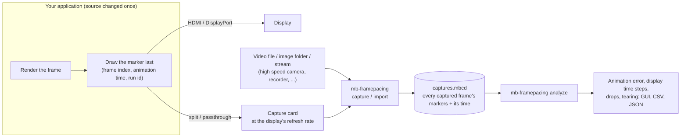
```mermaid
flowchart LR
    subgraph app["Your application (source changed once)"]
        A[Render the frame] --> B["Draw the marker last<br/>(frame index, animation time, run id)"]
    end
    B -->|HDMI / DisplayPort| C[Display]
    B -->|split / passthrough| D["Capture card<br/>at the display's refresh rate"]
    V["Video file / image folder / stream<br/>(high speed camera, recorder, ...)"] --> E
    D --> E["mb-framepacing<br/>capture / import"]
    E --> F[("captures.mbcd<br/>every captured frame's markers + its time")]
    F --> G["mb-framepacing analyze"]
    G --> H["Animation error, display time steps,<br/>drops, tearing: GUI, CSV, JSON"]
```

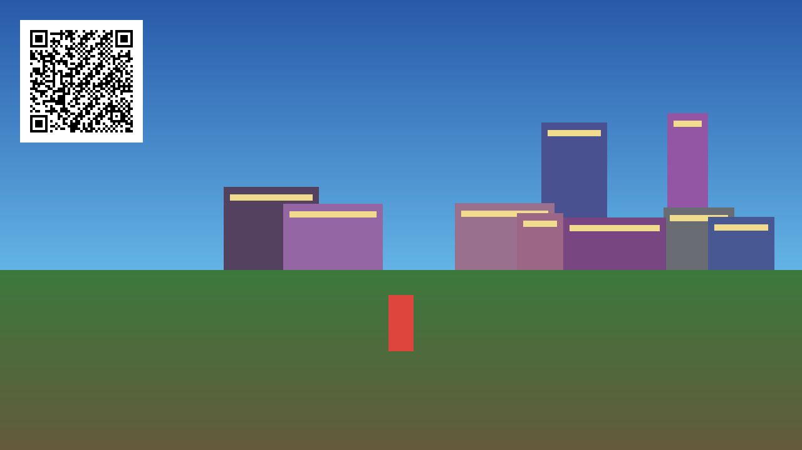

## The process

### 1. Once: build the marker into your application

Link the library and draw the marker as the very last thing in every frame, after post effects and UI, in pure black and white.
It writes pixel aligned triangles straight into your vertex buffer, without allocating:

```cpp
#include <mb/framemarker/FrameMarker.hpp>
namespace FM = MB::FrameMarker;

std::array<FM::Vertex, FM::MaxTriangleVertexCount()> vertices;   // once
FM::ModuleMatrix matrix;
FM::GenerateModules({frameIndex, animationTicks, runId, FM::MarkerKind::Frame}, matrix);   // encode once
const std::size_t count = FM::ModulesToTriangles(matrix, options, origin, vertices);        // draw it
DrawTriangles(vertices.data(), count);   // your renderer: (X, Y) in pixels, color (Luma, Luma, Luma)
```

`frameIndex` counts rendered frames, `animationTicks` is the time the frame was animated for (100 ns ticks).

- **C++:** see **[Integrating the marker](doc/integrating.md)** for adding the library with CMake (a release archive, git,
  `add_subdirectory` or `find_package`), choosing the size and position, and the start and end markers.
- **C#:** the general library [`marker/csharp`](marker/csharp/README.md) has the same API (`MarkerGenerator.TryGenerateModules`, `Marker.ModulesToTriangles`).
- **Unity:** the **[Unity package](doc/unity.md)** adds an overlay component that does all of this for you.
- **Python:** [`marker/python`](marker/python/README.md) (`mb_framemarker`), which also draws into pixel buffers.

[`marker/README.md`](marker/README.md) compares the four libraries; each has its own README with a quick start and its API.

### 2. Every test: record, run, analyse

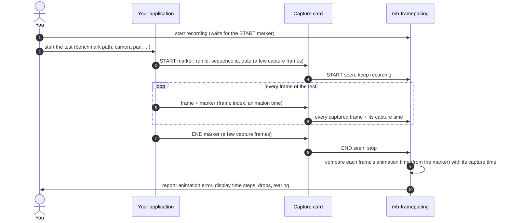
```mermaid
sequenceDiagram
    autonumber
    actor You
    participant App as Your application
    participant Card as Capture card
    participant Tool as mb-framepacing
    You->>Tool: start recording (waits for the START marker)
    You->>App: start the test (benchmark path, camera pan, ...)
    App->>Card: START marker: run id, sequence id, date (a few capture frames)
    Card->>Tool: START seen, keep recording
    loop every frame of the test
        App->>Card: frame + marker (frame index, animation time)
        Card->>Tool: every captured frame + its capture time
    end
    App->>Card: END marker (a few capture frames)
    Card->>Tool: END seen, stop
    Tool->>Tool: compare each frame's animation time (from the marker) with its capture time
    Tool->>You: report: animation error, display time steps, drops, tearing
```

1. Connect the application's display output through a capture card (it passes the signal on to your monitor). The recording
   can run on the same PC or a second one.
2. Start the recording: **Start capture** in the GUI, or `mb-framepacing capture --wait-for-start --stop-at-end --analyze`.
3. Run the test in your application. It shows the **start** marker, then the normal frame markers, then the **end** marker.
4. The recording stops by itself at the end marker and the analysis opens. Record with other equipment instead (a lossless video,
   a high speed camera's image sequence)? Use `mb-framepacing import` or the GUI's video/image/stream sources. Filming the screen
   with a calibrated high speed camera is **very experimental**: see [doc/camera.md](doc/camera.md).

The start and end markers bracket exactly the part you want measured. The start marker also carries a sequence id (a UUID, or a
short text tag) and the wall clock time, so every report knows what it measured:

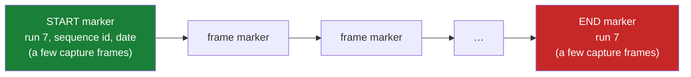
```mermaid
flowchart LR
    S["START marker<br/>run 7, sequence id, date<br/>(a few capture frames)"] --> F1[frame marker] --> F2[frame marker] --> F3[" … "] --> E["END marker<br/>run 7<br/>(a few capture frames)"]
    style S fill:#1a7f37,color:#fff
    style E fill:#c62828,color:#fff
```

| Start (with sequence id and time)            | Frame                                        | End                                      |
| -------------------------------------------- | -------------------------------------------- | ---------------------------------------- |
|  |  |  |

For tearing checks, also draw the small **sync marker** at the bottom left. It carries the frame index; when it disagrees with the
main marker, the capture shows parts of two frames. A camera filming the screen (very experimental) needs it for its timing:

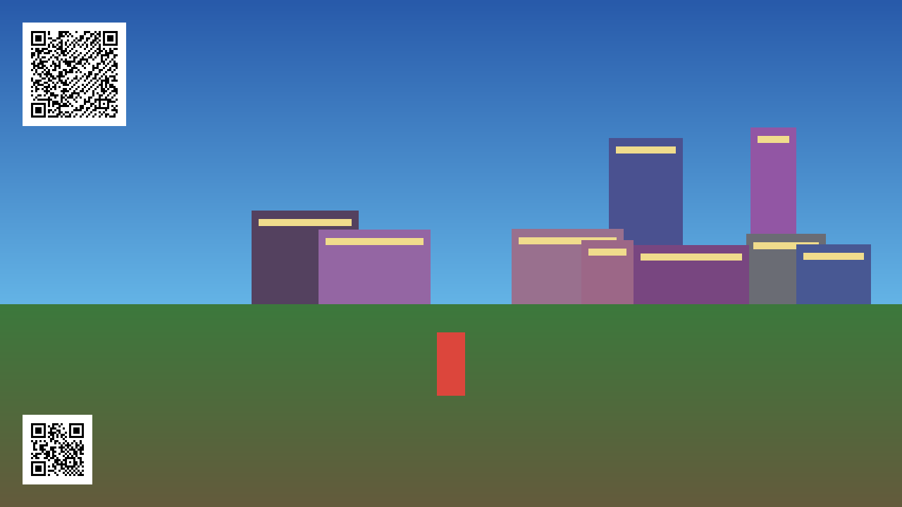

The exact format, sizing rules and placement are in [`doc/marker-format.md`](doc/marker-format.md).

## Getting started

| Step                               | Guide                                                                                                                      |
| ---------------------------------- | -------------------------------------------------------------------------------------------------------------------------- |
| 1. Install and build, per platform | **[Windows](doc/install/windows.md)** · **[Ubuntu](doc/install/ubuntu.md)** · **[macOS (Homebrew)](doc/install/macos.md)** |
| 2. Put the marker into your app    | **[Integrating the marker](doc/integrating.md)** (C++ library, size, position, start/end markers)                          |
| 3. Take a measurement and read it  | **[Using mb-framepacing](doc/usage.md)** (test game, capture card, video/image import, results, troubleshooting)           |

The platform guides cover ffmpeg, building the tools and putting them on your PATH, capture card devices and permissions, and
building the C++ library. The short version is below. What is planned next (HDR capture among it) is on the [roadmap](doc/roadmap.md).

### The GUI

Run `mb-framepacing-gui`. The first time, a short setup dialog helps you get ffmpeg and choose where captures go.

| Capture                                                          | Setup                                                   |
| ---------------------------------------------------------------- | ------------------------------------------------------- |
| 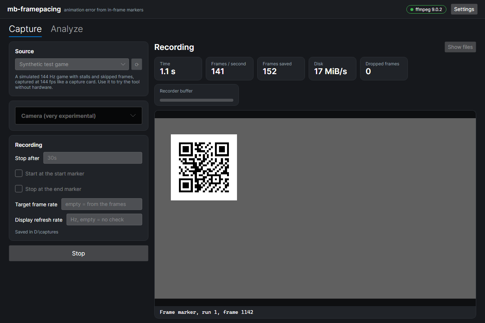 |  |

- **Capture:** pick a capture card, a video file, an image folder or a stream, and press **Start capture**. Pick _Synthetic test
  game_ to try everything without any hardware.
- **Analyze:** opens by itself after a capture, with the headline numbers, detailed statistics and charts. **Open reports** shows
  the CSV and JSON files for your own tooling.
- `mb-framepacing-gui --demo` captures and analyses the synthetic test game straight away.

### Reading the results

The examples below are the synthetic test game (a 144 Hz game with injected stalls and skipped frames), captured at 144 fps
like a capture card.

A capture card captures at the display's refresh rate, so every capture is one refresh. The analysis relies on that: the refresh
period is the capture period, and display time steps are whole refreshes, measured exactly. The animation error (the marker's animation
time step against the display time step) is then exact too, to the 100 ns tick. A camera filming the screen (**very experimental**) films faster than the display; there the refresh rate is calculated
from the frames, and compared with the display rate you expect when you give one (`--display-hz`, **Display refresh rate**).

**Late frames** are shown later than the application meant. When its frame pacer writes the **intended display time** into the
marker, a frame is late when it appears half a refresh or more after that time, which also catches frames that stay late after a
hitch; the animation error then splits into **pacing error** (shown off the plan) and **prediction error** (animated for another
moment than planned). With only a **target frame time** in the marker, or a target frame rate given to the tools (`--target-fps`,
**Target frame rate** in the GUI, for example 30 for a game locked to 30 fps on a 60 Hz display), a frame is late when it appears a
refresh or more after its target. Without any of them the target is the display's native refresh rate. Under the headline numbers, **Cause** tells which
of the two causes of animation error dominates: frames with an error where the display time step jumps are **bad pacing** (late,
early or dropped frames); frames with an error while the display time step stays even are **delta time jitter** (uneven animation
steps).

The GUI draws the report's cards itself, as wide as the window. The **Timeline** tab shows the report's panels on one time axis: the
mouse wheel zooms around the pointer, a sideways wheel or swipe (or Shift with the wheel), dragging and the scrollbar scroll left and
right, and **Reset zoom** (or a double-click) shows the whole run again; the scales stay the whole run's, so the axes do not jump while
you look around. Hovering shows the frame under the pointer (its display time step, animation error, lateness, frametime and CPU
busy). The distribution tabs follow the section the Timeline shows, and **Save view...** saves the card on screen, as it is zoomed, as
SVG or PNG. Every zoom draws in a few milliseconds whatever the capture's length, ten hours included: each pixel column's numbers
come from data prepared once per run. Zoomed in, the Timeline is a sliding window, drawn a screen wider on either side, so scrolling
only moves it; the next window is drawn in the background before you reach its edge.

The same panels as a report (below) of a test clip, a busy stretch at the full rate:

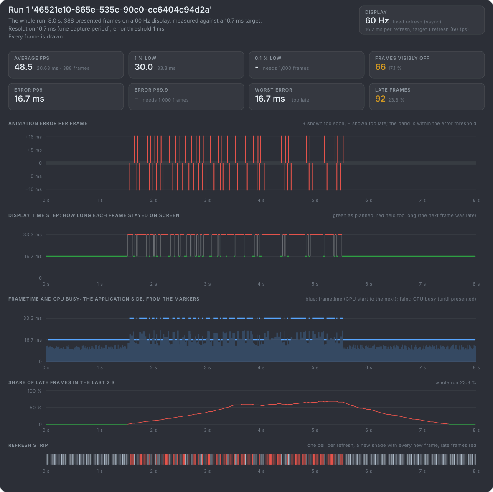

- **Animation error:** a bar per frame, up when it was shown too soon, down when shown too late; a frame without error draws
  nothing. Everything inside the shaded band counts as no error.
- **Display time step:** how long each frame stayed on screen, as a step until the next frame, on a grid of whole refreshes. It is red
  when the frame was held too long because the next one was late. An error bar over a red step is
  bad pacing; an error bar while the steps stay flat is delta time jitter.
- **Frametime and CPU busy** (when the markers carry the CPU start time and CPU busy): the application side on the same grid, each
  frame's frametime (its CPU start to the next frame's) as a blue step and its CPU busy (until it was presented) as a faint bar.
- **Share of late frames in the last 2 s:** the frames of the 2 s before each frame that were on screen longer than one refresh of the
  display. Amber where they all stayed as long as the pacer intended (its target in the markers is longer than a refresh); red where
  one was late, later than its target (without pacing information in the markers, one refresh); green where every frame took one
  refresh.
- **Refresh strip:** one cell per refresh, shaded by the frame on screen, late frames in red; grey where a capture card's captures
  could not be decoded, and a mark above frames with skipped frame indices before them (or a tear). Zoom in to see hold patterns
  such as 3-then-1.

The start of its busy stretch as a frame timeline (`render --timeline`): each frame's CPU work from its CPU start time for its CPU
busy, when it was presented, and what every refresh showed:

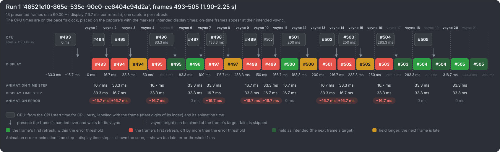

When a few frames are far off everything else (a hitch of hundreds of milliseconds among errors of a few), the error and display
time step scales cover the rest, and each frame beyond the scale gets a mark at the edge with its value; zoom out to see it whole.

The other tabs show how the values are distributed (`render` writes them as `run-<id>-<card>.svg` too). The count axes are
logarithmic, so a handful of bad frames stays visible next to hundreds of good ones. The examples are test clips: a naive 5 ms timer's
errors, and the display time steps of a game adapting its rate.

| Animation error distribution                                       | Display time step distribution                                                   |
| ------------------------------------------------------------------ | -------------------------------------------------------------------------------- |
| 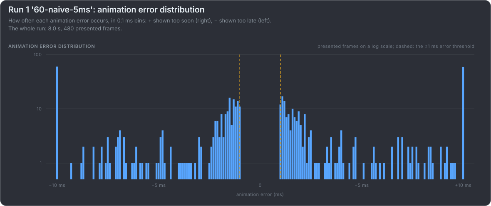 | 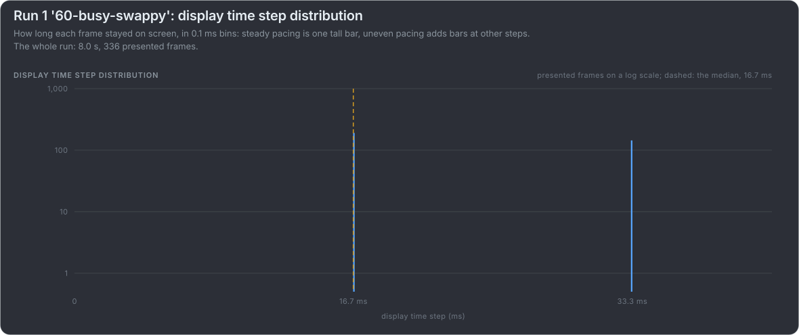 |

- **Animation error distribution:** how often each error occurred, in 0.1 ms bars for every capture source. Everything between the
  dashed lines (the error threshold, ±1 ms unless `--error-threshold-ms` changes it) counts as no error. Bars further out are real
  errors: positive = shown too soon (moved too far), negative = shown too late (moved too little).
- **Display time step distribution:** how long frames stayed on screen (PresentMon's `MsBetweenDisplayChange`; overlays often call
  this "frame time"). Even pacing is one tall bar. Separate bars further right (often at
  multiples of the refresh period) are frames that stayed on screen too long.
- **Animation error by percentile:** every frame's absolute error, sorted. The flat part is the typical frame; the rise on the
  right shows how bad the worst 5 % and 1 % are, and makes two runs easy to compare.

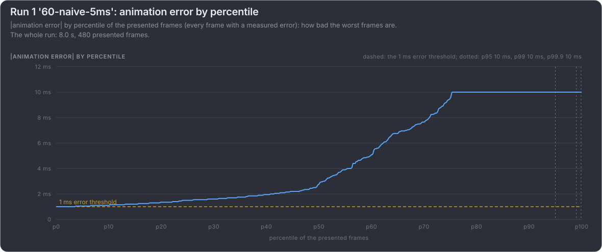

The charts can also be written as SVG cards next to the reports (`run-<id>-report.svg`, `-error-histogram.svg`,
`-error-percentiles.svg`, `-display-time-step-histogram.svg`, `-drift.svg`): `--charts` on the command line, **Save charts** in the
GUI (`render --png` makes PNGs of them). The
histograms and the pacing numbers are also in `summary.json` (`runs[].histograms`, `runs[].pacing`; the error per frame and
percent error in `runs[].statistics`), and late frames carry `Late`
in the `flags` column of `run-<id>-frames.csv`, so you can plot or compare them with your own tools: the files are specified in
[doc/analysis-output-format.md](doc/analysis-output-format.md), and the [data libraries](data/README.md) read them.

**The report** is the run as one SVG card, in the style of
[mb-framepacing-explained](https://github.com/Unarmed1000/mb-framepacing-explained)'s charts: the headline numbers, the animation
error, the display time step, the late share and the refresh strip. `--charts` and **Save charts** write it for the whole run
(`run-<id>-report.svg`); `mb-framepacing render` draws it from an analysis (no capture needed) for the whole run or any section
(`--from`/`--to`, in seconds on the Timeline's axis), the worst moments (`--details`), and as PNG too (`--png`, through Edge or
Chrome). A section of a few seconds shows every frame and refresh; a long run shows each pixel column's frames, the whole range faint
and the middle 90 % solid.

Every item of the card can be left out (`--hide late-share,refresh-strip`) or kept alone (`--only animation-error`); `--help`
lists the ids. Next to the report, `render` draws the distributions as cards in the same style (`run-<id>-<card>.svg`): the
animation error and display time step histograms (0.1 ms bins, counts on a log scale), the |animation error| by percentile and the
cumulative drift; `--cards` picks them (`--cards none` for the report only).

The test clips (`test-data/videos`, made by mb-framepacing-explained) as reports. The busy stretch at the full rate is the example
above: the frames that miss a refresh are late, and each is off by a whole refresh. Its companion adapts its rate like Android's
Swappy: late frames at first, then 30 fps (two refreshes per frame, as its markers' target frame time says) for a while, then 60
again:

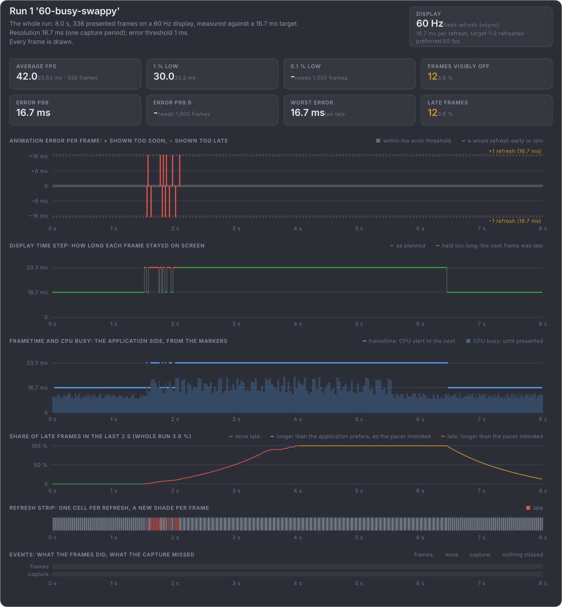

A naive delta time timer: every frame is shown on time, but the timer is off by up to 5 ms either way, so the animation steps
are off by up to 10 ms and nearly every frame is off (delta time jitter, not bad pacing):

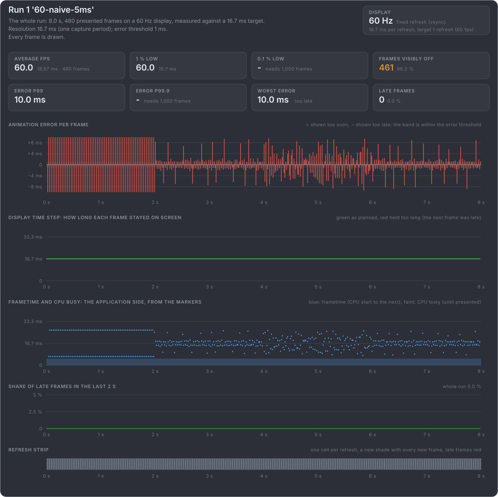

### The command line

```sh
mb-framepacing selftest                                   # check this machine, no hardware needed
mb-framepacing config --init --set-ffmpeg /path/to/ffmpeg # once, if ffmpeg is not found automatically
mb-framepacing devices --modes                            # list capture cards and their modes
mb-framepacing marker-size --source 3840x2160 --stored 960x540  # the module size the application should draw
mb-framepacing capture -d "Cam Link 4K" --mode 1920x1080@240 --scale 960x540 --wait-for-start --stop-at-end --analyze
mb-framepacing capture -d "Cam Link 4K" --mode 1920x1080@240 --roi auto --wait-for-start --stop-at-end  # fast capture
mb-framepacing locate -d "Cam Link 4K" --mode 1920x1080@240  # where the marker is, and the region a fast capture stores
mb-framepacing import recording.mkv --analyze             # a video file (its own timestamps are used)
mb-framepacing import frames/ --fps 1000 --analyze        # a folder of images at a known frame rate
mb-framepacing import frames/ --timestamps times.csv      # ... or with exact times per image (fileName,timeMs)
mb-framepacing import rtsp://camera/stream -t 30s         # a live network stream
mb-framepacing analyze <capture folder>                   # (re)analyse
mb-framepacing analyze <capture folder> --target-fps 30   # ... measuring late frames against a 30 fps target
mb-framepacing render <capture folder> --from 120 --to 125 --png  # the report of 5 s of the run, as SVG and PNG
# VERY EXPERIMENTAL: a high speed camera filming the screen (doc/camera.md)
mb-framepacing camera-rig calibrate clip.mp4 --recorded-fps 960 --name desk  # calibrate the mounted camera once, save it
mb-framepacing import run.mp4 --recorded-fps 960 --camera desk --display-hz 60 --analyze  # later: checks the camera and the display rate
mb-framepacing selftest --camera --fps 1000 --refresh 60  # the camera pipeline on a simulated camera
```

`mb-framepacing <command> --help` lists every option. Results go to `<capture folder>/analysis/`: `summary.json`,
`captures.csv` (one row per captured frame), `run-<id>-frames.csv` (one row per presented application frame) and, with `--charts`,
the charts as `run-<id>-*.png` and the report as `run-<id>-report.svg`.

### What you need

| For              | You need                                                                                                                                                                    |
| ---------------- | --------------------------------------------------------------------------------------------------------------------------------------------------------------------------- |
| Recording        | ffmpeg 5.1+ (installed separately), and a capture card, a video file, image frames or a stream                                                                              |
| Live capture     | An HDMI/DP capture card that passes the signal through and captures at the display's refresh rate (1080p 240 Hz cards are common)                                           |
| Disk             | Little: the capture data is 192 bytes per captured frame (about 170 MB for an hour at 240 Hz). Stored frames (`--keep-frames`) need a fast SSD: 0.5 MB per frame at 960×540 |
| Your application | Its source code, built with the C++20 or C# marker library, or the Unity package                                                                                            |

### How fast can it record?

There is no built-in frame rate limit: mb-framepacing records whatever the source delivers.

- **Capture cards:** the card's own modes decide (`mb-framepacing devices --modes`). 1080p at 240 fps is common, some cards go
  higher at lower resolutions. The live path is then limited by the card's USB/PCIe link, ffmpeg's decoding and scaling, and
  decoding the markers of every frame as it arrives (a locked marker decodes in well under a millisecond). Only the decoded
  markers and timestamps are stored (the capture data, [doc/capture-data-format.md](doc/capture-data-format.md)); with
  `--keep-frames` the frames are stored too, width × height bytes (grey) each, so 960×540 at 500 fps is about 250 MiB/s. When
  decoding or the disk falls behind, frames are counted as dropped, never silently lost.
- **Video files and image folders:** any rate. They are read as fast as the disk allows and nothing is dropped; the times come
  from the file (or from `--fps` / a timestamp file), so a 1000 fps or faster high speed camera recording works. Footage of a
  camera filming the screen needs a calibrated camera rig (`--camera`, **very experimental**, see [doc/camera.md](doc/camera.md)).
- **Precision:** a capture card captures at the display's refresh rate, so display time steps are whole refreshes and exact; a camera
  filming the screen is good to about one camera period (1 ms at 1000 fps), which shows as noise in its errors.

**Fast capture** (`--roi auto`, or **Locate marker** in the GUI) has ffmpeg deliver only the marker instead of whole frames. It
first reads the source for a moment to find the marker, then has ffmpeg crop to that region and downscale it to 3 stored pixels per
module: about 27 KB per captured frame instead of 2 MB from a 1080p source, which lowers what ffmpeg passes on (and stores, with
`--keep-frames`). The marker must stay at a fixed position, and only the top marker is kept, so tearing is not checked. `locate`
prints the region as `--roi … --scale …`, to reuse it without searching again.

`mb-framepacing selftest --fps <rate>` checks what this machine sustains (add `--keep-frames` to include storing the frames). On
the development PC, 1000 fps ran with the recorder's ring nearly empty; with stored frames (NVMe SSD), 960×540 at 2000 fps (about
980 MiB/s) ran with no drops and every frame matched.

## Configuration

`mb-framepacing.json` stores where ffmpeg is and where captures go; the GUI and the command line share it. Create it with
`mb-framepacing config --init` or the GUI's setup dialog.

Saved settings are safe and versioned:

- **Safe saves:** the configuration file, the GUI's remembered settings and saved cameras are written to a temporary file,
  flushed to the disk and then renamed over the old file. A crash or power cut leaves the old or the new version, never a
  broken file.
- **Backups:** the `backup` folder next to the file keeps `<file>.bak`, the version the last save replaced (hand edits included)
  or the deleted file, and `<file>.v<N>.bak`, the last file in format version N whenever a save changes the format. To undo a
  change, copy a backup back. Errors about a file that can not be read name its backup, and the GUI falls back to the backup of
  its settings by itself.
- **Format version:** every settings file has a `formatVersion`. A file written by a newer version of the tools is refused with
  a request to update, instead of being misread or overwritten.

| Location                                                                                                                            | Used when          |
| ----------------------------------------------------------------------------------------------------------------------------------- | ------------------ |
| `--config <file>`                                                                                                                   | always, when given |
| next to the executable                                                                                                              | portable installs  |
| `%APPDATA%\mb-framepacing\` (Windows), `~/Library/Application Support/mb-framepacing/` (macOS), `~/.config/mb-framepacing/` (Linux) | otherwise          |

ffmpeg is looked up in this order: `--ffmpeg`, the `MB_FFMPEG` environment variable, `ffmpegPath` in the configuration, PATH,
then the usual install folders (winget, Chocolatey, Scoop, Homebrew, apt, snap). It is never bundled: the tools run your own
`ffmpeg`.

## Building from source

Step-by-step instructions per platform, including putting the tools on your PATH, are in the [platform guides](#getting-started).
This is the developer summary. Requirements: the .NET 10 SDK, CMake 4.0+ with a C++20 compiler (MSVC 19.4x / Visual Studio 2026, GCC 12+, Clang 16+ or
AppleClang 15+), Python 3, and Node.js for formatting the docs.

```sh
# .NET: libraries, command line tool, GUI and tests
mb-quality -r --all .
dotnet test mb-framepacing.slnx

# C++ marker library (presets: windows, linux, linux-clang, macos); the tests fetch GoogleTest
cd marker/cpp && cmake --preset windows && cmake --build --preset windows && ctest --preset windows
python marker/cpp/tests/consumer/check_consumers.py   # the documented CMake integrations

# Unity package: assemble and validate; check it in a real Unity editor (batch mode, needs a Unity license)
python marker/unity/build_upm.py --output dist/upm --check
python marker/unity/check_in_unity.py

# Self-contained single-file executables for this machine (or --rid linux-x64, osx-arm64, ...)
python measure/build_standalone.py

# Python scripts: lint, format and type check (ruff, basedpyright; pinned in requirements-dev.txt)
python -m venv .venv && .venv/Scripts/python -m pip install -r requirements-dev.txt   # once (Linux/macOS: .venv/bin/python)
.venv/Scripts/activate                                                                  # Linux/macOS: source .venv/bin/activate
ruff check . && ruff format --check . && basedpyright

# Docs: formatting (Prettier) and the images in doc/images (rendered offscreen)
npm install && npm run format
dotnet run --project measure/tools/DocImages
```

The marker libraries are versioned in [`marker/VERSION`](marker/VERSION) and the tools in [`measure/VERSION`](measure/VERSION);
[Releasing](doc/releasing.md) describes both release streams. The pieces fit together like this:

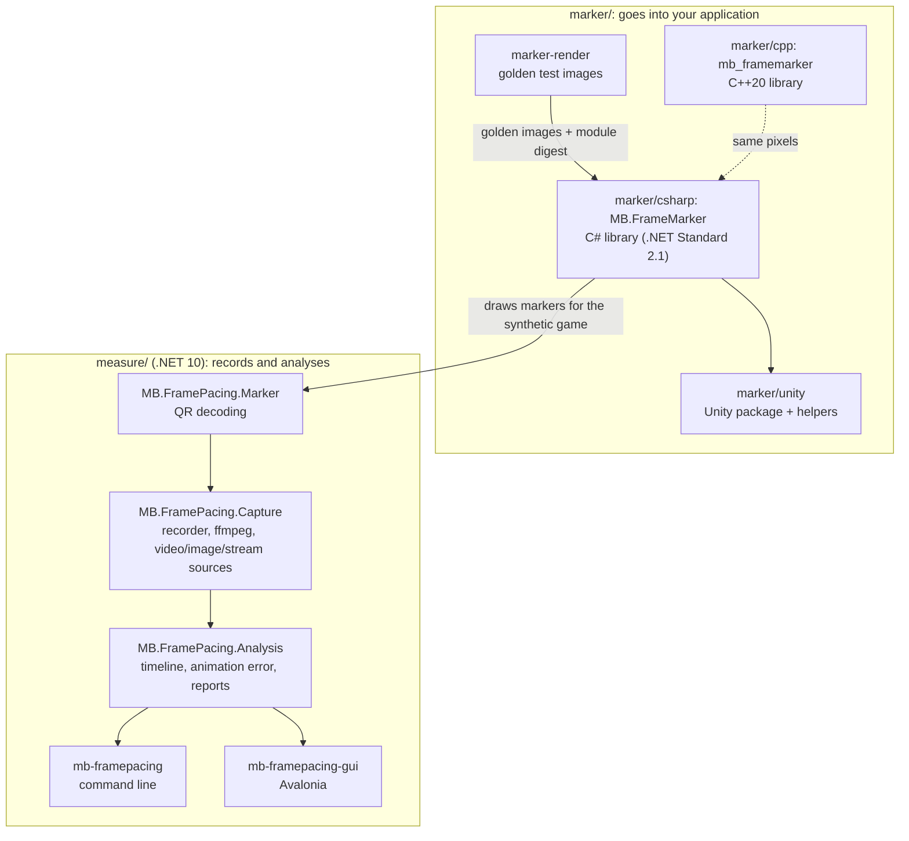
```mermaid
flowchart TB
    subgraph marker["marker/: goes into your application"]
        L["marker/cpp: mb_framemarker<br/>C++20 library"]
        R["marker-render<br/>golden test images"]
        CS["marker/csharp: MB.FrameMarker<br/>C# library (.NET Standard 2.1)"]
        U["marker/unity<br/>Unity package + helpers"]
    end
    subgraph dotnet["measure/ (.NET 10): records and analyses"]
        M["MB.FramePacing.Marker<br/>QR decoding"]
        CAP["MB.FramePacing.Capture<br/>recorder, ffmpeg, video/image/stream sources"]
        AN["MB.FramePacing.Analysis<br/>timeline, animation error, reports"]
        CLI["mb-framepacing<br/>command line"]
        GUI["mb-framepacing-gui<br/>Avalonia"]
    end
    R -- "golden images + module digest" --> CS
    L -.->|same pixels| CS
    CS --> U
    CS -- "draws markers for the synthetic game" --> M
    M --> CAP --> AN --> CLI
    AN --> GUI
```

| Path                      | Contents                                                                                          |
| ------------------------- | ------------------------------------------------------------------------------------------------- |
| `marker/`                 | **Goes into your application**: the marker libraries and their version                            |
| `marker/cpp/`             | The C++20 marker library, `marker-render` (golden images), GoogleTest tests, CMake consumer check |
| `marker/csharp/`          | The general C# marker library `MB.FrameMarker` (.NET Standard 2.1, C# 9) and its NUnit tests      |
| `marker/unity/`           | The Unity package's helpers, samples and build scripts (`build_upm.py`, `check_in_unity.py`)      |
| `marker/python/`          | The Python marker library `mb_framemarker` (standard library only) and its unittest tests         |
| `data/`                   | **Reads the results**: the data libraries (C#) for the capture data and the analysis output       |
| `measure/`                | **Measures it**: the recording and analysis tools and their version                               |
| `measure/libs/`           | Marker, Capture and Analysis libraries with their NUnit tests                                     |
| `measure/app/`            | `mb-framepacing` (command line) and `mb-framepacing-gui` (Avalonia)                               |
| `measure/tools/DocImages` | Renders `doc/images` (GUI screenshots offscreen, marker examples)                                 |
| `doc/`                    | Platform, usage, integration, Unity and release guides, marker specification, images              |
| `test-data/markers/`      | Golden marker images and module digest written by the C++ library, checked by the C# libraries    |
| `licenses/`               | Licenses of every third-party component                                                           |

## License

Two licenses, by path (see [`LICENSE`](LICENSE)): the frame marker libraries that applications embed (`marker/`), the
marker format specification, the integration guide and the golden marker images are BSD 3-Clause, and so are the data
libraries (`data/`), the formats they read and their golden data. Everything else,
including the measurement tools, is PolyForm Perimeter 1.0.1: free to use, change and share for any purpose, including
inside companies, but not to provide others a product that competes with it. Every source file names its license on an
`SPDX-License-Identifier` line (`BSD-3-Clause`, or `LicenseRef-PolyForm-Perimeter-1.0.1`). Third-party components and their
licenses are listed in [`licenses/README.md`](licenses/README.md).

## Disclaimer

This is a highly experimental project, developed with AI assistance. Expect rough edges and breaking changes, and verify the
results before you rely on them.
