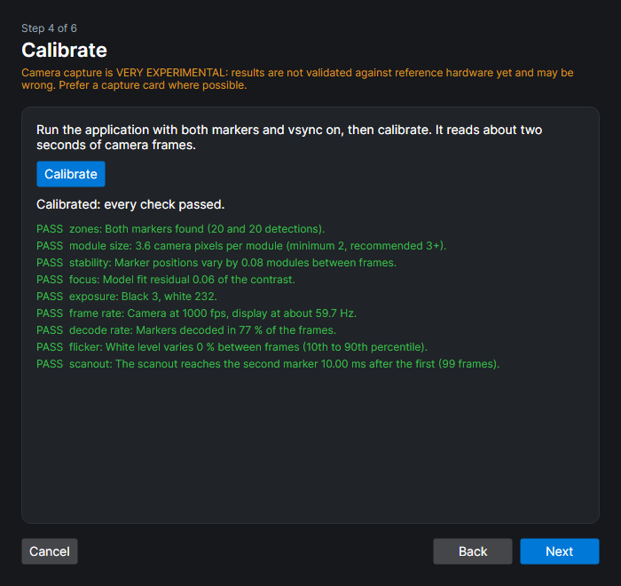
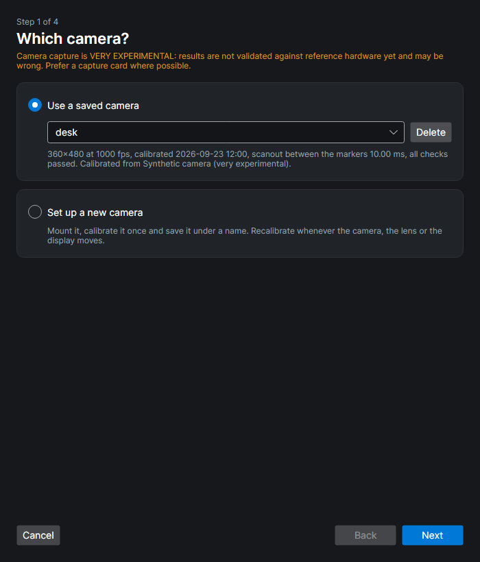
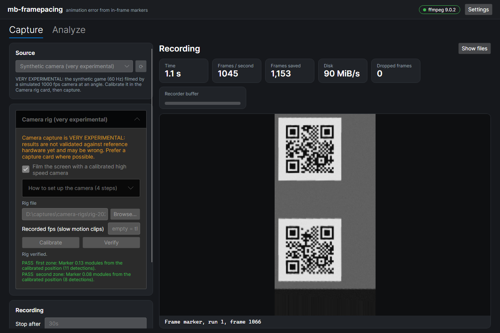

# High speed camera capture (very experimental)

> [!WARNING]
> **Camera capture is VERY EXPERIMENTAL.** It has only been checked against a simulated camera and simulated display. It has
> not been validated against real cameras, real displays or reference measurement hardware, and its numbers may be wrong. The
> rig file format, the commands and the report columns may change without notice. **Prefer a capture card wherever you can.**

A capture card records the signal that leaves the GPU. A high speed camera filming the screen records what the panel actually
shows. That includes variable refresh (G-Sync/FreeSync), the compositor, the scanout rolling down the screen and the panel's
response. This page describes the experimental camera path: how to set up a camera, calibrate it, and read the results.

## Status

What is implemented, how it was checked, known issues and the next steps are in
[Camera capture: status and next steps](camera-status.md).

## What you need

- **A camera mounted at a fixed position and distance**: a tripod or an arm, roughly square to the screen. It must not move
  after calibration. Every capture checks this and refuses to run if the markers moved.
- **At least 2× the display's refresh rate**, ideally 500–1000 fps. The results are exact to about ±1–2 camera frame periods
  (±1–2 ms at 1000 fps).
- **At least 3 camera pixels per marker module** (2 is the hard minimum). The camera does not need to see the whole screen, only
  the left edge with both markers. Zoom in, or draw a larger marker (`ModuleSizePx`).
- **Fixed focus and exposure.** Turn off every auto mode. A short exposure (half the frame period or less) reduces blending
  between frames.
- **Full brightness, no strobing.** PWM dimming and strobing/backlight modes (ULMB, "motion blur reduction") make the white level
  flicker between camera frames. Calibration reports this as a warning.
- **Two marker zones.** The application draws the **same** marker in the **TopLeft** and **BottomLeft** slots
  (`Marker::RecommendedOrigin`). In Unity, turn on **Tearing markers** (it also draws MiddleLeft, which is fine: calibration uses
  the outermost two). The two zones give the scanout delay and camera tear detection.
- **Vsync on** while you calibrate, so the refresh rate and the scanout delay can be measured.

Live cameras need a UVC (DirectShow, v4l2 or AVFoundation) mode ffmpeg can open. High frame rate UVC modes are usually MJPEG at low
resolution (`--input-format mjpeg`), and top out around 240–330 fps. Cameras that record internally (phones in slow motion,
Chronos, Phantom, Sony RX, ...) are imported as clips afterwards.

## Setting up

A mounted camera is calibrated **once** and saved under a name in the **camera library**. After that you pick it by name, and
every capture only checks, in about a second, that the camera has not moved. Recalibrate when the camera, the lens, the zoom or
the display moves.

The library is the `camera-rigs` folder next to the configuration file (see `mb-framepacing config`). The command line and the
GUI share it.

### In the GUI: the camera wizard

On the Capture page, open **Camera (very experimental)** and press **Set up camera...**:

1. **Which camera?** Pick a saved camera, which skips calibration, or set up a new one.
2. **Mount** (new camera): a checklist of the requirements above.
3. **Source**: the live camera (with its mode), a clip filmed with it (with its recorded fps), or the **Synthetic camera** to
   try everything without hardware.
4. **Calibrate** (new camera): the checks below. Fix every warning and calibrate again. A saved camera gets a quick **Check now**
   instead, which is optional because every capture checks anyway.
5. **Save** (new camera): give it a name.

When the wizard finishes, the capture page films with that camera. **Start capture** verifies it, then stores only the two
straightened marker zones. The camera card also lets you switch between saved cameras and verify one.





### On the command line

1. **Mount** the camera and point it at the left edge of the screen so both markers are sharp and at least 3 camera pixels per
   module. Fix focus and exposure.
2. **Run the application** with both markers (TopLeft + BottomLeft) and vsync on.
3. **Calibrate once** from a live camera or a short clip filmed with it, and save it by name. Fix every warning and calibrate again:

   ```sh
   mb-framepacing camera-rig calibrate -d "<camera>" --mode 640x360@330 --input-format mjpeg --name desk
   mb-framepacing camera-rig calibrate clip.mp4 --recorded-fps 960 --name desk   # a slow motion clip
   ```

4. **Capture** with the saved camera. Every capture verifies it first, then stores only the two straightened marker zones:

   ```sh
   mb-framepacing capture -d "<camera>" --mode 640x360@330 --input-format mjpeg --camera desk --wait-for-start --stop-at-end --analyze
   mb-framepacing import run.mp4 --recorded-fps 960 --camera desk --analyze
   ```

`camera-rig list` shows the saved cameras. `camera-rig delete <name>` removes one. `camera-rig verify --rig desk (-d "<camera>" |
clip.mp4)` only runs the check. `--camera` and `--rig` also take a rig file path, and `calibrate --output <file>` writes one, for
example to share a rig between machines.

**Slow motion clips** are often stored at a playback rate such as 30 fps. `--recorded-fps` gives the rate they were really
filmed at: frame _n_ is then timed at _n_ / rate and the file's timestamps are ignored. Calibration and verification warn when a
clip claims less than 120 fps.



## Calibration checks

| Check       | Pass                                               | What to do otherwise                                                  |
| ----------- | -------------------------------------------------- | --------------------------------------------------------------------- |
| zones       | Both markers found                                 | Draw TopLeft and BottomLeft; the camera must see both, sharp          |
| module size | ≥ 3 camera px per module (fail below 2)            | Move closer, zoom in or draw a larger marker                          |
| stability   | Detections within 0.5 modules of each other        | Use a rigid mount; nothing may vibrate                                |
| focus       | The marker model fits the image (residual < 0.18)  | Focus on the screen; avoid moiré (tiny defocus helps)                 |
| exposure    | Black and white at least 60 apart, white below 245 | Adjust exposure, aperture, gain or screen brightness                  |
| frame rate  | ≥ 120 fps and ≥ 2× the refresh rate                | Film faster; pass `--recorded-fps` for slow motion clips              |
| decode rate | Both markers decode in ≥ 50% of the frames         | Focus, exposure, shorter exposure time                                |
| flicker     | White level varies less than 15%                   | Full brightness, turn off PWM dimming and strobing                    |
| scanout     | The second zone switches measurably later          | A strobed/global refresh display switches both at once: no tear check |

## Reading the results

A camera capture has one timing zone: the zone the scanout reaches first, normally the top one. "First seen" is the first camera
frame in which that zone shows the new frame completely. That is a roughly constant time after the scanout started: the scanout
has to pass the marker and the panel has to switch. Frame-to-frame times (display time, animation error) are therefore not
affected by it, but absolute times are later than vsync.

The analysis adds, per run (`summary.json` → `runs[].camera`) and per frame (`run-*-frames.csv`):

- **Scanout delay** (`scanoutDelay`, `scanoutDelayMs`): how much later the second zone shows each frame than the timing zone.
  It is roughly constant; its median is the time the scanout takes between the two markers.
- **Camera tears** (`tornFrames`, flag `Torn`): a frame that reached the second zone clearly before the timing zone was
  presented while the scanout was between the zones (vsync off).
- **Second zone only** (`secondZoneOnlyFrames`): frames only the second zone ever showed. They were presented below the timing
  zone and replaced before the next scanout reached it, so they appear as skipped frame indices in the timeline.
- `captures.csv` gets `secondZoneFrameIndex`. Zones that disagree are normal for a camera and are **not** counted as torn
  captures.
- `UncertainStart` is only set when the gap before a frame is clearly longer than the usual scanout transition.

Every camera report carries the "VERY EXPERIMENTAL" warning.

## How it works

1. **Calibration.** A version 2 frame marker always has its three finder patterns and its alignment pattern at the same module
   positions, whatever the payload. ZXing's detector finds them even at an angle, and those four points define the perspective
   transform from module coordinates to camera pixels. The median over many frames is then refined by fitting the known module
   pattern to the image (Gauss-Newton on the four symbol corners plus black/white levels). That brings the detector's ~1 px
   error down to about 0.1–0.2 px. Each zone has its own transform, which also absorbs most lens distortion. The same frames
   give the scanout delay, the refresh rate, the decode rate and the flicker.
2. **Rectification.** ffmpeg crops each zone, undoes the perspective (`perspective=...:sense=source`) and scales it to 212×212
   pixels (53 modules at 4 px, room for the largest start marker). The zones are stacked in scanout order (`vstack`). A camera
   frame becomes a 212×424 grey image, about 90 KB, however large the camera frame was. Sources without ffmpeg use the same
   layout through a precomputed C# lookup table.
3. **Decoding.** Every stored marker sits at a known place with 4 px modules. The locked decoder samples each module centre and
   thresholds it against the finder patterns' own black and white. That is robust to the soft edges of camera footage.
4. **Analysis.** As for a capture card, plus the scanout delay and camera tears above.

## Limits and known issues

- **Nothing is validated against real hardware yet** (see Status).
- Only tears **between** the two zones can be detected, and only when the zones are at least 4 camera frames apart in the
  scanout.
- A **start marker in the BottomLeft slot** is larger than the frame marker and usually runs off the bottom of the screen. That
  zone then only shows frame markers. Verification therefore looks at a whole second of frames.
- If a display scans **bottom to top** (rotated), the BottomLeft zone becomes the timing zone, and its start markers are cut
  off. Keep the display in its normal orientation.
- The camera clock and the display clock drift apart by a few parts per million. That does not matter for frame-to-frame times.
- **Exposure and focus** cannot be set portably through ffmpeg: set them in the camera, its vendor tool, `v4l2-ctl`, or the
  DirectShow property dialog (`-show_video_device_dialog`).

## Performance

Measured with `dotnet run -c Release --project measure/tools/Benchmarks/Benchmarks.csproj -- --filter "*"` (BenchmarkDotNet, one
core unless noted):

| Operation                                            | Time    |
| ---------------------------------------------------- | ------- |
| Locked decode of one rectified camera zone           | ~17 µs  |
| C# rectification of both zones (no allocation)       | ~0.2 ms |
| Full marker search in a camera frame (calibration)   | ~2.3 ms |
| Refining one zone's transform                        | ~5.5 ms |
| Calibrating a rig from 500 camera frames (all cores) | ~45 ms  |

Per camera frame, capture needs about 35 µs of decoding (two zones) plus the rectification. That is far above 1000 fps on one core.
The analysis runs on all cores. In `selftest --camera` it analysed about 8,000 camera frames per second.

## Follow-ups

See [next steps](camera-status.md#next-steps).
