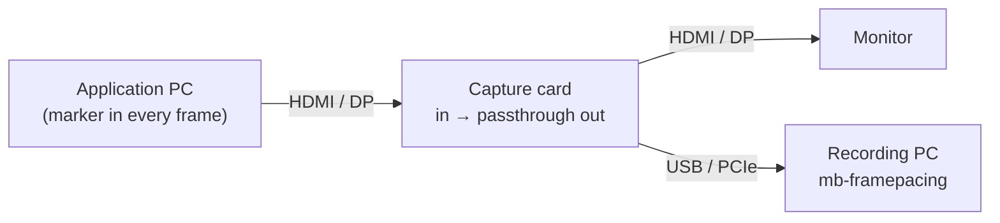

# Using mb-framepacing

This page walks through a first measurement, in the GUI and on the command line. It is the same on Windows, Ubuntu and macOS;
installing is covered by the platform guides: [Windows](install/windows.md) · [Ubuntu](install/ubuntu.md) ·
[macOS](install/macos.md).

Everything the GUI does can also be done on the command line (`mb-framepacing <command> --help` lists every option). Examples
below use `mb-framepacing` / `mb-framepacing-gui`; when running from source, use
`dotnet run --project measure/app/FramePacing -- <command>` and `dotnet run --project measure/app/FramePacing.Gui` instead.

## Before you start

- **ffmpeg** is installed and found. The GUI's setup dialog checks it; on the command line `mb-framepacing config` shows what is
  used.
- **Your application draws the marker** ([Integrating the marker](integrating.md)). mb-framepacing is a cooperative tool:
  without the marker there is nothing to measure. The synthetic test game below needs no application.
- **Vsync is on at a fixed refresh rate** in the application, and G-Sync/FreeSync is off. Every displayed frame is then whole.
  With vsync off the marker only reports the frame at the top of the screen, and capture cards record variable refresh at a
  constant rate, so neither measures what the display showed ([Marker format](marker-format.md#location)).

## 1. Try it without hardware

- **GUI:** start `mb-framepacing-gui`, choose **Synthetic test game** as the source and press **Start capture**. It records a
  simulated game with stalls and skipped frames for a few seconds; the Analyze page opens by itself.
- **Command line:** `mb-framepacing selftest` does the same and checks the result against the known answer. It prints `PASS`,
  or explains what went wrong (usually a disk that is too slow: try `--size 480x270`).

## 2. Measure with a capture card

Connect the capture card between the application's PC and its monitor. The card passes the picture on unchanged and sends a copy
to the recording PC (the same PC works too, if it has the spare CPU and disk speed).



Settings that matter:

- **Capture at the same rate the display runs at.** Set the application's output to a mode the card captures natively, and capture
  it at that refresh rate: a 240 Hz output in the card's 240 fps mode. Every refresh is then exactly one captured frame. A slower
  capture never sees some of the displayed frames (they are reported as frame indices never seen); a faster one only records
  duplicates. Results are exact to one refresh (±4.2 ms at 240 Hz, ±2 ms at 500 Hz).
- Turn **G-Sync/FreeSync off**. Capture cards only pass variable refresh through to the monitor; they record at a constant rate, so
  the capture would not show when the display showed each frame. (A high speed camera filming the screen does; see below.)
- Turn **HDR off**.
- Store frames downscaled (`--scale`) to save disk space, but keep at least 3 stored pixels per marker module: 1920×1080 → 960×540
  needs 6 px modules in the application. `mb-framepacing marker-size --source 1920x1080 --stored 960x540` prints the module size
  for your setup; the rules are in [marker-format.md](marker-format.md#sizing).

**GUI**

1. **Source:** pick the card, then its **mode** (highest frame rate). Under **Advanced**, set **Scale** (for example 960x540).
2. Tick **Start at the start marker** and **Stop at the end marker**.
3. Press **Start capture**. The preview shows the decoded marker ("Frame marker, run 7, frame 1234"); "No marker seen yet" means
   the marker does not reach the card intact (see [Troubleshooting](#troubleshooting)).
4. Run the test in your application. Recording stops by itself after the end marker and the Analyze page opens.

**Command line**

```sh
mb-framepacing devices --modes          # the card's name (Windows), /dev/videoN (Linux) or index (macOS), and its modes
mb-framepacing capture -d "<device>" --mode 1920x1080@240 --scale 960x540 --wait-for-start --stop-at-end --analyze
```

Add `--module-px 6` (the module size your application draws) to have the size checked before recording, and `-t 2m` as a safety
limit.

## 3. Measure from a recording

Recorded with other equipment, such as a high speed camera or a recorder? Import the recording. Nothing is dropped, and any frame
rate works.

| Source                                   | GUI source     | Command line                                                     |
| ---------------------------------------- | -------------- | ---------------------------------------------------------------- |
| Video file (its own timestamps are used) | Video file     | `mb-framepacing import recording.mkv --analyze`                  |
| Folder of images at a known frame rate   | Image folder   | `mb-framepacing import frames/ --fps 1000 --analyze`             |
| Folder of images with a time per image   | Image folder   | `mb-framepacing import frames/ --timestamps times.csv --analyze` |
| Network stream (RTSP, SRT, HTTP, ...)    | Network stream | `mb-framepacing import rtsp://camera/stream -t 30s --analyze`    |

- Record **at the display's refresh rate** (or faster, for a camera filming the screen). A 60 fps screen recording of a 144 Hz
  display misses most of the frames the viewer saw.
- Record **lossless or at a high bit rate** (FFV1, lossless H.264/HEVC, PNG images): heavy compression blurs the marker.
- Images are sorted by name with numbers compared as numbers (`frame2` before `frame10`). A timestamp file is CSV with one line per
  image, `fileName,timeMs`, in the order the frames were taken; `#` comments and a header line are allowed.
- `--scale` and `--roi x,y,width,height` work on imports too.

## 4. Results

Each recording gets its own folder under the capture folder (set in the GUI's setup, `config --set-capture-dir`, or `-o`):

```text
capture-20260924-153000/          (import-... for imports)
├── frames.mbfc                   every recorded frame with its capture time (binary)
├── capture.json                  source, mode, scale, tool version, drop counts
└── analysis/
    ├── summary.json              counts, statistics, histograms, warnings per run
    ├── captures.csv              one row per recorded frame: capture time and what its marker said
    └── run-<id>-frames.csv       one row per application frame shown: display time, animation error, drift
```

The headline numbers on the Analyze page:

| Tile                | Meaning                                                                                   |
| ------------------- | ----------------------------------------------------------------------------------------- |
| Presented frames    | Application frames that reached the display during the run                                |
| Frames visibly off  | Frames whose animation error is larger than one capture period (a real, measurable error) |
| Typical error (p95) | 95 % of the frames have a smaller absolute animation error                                |
| Worst error         | The largest absolute animation error                                                      |
| Resolution          | One capture period: smaller differences cannot be measured                                |

The charts are explained in the README under [Reading the results](../README.md#reading-the-results). To analyse again, for
example with a different clock or only one run:

```sh
mb-framepacing analyze capture-20260924-153000 --time host --run 7
```

or use **Browse...** and **Analyze** on the Analyze page.

## Troubleshooting

| Symptom                                          | What to do                                                                                                                                                                                                                                                  |
| ------------------------------------------------ | ----------------------------------------------------------------------------------------------------------------------------------------------------------------------------------------------------------------------------------------------------------- |
| "ffmpeg not found"                               | Install it (platform guide, step 1). If it is not on PATH, point to it: GUI **Settings**, `mb-framepacing config --set-ffmpeg <path>`, or `--ffmpeg <path>`.                                                                                                |
| "No marker seen yet" / many undecodable captures | The marker must be drawn **last** (after post effects, UI and upscaling), unblended, pure black and white, with HDR off. Check it is at least 3 stored pixels per module after `--scale`; avoid MJPEG if the card has another format.                       |
| Recording never starts with the start marker     | The start marker must appear whole in at least one captured frame (every frame is checked). Show it for about three capture frames (100 ms at 30 fps) so a dropped or torn capture cannot lose it, and check that the preview shows "SequenceStart marker". |
| Frames dropped by the recorder                   | The disk is too slow: use a smaller `--scale`, a `--roi` around the marker, or a faster SSD. `selftest --fps <rate> --size <size>` shows what this machine sustains.                                                                                        |
| Frames dropped by the device / ffmpeg            | The card or its USB link cannot keep up in that format: try an uncompressed format (`--input-format nv12` or `yuyv422`) or a lower mode.                                                                                                                    |
| Warning about host timestamps                    | The source gives no per-frame timestamps, so the recording PC's clock is used and has more jitter. Prefer device timestamps (v4l2 and most DirectShow cards provide them).                                                                                  |
| macOS: no frames arrive                          | Allow camera access: **System Settings → Privacy & Security → Camera**.                                                                                                                                                                                     |
| Linux: permission denied on `/dev/video0`        | `sudo usermod -aG video $USER`, then log out and in again.                                                                                                                                                                                                  |
