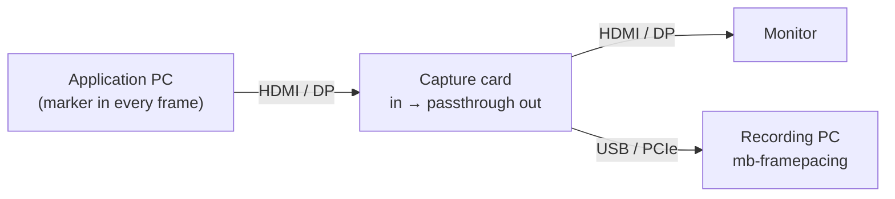

# Using mb-framepacing

This page walks through a first measurement, in the GUI and on the command line. It is the same on Windows, Ubuntu and macOS;
installing is covered by the platform guides: [Windows](install/windows.md) · [Ubuntu](install/ubuntu.md) ·
[macOS](install/macos.md).

Everything the GUI does can also be done on the command line (`mb-framepacing <command> --help` lists every option). Examples
below use `mb-framepacing` / `mb-framepacing-gui`; when running from source, use
`dotnet run --project measure/app/FramePacing -- <command>` and `dotnet run --project measure/app/FramePacing.Gui` instead.

## Before you start

- **ffmpeg** is installed and found. The GUI's setup dialog checks it; on the command line `mb-framepacing config` shows what is
  used.
- **Your application draws the marker** ([Integrating the marker](integrating.md)). mb-framepacing is a cooperative tool:
  without the marker there is nothing to measure. The synthetic test game below needs no application.
- **Vsync is on at a fixed refresh rate** in the application, and G-Sync/FreeSync is off. Every displayed frame is then whole.
  With vsync off the marker only reports the frame at the top of the screen, and capture cards record variable refresh at a
  constant rate, so neither measures what the display showed ([Marker format](marker-format.md#location)).

## 1. Try it without hardware

- **GUI:** start `mb-framepacing-gui`, choose **Synthetic test game** as the source and press **Start capture**. It records a
  simulated game with stalls and skipped frames for a few seconds; the Analyze page opens by itself.
- **Command line:** `mb-framepacing selftest` does the same and checks the result against the known answer. It prints `PASS`,
  or explains what went wrong (usually a disk that is too slow: try `--size 480x270`).

## 2. Measure with a capture card

Connect the capture card between the application's PC and its monitor. The card passes the picture on unchanged and sends a copy
to the recording PC (the same PC works too, if it has the spare CPU and disk speed).


```mermaid
flowchart LR
    PC["Application PC<br/>(marker in every frame)"] -->|HDMI / DP| CARD["Capture card<br/>in → passthrough out"]
    CARD -->|HDMI / DP| MON[Monitor]
    CARD -->|USB / PCIe| REC["Recording PC<br/>mb-framepacing"]
```

Settings that matter:

- **Capture at the same rate the display runs at.** Set the application's output to a mode the card captures natively, and capture
  it at that refresh rate: a 240 Hz output in the card's 240 fps mode. Every refresh is then exactly one captured frame, and the
  analysis relies on it: the refresh period is the capture period. Display times are then whole refreshes, measured exactly, and
  so is the animation error. A slower capture never sees some of the displayed frames (they
  are reported as frame indices never seen).
- Turn **G-Sync/FreeSync off**. Capture cards only pass variable refresh through to the monitor; they record at a constant rate, so
  the capture would not show when the display showed each frame. (A high speed camera filming the screen does: see the very
  experimental [camera capture](camera.md).)
- Turn **HDR off**.
- Store frames downscaled (`--scale`) to save disk space, but keep at least 3 stored pixels per marker module: 1920×1080 → 960×540
  needs 6 px modules in the application. `mb-framepacing marker-size --source 1920x1080 --stored 960x540` prints the module size
  for your setup; the rules are in [marker-format.md](marker-format.md#sizing).

**GUI**

1. **Source:** pick the card, then its **mode** (highest frame rate). Under **Advanced**, set **Scale** (for example 960x540).
2. Tick **Start at the start marker** and **Stop at the end marker**. If the application aims for a frame rate below the
   refresh rate (30 fps on 60 Hz), enter it as **Target frame rate**; it is stored with the capture. **Display refresh rate** is
   the rate you expect the display to run at: the analysis checks it against the capture rate (and, for a camera, against the
   rate it calculates from the frames).
3. Press **Start capture**. The preview shows the decoded marker ("Frame marker, run 7, frame 1234"); "No marker seen yet" means
   the marker does not reach the card intact (see [Troubleshooting](#troubleshooting)).
4. Run the test in your application. Recording stops by itself after the end marker and the Analyze page opens.

**Command line**

```sh
mb-framepacing devices --modes          # the card's name (Windows), /dev/videoN (Linux) or index (macOS), and its modes
mb-framepacing capture -d "<device>" --mode 1920x1080@240 --scale 960x540 --wait-for-start --stop-at-end --analyze
```

Add `--module-px 6` (the module size your application draws) to have the size checked before recording, `-t 2m` as a safety
limit, `--target-fps 30` when the application aims for less than the refresh rate, and `--display-hz 240` to have the display
rate you expect checked against the capture.

**Fast capture: store only the marker**

When the disk is the limit (high frame rates, long runs, a laptop), store only the marker instead of whole frames:

```sh
mb-framepacing locate -d "<device>" --mode 1920x1080@240     # optional: shows where the marker is and what would be stored
mb-framepacing capture -d "<device>" --mode 1920x1080@240 --roi auto --wait-for-start --stop-at-end --analyze
```

`--roi auto` reads the source for a moment (nothing is recorded), finds the marker, then records only the region around it,
downscaled to 3 stored pixels per module (4 with MJPEG). With 6 px modules in a 1080p source that is about 27 KB per captured frame
instead of 2 MB. In the GUI, type `auto` as the region under **Advanced**, or press **Locate marker** to fill in the region and
stored size now.

- The application must already draw the marker when the capture starts (idle frame markers are enough), and the marker must
  **not move**: a marker that leaves the region shows as undecodable captures, and the analysis warns about it.
- Only the top marker is stored, so tearing is not checked.
- `--roi auto` chooses the stored size itself; leave out `--scale`. `locate` prints the region as `--roi … --scale …` to reuse it
  without searching again.

## 3. Measure from a recording

Recorded with other equipment, such as a high speed camera or a recorder? Import the recording. Nothing is dropped, and any frame
rate works. A camera filming the screen needs a calibrated camera rig and `--camera`; that is **very experimental**, see
[camera capture](camera.md).

| Source                                   | GUI source     | Command line                                                     |
| ---------------------------------------- | -------------- | ---------------------------------------------------------------- |
| Video file (its own timestamps are used) | Video file     | `mb-framepacing import recording.mkv --analyze`                  |
| Folder of images at a known frame rate   | Image folder   | `mb-framepacing import frames/ --fps 1000 --analyze`             |
| Folder of images with a time per image   | Image folder   | `mb-framepacing import frames/ --timestamps times.csv --analyze` |
| Network stream (RTSP, SRT, HTTP, ...)    | Network stream | `mb-framepacing import rtsp://camera/stream -t 30s --analyze`    |

- Record **at the display's refresh rate**: like a capture card, a recording is analysed as one refresh per recorded frame. A
  60 fps screen recording of a 144 Hz display misses most of the frames the viewer saw. Only a camera filming the screen
  (`--camera`) films faster; its refresh rate is calculated from the frames.
- Record **lossless or at a high bit rate** (FFV1, lossless H.264/HEVC, PNG images): heavy compression blurs the marker.
- Images are sorted by name with numbers compared as numbers (`frame2` before `frame10`). A timestamp file is CSV with one line per
  image, `fileName,timeMs`, in the order the frames were taken; `#` comments and a header line are allowed.
- `--scale`, `--roi x,y,width,height` and `--roi auto` work on imports too.

## 4. Results

Each recording gets its own folder under the capture folder (set in the GUI's setup, `config --set-capture-dir`, or `-o`):

```text
capture-20260924-153000/          (import-... for imports)
├── frames.mbfc                   every recorded frame with its capture time (binary)
├── capture.json                  source, mode, scale, tool version, drop counts
└── analysis/
    ├── summary.json              counts, statistics, histograms, warnings per run
    ├── captures.csv              one row per recorded frame: capture time and what its marker said
    ├── run-<id>-frames.csv       one row per application frame shown: display time, animation error, drift
    └── run-<id>-*.png            only on request: the charts of the Analyze page (timeline, error-histogram,
                                  error-percentiles, display-time-histogram, drift)
```

The chart images are written by `--charts` (`analyze`, `import --analyze`, `capture --analyze`) or the GUI's **Save charts**; both
write the same files.

The headline numbers on the Analyze page:

| Tile                | Meaning                                                                                                |
| ------------------- | ------------------------------------------------------------------------------------------------------ |
| Presented frames    | Application frames that reached the display during the run                                             |
| Frames visibly off  | Frames whose \|animation error\| is above the error threshold: 1 ms, or `analyze --error-threshold-ms` |
| Typical error (p95) | 95 % of the frames have a smaller absolute animation error                                             |
| Worst error         | The largest absolute animation error                                                                   |
| Late frames         | Frames shown later than planned (see below), and their share of the run                                |
| Worst 2 s late      | The highest share of late frames in any 2 s: low for rare spikes, high for busy stretches              |
| Resolution          | One capture period: one refresh for a capture card, one camera frame for a camera                      |

Below the tiles, **Cause** tells whether the animation error comes mostly from **bad pacing** (the error frames are at late,
early or dropped frames) or from **delta time jitter** (the display stays even, the animation steps do not), and the line after it
the target frame time and the refresh rate used, compared with the expected display rate when one was given. What "late" is
measured against, in order: the intended display times the application's frame pacer writes into the marker (then **Detailed
statistics** also shows the pacing and prediction error), its target frame time in the marker, the **target frame rate** given at
capture or analysis time (rounded up to whole refreshes), and otherwise the display's native refresh rate.

The charts are explained in the README under [Reading the results](../README.md#reading-the-results). To analyse again, for
example with a different clock or only one run:

```sh
mb-framepacing analyze capture-20260924-153000 --time host --run 7
mb-framepacing analyze capture-20260924-153000 --target-fps 30        # late frames against a 30 fps target
```

or use **Browse...**, **Target fps** and **Analyze** on the Analyze page.

## Troubleshooting

| Symptom                                          | What to do                                                                                                                                                                                                                                                  |
| ------------------------------------------------ | ----------------------------------------------------------------------------------------------------------------------------------------------------------------------------------------------------------------------------------------------------------- |
| "ffmpeg not found"                               | Install it (platform guide, step 1). If it is not on PATH, point to it: GUI **Settings**, `mb-framepacing config --set-ffmpeg <path>`, or `--ffmpeg <path>`.                                                                                                |
| "No marker seen yet" / many undecodable captures | The marker must be drawn **last** (after post effects, UI and upscaling), unblended, pure black and white, with HDR off. Check it is at least 3 stored pixels per module after `--scale`; avoid MJPEG if the card has another format.                       |
| Recording never starts with the start marker     | The start marker must appear whole in at least one captured frame (every frame is checked). Show it for about three capture frames (100 ms at 30 fps) so a dropped or torn capture cannot lose it, and check that the preview shows "SequenceStart marker". |
| Frames dropped by the recorder                   | The disk is too slow: store only the marker (`--roi auto`), use a smaller `--scale`, or a faster SSD. `selftest --fps <rate> --size <size>` shows what this machine sustains.                                                                               |
| Frames dropped by the device / ffmpeg            | The card or its USB link cannot keep up in that format: try an uncompressed format (`--input-format nv12` or `yuyv422`) or a lower mode.                                                                                                                    |
| Warning about host timestamps                    | The source gives no per-frame timestamps, so the recording PC's clock is used and has more jitter. Prefer device timestamps (v4l2 and most DirectShow cards provide them).                                                                                  |
| macOS: no frames arrive                          | Allow camera access: **System Settings → Privacy & Security → Camera**.                                                                                                                                                                                     |
| Linux: permission denied on `/dev/video0`        | `sudo usermod -aG video $USER`, then log out and in again.                                                                                                                                                                                                  |
