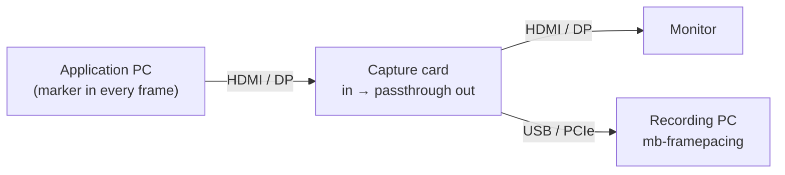

# Using mb-framepacing

This page walks through a first measurement, in the GUI and on the command line. It is the same on Windows, Ubuntu and macOS;
installing is covered by the platform guides: [Windows](install/windows.md) · [Ubuntu](install/ubuntu.md) ·
[macOS](install/macos.md).

Everything the GUI does can also be done on the command line (`mb-framepacing <command> --help` lists every option). Examples
below use `mb-framepacing` / `mb-framepacing-gui`; when running from source, use
`dotnet run --project measure/app/FramePacing -- <command>` and `dotnet run --project measure/app/FramePacing.Gui` instead.

## Before you start

- **ffmpeg** is installed and found. The GUI's setup dialog checks it; on the command line `mb-framepacing config` shows what is
  used.
- **Your application draws the marker** ([Integrating the marker](integrating.md)). mb-framepacing is a cooperative tool:
  without the marker there is nothing to measure. The synthetic test game below needs no application.
- **Vsync is on at a fixed refresh rate** in the application, and G-Sync/FreeSync is off. Every displayed frame is then whole.
  With vsync off the marker only reports the frame at the top of the screen, and capture cards record variable refresh at a
  constant rate, so neither measures what the display showed ([Marker format](marker-format.md#location)).

## 1. Try it without hardware

- **GUI:** start `mb-framepacing-gui`, choose **Synthetic test game** as the source and press **Start capture**. It records a
  simulated game with stalls and skipped frames for a few seconds; the Analyze page opens by itself.
- **Command line:** `mb-framepacing selftest` does the same and checks the result against the known answer. It prints `PASS`,
  or explains what went wrong (usually a machine too slow for the rate: try a lower `--fps`, or `--size 480x270`).

## 2. Measure with a capture card

Connect the capture card between the application's PC and its monitor. The card passes the picture on unchanged and sends a copy
to the recording PC (the same PC works too, if it has the spare CPU).


```mermaid
flowchart LR
    PC["Application PC<br/>(marker in every frame)"] -->|HDMI / DP| CARD["Capture card<br/>in → passthrough out"]
    CARD -->|HDMI / DP| MON[Monitor]
    CARD -->|USB / PCIe| REC["Recording PC<br/>mb-framepacing"]
```

Settings that matter:

- **Capture at the same rate the display runs at.** Set the application's output to a mode the card captures natively, and capture
  it at that refresh rate: a 240 Hz output in the card's 240 fps mode. Every refresh is then exactly one captured frame, and the
  analysis relies on it: the refresh period is the capture period. Display time steps are then whole refreshes, measured exactly, and
  so is the animation error. A slower capture never sees some of the displayed frames (they
  are reported as frame indices never seen).
- Turn **G-Sync/FreeSync off**. Capture cards only pass variable refresh through to the monitor; they record at a constant rate, so
  the capture would not show when the display showed each frame. (A high speed camera filming the screen does: see the very
  experimental [camera capture](camera.md).)
- Turn **HDR off**.
- Store frames downscaled (`--scale`) to save disk space, but keep at least 3 stored pixels per marker module: 1920×1080 → 960×540
  needs 6 px modules in the application. `mb-framepacing marker-size --source 1920x1080 --stored 960x540` prints the module size
  for your setup; the rules are in [marker-format.md](marker-format.md#sizing).

**GUI**

1. **Source:** pick the card, then its **mode** (highest frame rate). Under **Advanced**, set **Scale** (for example 960x540).
2. **Start at the start marker** and **Stop at the end marker** are ticked by default, and **Stop after** is empty: the capture
   records the run between its markers. A **Stop after** time (30s, 2m) is only a limit, counted from the start marker; untick
   the marker boxes for an application without start and end markers. If the application aims for a frame rate below the
   refresh rate (30 fps on 60 Hz), enter it as **Target frame rate**; it is stored with the capture. **Display refresh rate** is
   the rate you expect the display to run at: the analysis checks it against the capture rate (and, for a camera, against the
   rate it calculates from the frames).
3. Press **Start capture**. The preview shows the decoded marker ("Frame marker, run 7, frame 1234"); "No marker seen yet" means
   the marker does not reach the card intact (see [Troubleshooting](#troubleshooting)).
4. Run the test in your application. Recording stops by itself after the end marker and the Analyze page opens.

**Command line**

```sh
mb-framepacing devices --modes          # the card's name (Windows), /dev/videoN (Linux) or index (macOS), and its modes
mb-framepacing capture -d "<device>" --mode 1920x1080@240 --scale 960x540 --wait-for-start --stop-at-end --analyze
```

Add `--module-px 6` (the module size your application draws) to have the size checked before recording, `-t 2m` as a safety
limit, `--target-fps 30` when the application aims for less than the refresh rate, `--display-hz 240` to have the display
rate you expect checked against the capture, and `--name "menu scroll"` to give the capture a name the reports show instead of the
runs' sequence id (the GUI's **Name** field; `import` takes it too).

**What is stored**

A capture decodes every frame's markers as it records and stores only them with the frame's timestamps: the capture data
(`captures.mbcd`, 192 bytes per captured frame, about 170 MB for an hour at 240 Hz; [format](capture-data-format.md)). That is all
the analysis needs. To also store the frames themselves (to look at them, or decode them again later with `analyze --redecode`),
add `--keep-frames`, or tick **Store video frames** in the GUI: 0.5 MB per frame at 960×540.

**Fast capture: read only the marker**

When ffmpeg or, with `--keep-frames`, the disk is the limit (high frame rates, long runs, a laptop), have ffmpeg deliver only the
marker instead of whole frames:

```sh
mb-framepacing locate -d "<device>" --mode 1920x1080@240     # optional: shows where the marker is and what would be stored
mb-framepacing capture -d "<device>" --mode 1920x1080@240 --roi auto --wait-for-start --stop-at-end --analyze
```

`--roi auto` reads the source for a moment (nothing is recorded), finds the marker, then records only the region around it,
downscaled to 3 stored pixels per module (4 with MJPEG). With 6 px modules in a 1080p source that is about 27 KB per captured frame
instead of 2 MB. In the GUI, type `auto` as the region under **Advanced**, or press **Locate marker** to fill in the region and
stored size now.

- The application must already draw the marker when the capture starts (idle frame markers are enough), and the marker must
  **not move**: a marker that leaves the region shows as undecodable captures, and the analysis warns about it.
- Only the top marker is kept, so tearing is not checked.
- `--roi auto` chooses the stored size itself; leave out `--scale`. `locate` prints the region as `--roi … --scale …` to reuse it
  without searching again.

## 3. Measure from a recording

Recorded with other equipment, such as a high speed camera or a recorder? Import the recording. Nothing is dropped, and any frame
rate works. A camera filming the screen needs a calibrated camera rig and `--camera`; that is **very experimental**, see
[camera capture](camera.md).

| Source                                   | GUI source     | Command line                                                     |
| ---------------------------------------- | -------------- | ---------------------------------------------------------------- |
| Video file (its own timestamps are used) | Video file     | `mb-framepacing import recording.mkv --analyze`                  |
| Folder of images at a known frame rate   | Image folder   | `mb-framepacing import frames/ --fps 1000 --analyze`             |
| Folder of images with a time per image   | Image folder   | `mb-framepacing import frames/ --timestamps times.csv --analyze` |
| Network stream (RTSP, SRT, HTTP, ...)    | Network stream | `mb-framepacing import rtsp://camera/stream -t 30s --analyze`    |

- Record **at the display's refresh rate**: like a capture card, a recording is analysed as one refresh per recorded frame. A
  60 fps screen recording of a 144 Hz display misses most of the frames the viewer saw. Only a camera filming the screen
  (`--camera`) films faster; its refresh rate is calculated from the frames.
- Record **lossless or at a high bit rate** (FFV1, lossless H.264/HEVC, PNG images): heavy compression blurs the marker.
- Images are sorted by name with numbers compared as numbers (`frame2` before `frame10`). A timestamp file is CSV with one line per
  image, `fileName,timeMs`, in the order the frames were taken; `#` comments and a header line are allowed.
- `--scale`, `--roi x,y,width,height` and `--roi auto` work on imports too.

## 4. Results

Each recording gets its own folder under the capture folder (set in the GUI's setup, `config --set-capture-dir`, or `-o`):

```text
capture-20260924-153000/          (import-... for imports)
├── captures.mbcd                 every captured frame's decoded markers and timestamps (binary, the capture data)
├── frames.mbfc                   only with --keep-frames: every captured frame itself (binary)
├── capture.json                  source, mode, scale, tool version, drop counts
└── analysis/
    ├── summary.json              counts, statistics, histograms, warnings per run
    ├── captures.csv              one row per captured frame: its times, what its marker said and the marker's bytes
    ├── run-<id>-frames.csv       one row per application frame shown: display time step, animation error, drift
    ├── run-<id>-report*.svg      only on request: the run (or a section of it) as one SVG report card
    └── run-<id>-<card>*.svg      only on request: the distribution cards of the Analyze page (error-histogram,
                                  error-percentiles, display-time-step-histogram, drift)
```

`summary.json` and the CSV files are specified in [the analysis output format](analysis-output-format.md), `captures.mbcd` in
[the capture data format](capture-data-format.md); the [data libraries](../data/README.md) read them in your own code.

The whole run's report and distribution cards are written by `--charts` (`analyze`, `import --analyze`, `capture --analyze`) or
the GUI's **Save charts**; both write the same files, as SVG. `render` draws reports from an analysis (the capture itself is not needed):

```sh
mb-framepacing render capture-20260924-153000                      # the whole run: run-<id>-report.svg and the distribution cards
mb-framepacing render capture-20260924-153000 --from 120 --to 125  # 5 s of it, every frame: run-<id>-report-120s-125s.svg
mb-framepacing render capture-20260924-153000 --details --png      # also the worst moments, and PNGs (needs Edge or Chrome)
mb-framepacing render capture-20260924-153000 --timeline --from 12.5 --to 12.8  # the frame timeline: run-<id>-timeline-12.5s-12.8s.svg
```

The **frame timeline** (`--timeline`, at most 40 frames) draws a short stretch as a timing diagram: every refresh (bright where a frame
could be aimed at its target, faint where not), each frame's CPU work from its CPU start time for its CPU busy (boxes that overlap go to
further lanes), its present arrow, what every refresh showed (green: the frame's first refresh within the error threshold, red: off by
more, dark green: held as its successor's target intends, amber: held longer because the next frame is late) and each frame's
animation time step, display time step and animation error. The CPU times are on the pacer's clock; the markers' intended display
times place them on the capture's clock (on-time frames appear at their intended vsync), otherwise they are placed so that no frame
is presented after it first appears.

Times are seconds since the run's first frame, the Timeline's axis. Every item of the card can be left out or kept alone, by id:
`--hide late-share,refresh-strip`, `--only animation-error,display-time-step`. The ids: `title`, `description`, `display`, `tiles`
(all tiles) or one tile (`average-fps`, `one-percent-low`, `point-one-percent-low`, `frames-off`, `error-p99`, `error-p999`,
`worst-error`, `late-frames`), and the panels `animation-error`, `display-time-step`, `frametime`, `late-share`, `refresh-strip`.
Overlays are opt-in: `--show animation-time-step` draws the animation time step as a blue line over the display time step (an even
display with an uneven animation is delta time jitter; the scale covers both). For a card in a document: `--title "..."` replaces
the run's title, `--strip-seconds 1` draws the refresh strip over only the first second (readable cells on a long section),
`--hide-empty` leaves out the tiles without a value (the 0.1 % low and p99.9 below 1,000 frames) and the late share when no frame is
late, and `--tiles-per-row 5` puts five tiles in a row (default 4):

```sh
mb-framepacing render capture-20260924-153000 --cards none --only title,display,tiles,animation-error,display-time-step,refresh-strip \
  --show animation-time-step --strip-seconds 1 --hide-empty --tiles-per-row 5 --title "Naive timer, heavy load"
```

`--details` adds 2 s either side of the largest animation error
(`-worst-error`) and the worst 2 s of late frames (`-worst-late`). `--png` saves each at twice the size through a headless Edge or
Chrome, found in the usual places or set with `MB_BROWSER`.

Every panel says in its title what it shows; its key on the right names each colour and lists only what the section shows (a clean
refresh strip has no key at all).

The **refresh strip** draws one cell per refresh from each frame's first capture, a new shade with every frame, late frames red and
static frames violet. With a capture card, the refreshes between a frame's last capture and the next frame (captures that could not be
decoded) are grey; a camera sees each frame until the next one. A mark above the strip shows a frame with skipped frame indices before
it, or a tear.

**Static stretches** (the marker's `Static` flag: nothing animates) are a violet band behind every time panel. The display time step
and frametime scales leave a static frame's hold and frametime out (idle waits), so an idle second does not squash the panel; those
values get a mark with their value at the top edge.

The **distribution cards** are drawn next to the report for the same run or section: `run-<id>-error-histogram.svg`,
`-display-time-step-histogram.svg`, `-error-percentiles.svg` and `-drift.svg` (with the section's `-<from>s-<to>s`). The histograms
use the fixed 0.1 ms bins with the counts on a log scale, so a handful of bad frames stay visible next to thousands of good ones;
the error histogram marks the error threshold either way, the display time step histogram its median. The percentile card draws the
|animation error| from p0 to p100 in steps of 0.1 with the threshold and p95, p99 and p99.9 marked; the drift card the animation time
minus the display time since the run's first frame. `--cards error-histogram,drift` draws only those, `--cards none` none.

The headline numbers on the Analyze page (the report card shows the same):

| Tile               | Meaning                                                                                                                                                      |
| ------------------ | ------------------------------------------------------------------------------------------------------------------------------------------------------------ |
| Average fps        | Presented frames per second of the time their display time steps cover; underneath the mean step and the frame count, or how many static frames are excluded |
| 1 % low            | The frame rate at the 99th percentile display time step (nearest rank), the step underneath; needs 100 frames                                                |
| 0.1 % low          | The same at the 99.9th percentile; needs 1000 frames                                                                                                         |
| Frames visibly off | Frames whose \|animation error\| is above the error threshold: 1 ms, or `analyze --error-threshold-ms`, and their share                                      |
| Error p99          | 99 % of the frames have a smaller \|animation error\|; needs 100 frames                                                                                      |
| Error p99.9        | 99.9 % of the frames have a smaller \|animation error\|; needs 1000 frames                                                                                   |
| Worst error        | The largest absolute animation error, and whether that frame was shown too soon or too late                                                                  |
| Late frames        | Frames shown later than planned (see below), and their share of the run                                                                                      |

The frame rate numbers (average fps, the lows) and the display time step statistics and histogram describe the frames that animate: a
static frame's time on screen (the marker's `Static` flag) is left out, and the tile, the report's description and the statistics
table say how many ("excluding 48 static frames"; `statistics.excludedStaticFrames` in `summary.json`, `StaticBefore` in the frames
CSV).

Gamers Nexus's error per frame and percent error stay in `summary.json` (`statistics.errorPerFrameMs`, `statistics.percentError`)
for comparisons with their numbers.

Below the tiles, **Cause** tells whether the animation error comes mostly from **bad pacing** (the error frames are at late,
early or dropped frames) or from **delta time jitter** (the display stays even, the animation steps do not), and the line after it
the target frame time and the refresh rate used, compared with the expected display rate when one was given. What "late" is
measured against, in order: the intended display times the application's frame pacer writes into the marker (then **Detailed
statistics** also shows the pacing and prediction error), its target frame time in the marker, its preferred frame time in the marker
(a game that wants 30 fps on a 60 Hz display is measured against two refreshes), the **target frame rate** given at
capture or analysis time (rounded up to whole refreshes), and otherwise the display's native refresh rate.

The charts are explained in the README under [Reading the results](../README.md#reading-the-results). To analyse again, for
example with a different clock or only one run:

```sh
mb-framepacing analyze capture-20260924-153000 --time host --run 7
mb-framepacing analyze capture-20260924-153000 --target-fps 30        # late frames against a 30 fps target
mb-framepacing analyze capture-20260924-153000 --name "menu scroll"   # this analysis's name for the runs
mb-framepacing name capture-20260924-153000 "menu scroll"             # store (or with no name, clear) the capture's name
```

The name stored in `capture.json` names the runs in every analysis; `analyze --name` and `render --name` override it for their
output. Reports then show the name in the title and the sequence id below it.

or use **Browse...**, **Target fps** and **Analyze** on the Analyze page.

## Troubleshooting

| Symptom                                          | What to do                                                                                                                                                                                                                                                  |
| ------------------------------------------------ | ----------------------------------------------------------------------------------------------------------------------------------------------------------------------------------------------------------------------------------------------------------- |
| "ffmpeg not found"                               | Install it (platform guide, step 1). If it is not on PATH, point to it: GUI **Settings → Set up...**, `mb-framepacing config --set-ffmpeg <path>`, or `--ffmpeg <path>`.                                                                                    |
| "No marker seen yet" / many undecodable captures | The marker must be drawn **last** (after post effects, UI and upscaling), unblended, pure black and white, with HDR off. Check it is at least 3 stored pixels per module after `--scale`; avoid MJPEG if the card has another format.                       |
| Recording never starts with the start marker     | The start marker must appear whole in at least one captured frame (every frame is checked). Show it for about three capture frames (100 ms at 30 fps) so a dropped or torn capture cannot lose it, and check that the preview shows "SequenceStart marker". |
| Frames dropped by the recorder                   | Decoding (or, with `--keep-frames`, the disk) falls behind: lower the rate or `--scale`, read only the marker (`--roi auto`), or a faster SSD for stored frames. `selftest --fps <rate> --size <size>` shows what this machine sustains.                    |
| Frames dropped by the device / ffmpeg            | The card or its USB link cannot keep up in that format: try an uncompressed format (`--input-format nv12` or `yuyv422`) or a lower mode.                                                                                                                    |
| Warning about host timestamps                    | The source gives no per-frame timestamps, so the recording PC's clock is used and has more jitter. Prefer device timestamps (v4l2 and most DirectShow cards provide them).                                                                                  |
| macOS: no frames arrive                          | Allow camera access: **System Settings → Privacy & Security → Camera**.                                                                                                                                                                                     |
| Linux: permission denied on `/dev/video0`        | `sudo usermod -aG video $USER`, then log out and in again.                                                                                                                                                                                                  |
