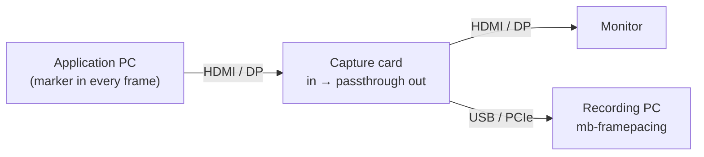

# Live capture (experimental)

> **Experimental.** mb-framepacing can record a capture card, or a network stream, itself and decode the markers as the frames
> arrive. It is not the way we suggest to measure: record the capture card with OBS Studio and import the recording, as
> [Measure with OBS and a capture card](usage.md#2-measure-with-obs-and-a-capture-card) describes. Live capture has to keep up with
> every frame as it comes, and on some platforms, **macOS among them, it is probably too slow to be usable**.

Live capture is hidden unless you ask for it:

- **GUI:** the capture cards and the network stream appear in the source list with **Settings → Experimental features** on.
- **Command line:** `capture`, `locate`, `devices`, and a stream URL for `import`, need `--experimental`; without it `--help` leaves
  them out and running them stops with a hint.

The same switch shows the [camera capture](camera.md), which is very experimental.

## Status

| Checked                                                                                                    | Not checked                                                          |
| ---------------------------------------------------------------------------------------------------------- | -------------------------------------------------------------------- |
| The recorder with the synthetic test game (`mb-framepacing selftest`, the same recorder at any rate)       | Real capture cards at their highest rates, on every platform         |
| The markers decoded live give the same records as decoding the stored frames afterwards (`VideoClipTests`) | Long captures on a busy PC, with the application on the same machine |
| Frames the recorder could not keep up with are counted as dropped, never lost silently                     | macOS: AVFoundation's frame delivery and timestamps at high rates    |

## How it works

Connect the capture card between the application's PC and its monitor. The card passes the picture on unchanged and sends a copy
to the recording PC (the same PC works too, if it has the spare CPU).



Settings that matter:

- **Capture at the same rate the display runs at.** Set the application's output to a mode the card captures natively, and capture
  it at that refresh rate: a 240 Hz output in the card's 240 fps mode. Every refresh is then exactly one captured frame, and the
  analysis relies on it: the refresh period is the capture period. Display time steps are then whole refreshes, measured exactly, and
  so is the animation error. A slower capture never sees some of the displayed frames (they are reported as frame indices never
  seen).
- Turn **G-Sync/FreeSync off**. Capture cards only pass variable refresh through to the monitor; they record at a constant rate, so
  the capture would not show when the display showed each frame.
- Turn **HDR off**.
- Store frames downscaled (`--scale`) to save disk space, but keep at least 3 stored pixels per marker module: 1920×1080 → 960×540
  needs 6 px modules in the application. `mb-framepacing marker-size --source 1920x1080 --stored 960x540` prints the module size
  for your setup; the rules are in [marker-format.md](../../sdk/doc/marker-format.md#sizing).

**GUI**

1. Turn on **Settings → Experimental features**.
2. **Source:** pick the card. Under **Advanced**, pick its **Device mode** (highest frame rate) and set the **Stored size** (for
   example 960x540).
3. **Start at the start marker** and **Stop at the end marker** are ticked by default, and **Stop after** is empty: the capture
   records the run between its markers. A **Stop after** time (30s, 2m) is only a limit, counted from the start marker; untick
   the marker boxes for an application without start and end markers. If the application aims for a frame rate below the
   refresh rate (30 fps on 60 Hz), enter it as **Target frame rate**; it is stored with the capture. **Display refresh rate** is
   the rate you expect the display to run at: the analysis checks it against the capture rate.
4. Press **Start capture**. The preview shows the decoded marker ("Frame marker, run 7, frame 1234"); "No marker seen yet" means
   the marker does not reach the card intact (see [Troubleshooting](usage.md#troubleshooting)).
5. Run the test in your application. Recording stops by itself after the end marker and the Analyze page opens.

**Command line**

```sh
mb-framepacing devices --experimental --modes   # the card's name (Windows), /dev/videoN (Linux) or index (macOS), and its modes
mb-framepacing capture --experimental -d "<device>" --mode 1920x1080@240 --scale 960x540 --wait-for-start --stop-at-end --analyze
```

Add `--module-px 6` (the module size your application draws) to have the size checked before recording, `-t 2m` as a safety
limit, `--target-fps 30` when the application aims for less than the refresh rate, `--display-hz 240` to have the display
rate you expect checked against the capture, and `--name "menu scroll"` to give the capture a name the reports show instead of the
runs' sequence id (the GUI's **Name** field).

**What is stored**

A capture decodes every frame's markers as it records and stores only them with the frame's timestamps: the capture data
(`captures.mbcd`, 192 bytes per captured frame, about 170 MB for an hour at 240 Hz; [format](../../sdk/doc/capture-data-format.md)).
That is all the analysis needs. To also store the frames themselves (to look at them, or decode them again later with
`analyze --redecode`), add `--keep-frames`, or tick **Store video frames** in the GUI: 0.5 MB per frame at 960×540.

## How fast can it record?

There is no built-in frame rate limit: the card's own modes decide (`mb-framepacing devices --experimental --modes`). 1080p at
240 fps is common, some cards go higher at lower resolutions. The live path is then limited by the card's USB/PCIe link, ffmpeg's
decoding and scaling, and decoding the markers of every frame as it arrives (a locked marker decodes in well under a millisecond).
With `--keep-frames` the frames are stored too, width × height bytes (grey) each, so 960×540 at 500 fps is about 250 MiB/s. When
decoding or the disk falls behind, frames are counted as dropped, never silently lost.

`mb-framepacing selftest --fps <rate>` checks what this machine sustains (add `--keep-frames` to include storing the frames). On
the development PC, 1000 fps ran with the recorder's ring nearly empty; with stored frames (NVMe SSD), 960×540 at 2000 fps (about
980 MiB/s) ran with no drops and every frame matched. A recording imported afterwards never drops a frame: it is read as fast as
the disk allows.

## Fast capture: read only the markers

When ffmpeg or, with `--keep-frames`, the disk is the limit (high frame rates, long runs, a laptop), have ffmpeg deliver only the
markers instead of whole frames (an imported recording does this by itself, see [usage](usage.md)):

```sh
mb-framepacing locate --experimental -d "<device>" --mode 1920x1080@240   # optional: where the marker is and what would be stored
mb-framepacing capture --experimental -d "<device>" --mode 1920x1080@240 --roi auto --wait-for-start --stop-at-end --analyze
```

`--roi auto` reads the source for a moment (nothing is recorded), finds the markers, then records only the regions around them,
downscaled to 3 stored pixels per module (4 with MJPEG): the main marker's, and below it the sync marker's when the source shows
one, as one frame. With 6 px modules in a 1080p source that is about 27 KB per captured frame instead of 2 MB (46 KB with a sync
marker). In the GUI, type `auto` as the region under **Advanced**, or press **Locate marker** to fill in the main marker's region
and stored size now.

- The application must already draw the marker when the capture starts (idle frame markers are enough), and the markers must
  **not move**: a marker that leaves its region shows as undecodable captures, and the analysis warns about it.
- With a sync marker's region stored too, tearing is checked as in a whole frame. A region given as a rectangle
  (`--roi x,y,width,height`, the **Locate marker** button) is one rectangle: the sync marker is not stored and tearing is not
  checked.
- `--roi auto` chooses the stored size itself; leave out `--scale`. `locate` prints the main marker's region as
  `--roi … --scale …` to reuse it without searching again.

## Network streams

`mb-framepacing import --experimental rtsp://camera/stream -t 30s --analyze` (the GUI's **Network stream (URL, experimental)...**)
records a stream ffmpeg can open (rtsp://, srt://, udp://, http(s)://) live, with the same recorder. Stop it with Stop or a
duration.

## Per platform

### Windows

Windows exposes capture cards as **DirectShow** devices (Elgato, AVerMedia, Magewell, Blackmagic and most USB/HDMI dongles).
`mb-framepacing devices --experimental --modes` lists them with their modes. Use the name as shown, for example:

```powershell
mb-framepacing capture --experimental -d "Cam Link 4K" --mode 1920x1080@60 --input-format nv12 --scale 960x540 -t 30s --analyze
```

- Close the vendor's own capture software first: most cards can only be opened by one program at a time.
- Prefer an uncompressed format (`nv12`, `yuyv422`) over `mjpeg` when the card offers the rate you need; MJPEG blurs the
  marker (see [marker-format.md](../../sdk/doc/marker-format.md#sizing)).
- `dshow` buffers frames in memory (`-rtbufsize`, 1 GB by default); dropped frames are reported in the results.

### Ubuntu

Linux exposes capture cards as **Video4Linux2** devices (`/dev/video0`, `/dev/video1`, ...).

```sh
sudo usermod -aG video $USER     # once, then log out and in again: access to /dev/video*
mb-framepacing devices --experimental --modes   # lists the devices and their formats
v4l2-ctl --list-formats-ext -d /dev/video0      # frame rates per size, if you need them
mb-framepacing capture --experimental -d /dev/video0 --mode 1920x1080@60 --input-format yuyv422 --scale 960x540 -t 30s --analyze
```

- Many USB capture devices create two nodes per card; the first one usually carries the video.
- Prefer `yuyv422`/`nv12` over `mjpeg` when the card reaches the rate you need.
- v4l2 gives kernel timestamps for every frame, which the analysis uses automatically.

### macOS

**Probably too slow to be usable**: record with OBS and import the recording instead. macOS exposes capture cards as
**AVFoundation** video devices (Elgato, Blackmagic UltraStudio, Magewell USB and UVC dongles); `mb-framepacing devices
--experimental` lists them by index:

```sh
mb-framepacing capture --experimental -d 0 --mode 1920x1080@60 --scale 960x540 -t 30s --analyze
```

- **Camera permission:** macOS asks before any program reads a video device. The first capture from Terminal (or iTerm, or the
  GUI) triggers the prompt. If you declined it, enable the app under **System Settings → Privacy & Security → Camera** and start
  it again. Without permission ffmpeg reports that no frames arrive.
- AVFoundation does not report the supported modes; use the card vendor's documentation or try `--mode` values.
- Keep the Mac awake during long captures (`caffeinate -dims mb-framepacing capture ...`).
