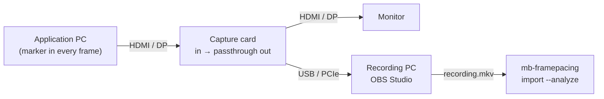
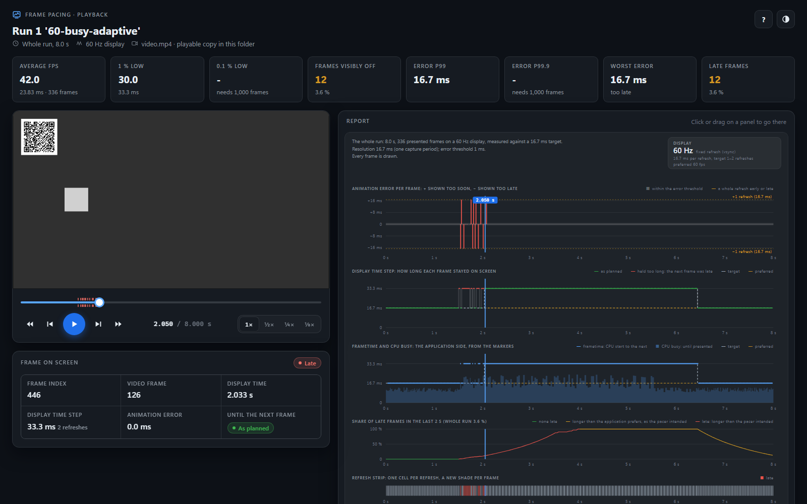

# Using mb-framepacing

This page walks through a first measurement, in the GUI and on the command line. It is the same on Windows, Ubuntu and macOS;
installing is covered by the platform guides: [Windows](install/windows.md) · [Ubuntu](install/ubuntu.md) ·
[macOS](install/macos.md).

Everything the GUI does can also be done on the command line (`mb-framepacing <command> --help` lists every option). Examples
below use `mb-framepacing` / `mb-framepacing-gui`; when running from source, use
`dotnet run --project measure/app/FramePacing -- <command>` and `dotnet run --project measure/app/FramePacing.Gui` instead.

## Before you start

- **ffmpeg** is installed and found. The GUI's setup dialog checks it; on the command line `mb-framepacing config` shows what is
  used.
- **Your application draws the marker** ([Integrating the marker](../../sdk/doc/integrating.md)). mb-framepacing is a cooperative tool:
  without the marker there is nothing to measure. The self-test below needs no application.
- **Vsync is on at a fixed refresh rate** in the application, and G-Sync/FreeSync is off. Every displayed frame is then whole.
  With vsync off the marker only reports the frame at the top of the screen, and capture cards record variable refresh at a
  constant rate, so neither measures what the display showed ([Marker format](../../sdk/doc/marker-format.md#location)).

## 1. Try it without hardware

`mb-framepacing selftest` records a simulated game with stalls and skipped frames for a few seconds, analyses it and checks the
result against the known answer. It prints `PASS`, or explains what went wrong (usually a machine too slow for the rate: try a
lower `--fps`, or `--size 480x270`).

## 2. Measure with OBS and a capture card

**This is the way we suggest for now:** [OBS Studio](https://obsproject.com) records what a capture card sees, and mb-framepacing
analyses the recording afterwards. You keep the recording, so a measurement can be analysed again.



### One rate, in three places

The analysis takes every recorded frame as one refresh of the display. That only holds when the same rate is set in all three places:

1. **The display mode** the application's PC outputs: a fixed refresh rate (60 Hz, say), with G-Sync/FreeSync off and HDR off
   ([Before you start](#before-you-start)).
2. **The rate OBS takes frames from the card at**: the capture card source's FPS.
3. **The rate OBS records and saves the file at**: OBS's video FPS.

What goes wrong otherwise:

- A lower rate in 2 or 3 than the display's never records some of the frames that were shown. They are reported as frame indices
  never seen.
- A rate in 3 that differs from 2 makes OBS repeat or leave out frames to fit. In the recording a repeated frame is a frame that
  stayed on screen for two refreshes, and a left out one is a frame that was never shown: the analysis cannot tell them from what the
  application did.
- 59.94 Hz and 60 Hz are different rates. Use the display's exact one.

Give the analysis the rate you expect (`--display-hz`, the GUI's **Display refresh rate**): it warns when the recording runs at
another one.

### OBS settings

The settings below follow from the rule above and from the [recording rules](#3-measure-from-a-recording): the display's rate, no
scaling, little or no compression. **We have not yet verified each of them with a recording**; where your OBS or card differs, keep
to the rule.

| Where in OBS                                                           | Set                                                                                                                                                                                                       |
| ---------------------------------------------------------------------- | --------------------------------------------------------------------------------------------------------------------------------------------------------------------------------------------------------- |
| **Sources → Video Capture Device** (the card) → Properties             | **Resolution/FPS Type:** Custom. **Resolution:** the signal's (1920x1080). **FPS:** the display's refresh rate. **Video Format:** an uncompressed one when the card offers it (NV12, YUY2), not MJPEG     |
| The source in the preview                                              | At its own size in the top-left corner (**Transform → Reset Transform**), and nothing else in the scene: the marker must reach the recording pixel for pixel                                              |
| **Settings → Video**                                                   | **Base (Canvas) Resolution** and **Output (Scaled) Resolution:** both the signal's resolution, so nothing is scaled                                                                                       |
| **Settings → Video → FPS**                                             | The display's refresh rate: **Common FPS Values**, or **Integer FPS Value** for a rate that is not in the list (144, 240), or **Fractional FPS Value** 60000 / 1001 for 59.94 Hz                          |
| **Settings → Output → Output Mode:** Advanced → **Recording**          | **Recording Format:** Matroska Video (.mkv): a recording that is cut short stays readable. **Rescale Output:** off                                                                                        |
| **Settings → Output → Recording → Video Encoder** and its rate control | Lossless or close to it: x264 with **Rate Control** CRF and a CRF of 0 (lossless) to about 10, or your GPU encoder's lossless or constant quality (CQP) setting with a low value. Not a streaming bitrate |

Then:

1. Check the preview: the marker is sharp, and the source's FPS and OBS's FPS are the display's rate.
2. **Start Recording** before the application shows its start marker, run the test, and **Stop Recording** after the end marker. What
   is recorded before and after the run does not matter: the markers cut it.

### Analyse the recording

```sh
mb-framepacing import recording.mkv --display-hz 60 --wait-for-start --stop-at-end --analyze
```

- `--display-hz 60`: the display's refresh rate. A recording that runs at another rate (by more than 1 %) gets a warning: "The capture
  runs at 30 fps, but a 60 Hz display was expected".
- `--wait-for-start --stop-at-end`: only the run between its start and end markers is measured.
- `--charts` also writes the report cards; `--name "menu scroll"` names the run in the reports.

In the GUI: choose **Video file...** as the source, pick the recording, enter the **Display refresh rate**, and press **Analyze
recording**.

Before you trust the numbers, check that the recording is what the display showed:

- The report's first line gives the recording's period ("period 16.667 ms" at 60 Hz): it must be the display's refresh period.
  With `--display-hz`, the report also says "Display refresh 60 Hz (the capture rate), expected 60 Hz: matches."
- An application that ran every refresh shows no frame indices never seen. Many of them, evenly spread, point to a lower rate in
  OBS than the display's.
- The warning "No frame markers were found in the capture" (the GUI's preview: "No marker seen yet") or many undecodable captures
  point to scaling or compression: see [Troubleshooting](#troubleshooting).

mb-framepacing can also record the card itself, without OBS, but that is **experimental** and on some platforms, macOS among them,
probably too slow to be usable: see [Live capture](live-capture.md).

## 3. Measure from a recording

Recorded with OBS ([above](#2-measure-with-obs-and-a-capture-card)) or other equipment, such as a high speed camera or a recorder?
Import the recording. Nothing is dropped, and any frame
rate works. A camera filming the screen needs a calibrated camera rig and `--camera`; that is **very experimental**, see
[camera capture](camera.md).

| Source                                   | GUI source      | Command line                                                     |
| ---------------------------------------- | --------------- | ---------------------------------------------------------------- |
| Video file (its own timestamps are used) | Video file...   | `mb-framepacing import recording.mkv --analyze`                  |
| Folder of images at a known frame rate   | Image folder... | `mb-framepacing import frames/ --fps 1000 --analyze`             |
| Folder of images with a time per image   | Image folder... | `mb-framepacing import frames/ --timestamps times.csv --analyze` |

- Record **at the display's refresh rate**: like a capture card, a recording is analysed as one refresh per recorded frame. A
  60 fps screen recording of a 144 Hz display misses most of the frames the viewer saw. Only a camera filming the screen
  (`--camera`) films faster; its refresh rate is calculated from the frames.
- Record **lossless or at a high bit rate** (FFV1, lossless H.264/HEVC, PNG images): heavy compression blurs the marker.
- Images are sorted by name with numbers compared as numbers (`frame2` before `frame10`).
- A timestamp file is CSV: a header line that names the columns, `fileName,timeTicks`, then one line per image in the order the
  frames were taken. A time is a whole number of 100 ns ticks, as every time in the tools' files (a millisecond is 10 000 ticks):

  ```text
  fileName,timeTicks
  frame0001.png,0
  frame0002.png,166667
  ```

  The columns are found by their names, so their order does not matter and other columns are ignored; `#` comments and empty lines
  are skipped. A file without the header, or with a time that is not a whole number, is refused with the line it is on.

- **Only the markers are read.** An import first finds the markers in the recording (it reads on until the first one, so the
  recording may start before the application does), then has ffmpeg deliver only their regions: the main marker's and, when the
  recording has one, the sync marker's, stored as one small frame. That is about twice as fast as reading whole frames, and the
  result is the same. It relies on the markers staying where they are, as the decoder always has.
  - `--roi full` reads whole frames; so do `--scale` and `--keep-frames` (the frames are stored as they are) without `--roi`. In
    the GUI these are the region box under **Advanced** (`full`), the stored size and **Store video frames**.
  - `--roi x,y,width,height` reads that rectangle, and `--roi auto` is the default said out loud.
  - A recording without any marker stops with "No marker was found". A marker that moved while it was located, or that is partly
    outside the frame, makes the import read whole frames and say so.
- A network stream is recorded live, which is experimental: see [Live capture](live-capture.md#network-streams).

## 4. Results

Each recording gets its own folder under the capture folder (set in the GUI's setup, `config --set-capture-dir`, or `-o`):

```text
capture-20260924-153000/          (import-... for imports)
├── captures.mbcd                 every captured frame's decoded markers and timestamps (binary, the capture data)
├── frames.mbfc                   only with --keep-frames: every captured frame itself (binary)
├── capture.json                  source, mode, scale, tool version, drop counts
└── analysis/
    ├── summary.json              counts, statistics, histograms, warnings per run
    ├── captures.csv              one row per captured frame: its times, what its marker said and the marker's bytes
    ├── run-<id>-frames.csv       one row per application frame shown: display time step, animation error, drift
    ├── run-<id>-report*.svg      only on request: the run (or a section of it) as one SVG report card
    ├── run-<id>-<card>*.svg      only on request: the distribution cards of the Analyze page (error-histogram,
    │                             error-percentiles, display-time-step-histogram, drift)
    └── playback/                 only on request: the playback reports (below), a folder each
        └── run-<id>[-<from>s-<to>s]/
            ├── index.html        the run (or a section of it) next to the recording, with a player
            ├── video.mp4         the report's copy of the recording, or a playable copy (none without one)
            └── playback.json     which video the page plays, and the recording it was made from
```

`summary.json` and the CSV files are specified in [the analysis output format](../../sdk/doc/analysis-output-format.md), `captures.mbcd` in
[the capture data format](../../sdk/doc/capture-data-format.md); the SDK's [data modules](../../sdk/README.md#the-data-module) read them in your own code.

### The playback page



A playback report shows the recording a capture was imported from next to its report: play it, step it a video frame or an
application frame at a time, slow it down, and see on every panel of the report where the frame on screen is. Click or drag on a
panel to go to that moment; the readout says which frame is on screen, its display time step and animation error, and whether it
was late or static. It is one HTML file that runs from the disk in any current browser (Edge, Chrome, Firefox, Safari): no server,
nothing loaded from the network.

```sh
mb-framepacing import recording.mkv --display-hz 60 --playback   # import, analyse and write the page
mb-framepacing render <capture folder> --playback                # the page of an analysed import
mb-framepacing render <capture folder> --playback --from 120 --to 125   # a page for 5 s of the run
```

In the GUI: **Save playback page** on the Analyze page writes the selected run's report (the part in view when the Timeline is
zoomed), and **Open playback page** opens it. A report is written only when you ask for it.

- **Zoom the report** with the buttons above it (**Whole**, **60 s**, **10 s**, **2 s** per screen) or **+** and **−**: zoomed,
  the panels keep their titles, keys and axes while the plots scroll with the playhead, and scrolling sideways over them moves
  through the recording. A zoomed card holds the whole report at its zoom, so a page offers the steps that fit about 64 MB: two
  minutes or ten get every step down to 2 s, half an hour 10 s, an hour 60 s (each zoom is read only when it is first shown). For
  frame detail in a long run, write a report of a section of it (`--from`/`--to`, or the GUI's zoomed Timeline).
- **Recordings imported as a video file only.** The page finds a capture in the video by its time, the video's own timestamps,
  so it needs a capture made by `import` of a video file. A capture card recorded live, a folder of images or a camera capture
  have no page. Imports made before capture.json named the recording need it named: `--video <file>` (the GUI asks for it).
- **Every report has a folder of its own** in `analysis/playback/`, named like the SVG reports (`run-1`, `run-1-120s-125s`), with
  its page and a copy of the recording: the folder plays anywhere on its own (zip it and send it), and names nothing outside it,
  no link and no local path. Saving the same report again replaces its folder's files; other reports are never touched.
- **Recordings browsers cannot play** (lossless H.264 or HEVC, 4:4:4, UTVideo, FFV1, and MKV files) get a playable copy instead:
  ffmpeg copies the video into an MP4 file when only the container is the problem (quick), and otherwise encodes it as H.264 (this
  takes a while). Every frame keeps its timestamp. The tools **ask** first; without the copy the report has no video, and the page
  shows the command that makes it and an **Open video...** button for a file of the recording.
- **The answer can be given in advance**: per run with `--playback-transcode yes|no|ask`, or for good in the configuration
  (`playbackTranscode`; `config --set-playback-transcode yes`, the GUI's Settings page, or **Remember my choice** in its question).
  When the command line cannot ask (its input is redirected), it makes no copy and says which option answers the question.
- **A video of your own instead of the copy** (command line only): `--playback-video-url <url-or-path>` writes the URL, or a path
  relative to the report's folder (`../../videos/run.mp4`), into the page as given, and nothing is copied or asked; the browser
  resolves a relative path against the page's address, so it works from the disk and from a web server alike. Use it when the
  report is published next to a video you serve yourself, such as a web encode of the same recording. Its frames must have the
  recording's timestamps (the same start and frame timing): the page finds a frame by its time. The tools do not judge it; a file
  that is there and shorter than the run is only a warning.
- Saving the same report again uses its video again while the recording is unchanged (`playback.json` keeps the recording's file
  name, size and modification time, no path), without asking.
- **A report's folder may be sent on as it is.** The page is part of mb-framepacing and carries its license's terms (PolyForm
  Perimeter 1.0.1) and notice in its source.

Keys: **Space** plays and pauses, **←** **→** step a video frame, **Shift**+**←** **→** an application frame, **Home** and
**End** go to the start and the end, **1** to **4** set the speed (1×, ½×, ¼×, ⅛×), **+** and **−** zoom the report. The address
keeps the moment on screen and the zoom (`index.html#t=12.345&zoom=10`, seconds since the run's first frame), so a link opens the
page there.

The whole run's report and distribution cards are written by `--charts` (`analyze`, `import --analyze`, `capture --analyze`) or
the GUI's **Save charts**; both write the same files, as SVG. `render` draws reports from an analysis (the capture itself is not needed):

```sh
mb-framepacing render capture-20260924-153000                      # the whole run: run-<id>-report.svg and the distribution cards
mb-framepacing render capture-20260924-153000 --from 120 --to 125  # 5 s of it, every frame: run-<id>-report-120s-125s.svg
mb-framepacing render capture-20260924-153000 --details --png      # also the worst moments, and PNGs (needs Edge or Chrome)
mb-framepacing render capture-20260924-153000 --timeline --from 12.5 --to 12.8  # the frame timeline: run-<id>-timeline-12.5s-12.8s.svg
```

The **frame timeline** (`--timeline`, at most 40 frames) draws a short stretch as a timing diagram: every refresh (bright where a frame
could be aimed at its target, faint where not), each frame's CPU work from its CPU start time for its CPU busy (boxes that overlap go to
further lanes), its present arrow, what every refresh showed (green: the frame's first refresh within the error threshold, red: off by
more, dark green: held as its successor's target intends, amber: held longer because the next frame is late, violet: a static frame,
where nothing animates; a frame presented on demand is never held longer, since it has no interval to be late for) and each frame's
animation time step, display time step and animation error. The CPU times are on the pacer's clock; the markers' intended display
times place them on the capture's clock (on-time frames appear at their intended vsync), otherwise they are placed so that no frame
is presented after it first appears.

Times are seconds since the run's first frame, the Timeline's axis. Every item of the card can be left out or kept alone, by id:
`--hide late-share,refresh-strip`, `--only animation-error,display-time-step`. The ids: `title`, `description`, `display`, `tiles`
(all tiles) or one tile (`average-fps`, `one-percent-low`, `point-one-percent-low`, `frames-dropped`, `out-of-order`, `frames-off`,
`error-p99`, `error-p999`, `worst-error`, `late-frames`), the panels `animation-error`, `display-time-step`, `frametime`, `late-share`, `refresh-strip`,
`events`, and `frame-time-lines`: the target and preferred frame time as dashed lines on the display time step and frametime panels
(light grey the target, in whole refreshes on the display time step as the analysis compares; amber the preferred frame time, only
where it differs from the target: the stretch the late share shows amber; none on demand).
The tiles `frames-dropped` and `out-of-order` are left out together when the run (or section) has neither; `--show
frames-dropped,out-of-order` keeps them anyway, `--hide` leaves them out. Overlays are opt-in: `--show animation-time-step` draws the animation time step as a blue line over the display time step (an even
display with an uneven animation is delta time jitter; the scale covers both). For a card in a document: `--title "..."` replaces
the run's title, `--strip-seconds 1` draws the refresh strip over only the first second (readable cells on a long section),
`--hide-empty` leaves out the tiles without a value (the 0.1 % low and p99.9 below 1,000 frames) and the late share when no frame is
late, and `--tiles-per-row 5` puts five tiles in a row (default: two rows, half the tiles each, at least four):

```sh
mb-framepacing render capture-20260924-153000 --cards none --only title,display,tiles,animation-error,display-time-step,refresh-strip \
  --show animation-time-step --strip-seconds 1 --hide-empty --tiles-per-row 5 --title "Naive timer, heavy load"
```

`--details` adds 2 s either side of the largest animation error
(`-worst-error`) and the worst 2 s of late frames (`-worst-late`). `--png` saves each at twice the size through a headless Edge or
Chrome, found in the usual places or set with `MB_BROWSER`.

Every panel says in its title what it shows; its key on the right names each colour and lists only what the section shows (a clean
refresh strip has no key at all).

The **refresh strip** draws one cell per refresh from each frame's first capture, a new shade with every frame, late frames red and
static frames violet. Where frames the application rendered never reached the display (dropped, over a capture without gaps), the
refreshes where they were due repeat the frame before and are orange. A refresh that showed an older frame out of order is pink. With a
capture card, the other refreshes between a frame's last capture and the next frame (captures that could not be decoded or were not
recorded) are grey; a camera sees each frame until the next one.

The **events** panel under it shows what went wrong where, at every zoom (the strip needs a section of a few seconds to draw its cells),
in two lanes that are never mixed up: **frames**, what the application and the display did (frames the target dropped orange, an
older frame shown out of order pink, a torn refresh cyan), and **capture**, what the capture missed (a capture not recorded, frames the
capture source reported dropping, refreshes its timestamps say it missed: grey; a capture whose marker could not be decoded: dark
grey). Each pixel column shows one mark per lane, the kind that outweighs the others there. The key counts each kind in the section.
The panel is in the report card (`--charts`, `render`, the GUI's **Save charts**), not in the GUI's Timeline. The capture lane needs `captures.csv` next to the frames.

**Capture gaps** (captures not decoded, not recorded, or dropped by the capture source) leave the display time of the next frame
uncertain: the steps into and out of it are not judged (no animation error, no late verdict, not in the frame rates), drawn dashed grey
in the display time step panel, counted (`statistics.uncertainSteps`) and named in the report's description. A frame index skipped
across a gap is never called dropped: the frame may have been shown in the refresh the capture missed.

**Static stretches** (the marker's `StaticAfter` or `StaticBefore` flag: nothing animates while a frame is on screen) are a violet band behind every time panel. The display time step
and frametime scales leave a static frame's hold and frametime out (idle waits), so an idle second does not squash the panel; those
values get a mark with their value at the top edge. The same holds for a static frame's CPU busy (an application that waits for input
inside its frame) and for the target and preferred frame time of an idle stretch (its reference lines). This is **Clamp static**, on by
default: `render --no-static-clamp` and the GUI's **Clamp static** check box (next to Save charts, which follows it) let the static
values set the scales too.

**A rest whose static flag a dropped frame took** is assumed static: the analysis flags the frame that held it `StaticAssumed`, the
report's description counts such frames ("1 static frame is assumed: its flag was lost with a dropped frame.") and the hover says so.
It happens when the target drops the frame that carried the flag, or the frame a `StaticBefore` spoke for; a flag lost without a
trace is only assumed in a run that uses the static flags, over a hold where the animation clock stood still. `analyze
--no-static-guess` and the GUI's **Guess static** check box (used at the next Analyze) judge such a rest like any other step.

The **distribution cards** are drawn next to the report for the same run or section: `run-<id>-error-histogram.svg`,
`-display-time-step-histogram.svg`, `-error-percentiles.svg` and `-drift.svg` (with the section's `-<from>s-<to>s`). The histograms
use the fixed 0.1 ms bins with the counts on a log scale, so a handful of bad frames stay visible next to thousands of good ones;
the error histogram marks the error threshold either way, the display time step histogram its median. The percentile card draws the
|animation error| from p0 to p100 in steps of 0.1 with the threshold and p95, p99 and p99.9 marked; the drift card the animation time
minus the display time since the run's first frame. `--cards error-histogram,drift` draws only those, `--cards none` none.

The headline numbers on the Analyze page (the report card shows the same):

| Tile               | Meaning                                                                                                                                                                                                                             |
| ------------------ | ----------------------------------------------------------------------------------------------------------------------------------------------------------------------------------------------------------------------------------- |
| Average fps        | Presented frames per second of the time their display time steps cover; underneath the mean step and the frame count, or how many static frames are excluded                                                                        |
| 1 % low            | The frame rate at the 99th percentile display time step (nearest rank), the step underneath; needs 100 frames                                                                                                                       |
| 0.1 % low          | The same at the 99.9th percentile; needs 1000 frames                                                                                                                                                                                |
| Frames dropped     | Frames the application rendered that never reached the display (skipped frame indices over a capture without gaps, never shown later), and their share of the rendered frames; only when the run has dropped or out-of-order frames |
| Out of order       | Refreshes that showed an older frame again after a newer one; only when the run has dropped or out-of-order frames                                                                                                                  |
| Frames visibly off | Frames whose \|animation error\| is above the error threshold: 1 ms, or `analyze --error-threshold-ms`, and their share                                                                                                             |
| Error p99          | 99 % of the frames have a smaller \|animation error\|; needs 100 frames                                                                                                                                                             |
| Error p99.9        | 99.9 % of the frames have a smaller \|animation error\|; needs 1000 frames                                                                                                                                                          |
| Worst error        | The largest absolute animation error, and whether that frame was shown too soon or too late                                                                                                                                         |
| Late frames        | Frames shown later than planned (see below), and their share of the run                                                                                                                                                             |

Beside them, the **Display** card (the report's display box, top right) shows the refresh rate and whether it is a capture card's fixed
refresh (vsync) or calculated from a camera, the time per refresh with what the frames targeted in whole refreshes, and what the
application prefers when its markers say so. The rate turns amber when it differs from the display rate you expected; the card's
tooltip says by how much.

The frame rate numbers (average fps, the lows) and the display time step statistics and histogram describe the frames that animate: a
static frame's time on screen (the marker's `StaticAfter` or `StaticBefore` flag) is left out, and the tile, the report's description and the statistics
table say how many ("excluding 48 static frames"; `statistics.excludedStaticFrames` in `summary.json`, `StaticBefore` in the frames
CSV).

Gamers Nexus's error per frame and percent error stay in `summary.json` (`statistics.errorPerFrameMs`, `statistics.percentError`)
for comparisons with their numbers.

Below the tiles, **Cause** tells whether the animation error comes mostly from **bad pacing** (the error frames are at late,
early or dropped frames) or from **delta time jitter** (the display stays even, the animation steps do not), and the line after it
what "late" is measured against, with the typical target frame time. The refresh rate used, compared with the expected display
rate when one was given, is the Display card's tooltip. What "late" is
measured against, in order: the intended display times the application's frame pacer writes into the marker (then **Detailed
statistics** also shows the pacing and prediction error), its target frame time in the marker, its preferred frame time in the marker
(a game that wants 30 fps on a 60 Hz display is measured against two refreshes), the **target frame rate** given at
capture or analysis time (rounded up to whole refreshes), and otherwise the display's native refresh rate.

The charts are explained in the README under [Reading the results](../../README.md#reading-the-results). To analyse again, for
example with a different clock or only one run:

```sh
mb-framepacing analyze capture-20260924-153000 --time host --run 7
mb-framepacing analyze capture-20260924-153000 --target-fps 30        # late frames against a 30 fps target
mb-framepacing analyze capture-20260924-153000 --name "menu scroll"   # this analysis's name for the runs
mb-framepacing name capture-20260924-153000 "menu scroll"             # store (or with no name, clear) the capture's name
```

The name stored in `capture.json` names the runs in every analysis; `analyze --name` and `render --name` override it for their
output. Reports then show the name in the title and the sequence id below it.

or use **Browse...**, **Target fps** and **Analyze** on the Analyze page.

## Troubleshooting

| Symptom                                          | What to do                                                                                                                                                                                                                                                  |
| ------------------------------------------------ | ----------------------------------------------------------------------------------------------------------------------------------------------------------------------------------------------------------------------------------------------------------- |
| "ffmpeg not found"                               | Install it (platform guide, step 1). If it is not on PATH, point to it: GUI **Settings → Set up...**, `mb-framepacing config --set-ffmpeg <path>`, or `--ffmpeg <path>`.                                                                                    |
| "No marker seen yet" / many undecodable captures | The marker must be drawn **last** (after post effects, UI and upscaling), unblended, pure black and white, with HDR off. Check it is at least 3 stored pixels per module after `--scale`; avoid MJPEG if the card has another format.                       |
| Recording never starts with the start marker     | The start marker must appear whole in at least one captured frame (every frame is checked). Show it for about three capture frames (100 ms at 30 fps) so a dropped or torn capture cannot lose it, and check that the preview shows "SequenceStart marker". |
| Frames dropped by the recorder                   | Decoding (or, with `--keep-frames`, the disk) falls behind: lower the rate or `--scale`, read only the marker (`--roi auto`), or a faster SSD for stored frames. `selftest --fps <rate> --size <size>` shows what this machine sustains.                    |
| Frames dropped by the device / ffmpeg            | The card or its USB link cannot keep up in that format: try an uncompressed format (`--input-format nv12` or `yuyv422`) or a lower mode.                                                                                                                    |
| Warning about host timestamps                    | The source gives no per-frame timestamps, so the recording PC's clock is used and has more jitter. Prefer device timestamps (v4l2 and most DirectShow cards provide them).                                                                                  |
| macOS: no frames arrive                          | Allow camera access: **System Settings → Privacy & Security → Camera**.                                                                                                                                                                                     |
| Linux: permission denied on `/dev/video0`        | `sudo usermod -aG video $USER`, then log out and in again.                                                                                                                                                                                                  |
| The GUI misbehaves or closes                     | Its log has what went wrong: a file per day, the last 7 days kept, in the `logs` folder next to the GUI settings (**Settings → About → Open the log folder**). Attach it when reporting a problem. The command line tool logs to the console with `-v`.     |
