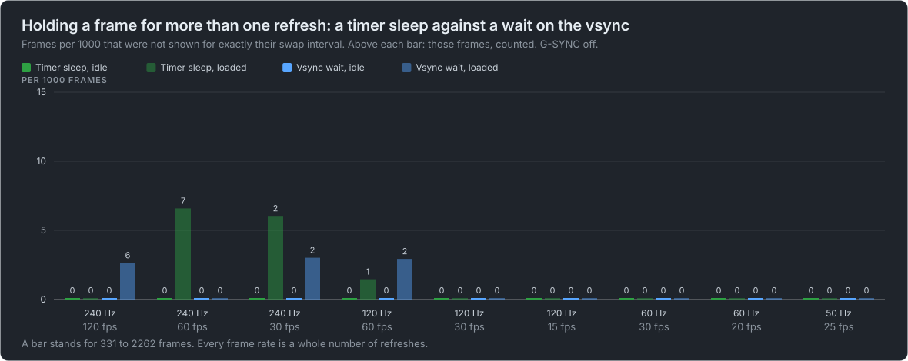
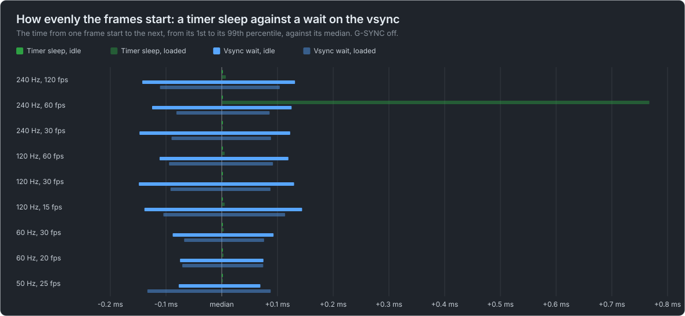
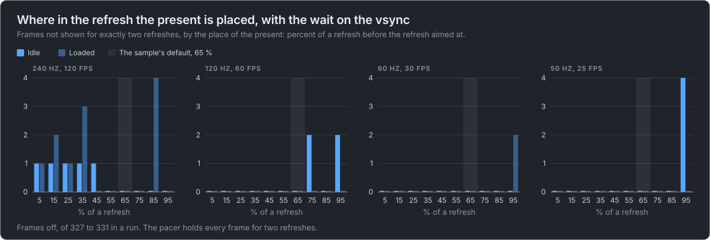
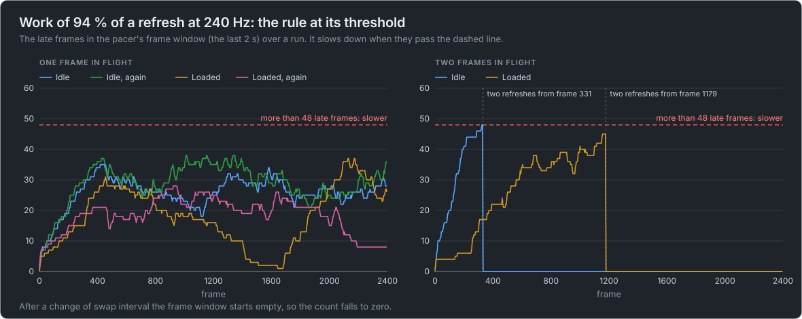
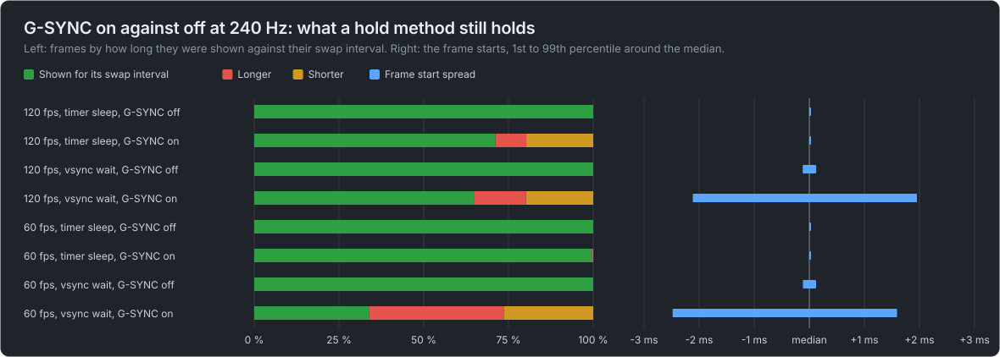

# Windows hold captures, 2026-10-04

What 247 runs of the experimental [frame pacer](../sdk/doc/pacer.md) on a real swap chain show about holding a frame for more than
one refresh on plain Vulkan. The runs are in [`2026-10-04-windows-hold.zip`](https://github.com/Unarmed1000/mb-framepacing/releases/download/pacer-captures/2026-10-04-windows-hold.zip), an asset of this repository's
`pacer-captures` release; every number, table and
chart here is worked out from its frame logs by `tools/pacer_capture_report.py`, and the row per run it extracts is
[`runs.csv`](2026-10-04-windows-hold/runs.csv).

These are the display times a graphics driver reports, on one machine. No capture card recorded the runs, so nothing here is a
measurement by this project's tools: see [What this capture can not say](#what-this-capture-can-not-say).

## What was run

The Vulkan FramePacing sample of the unofficial [gtec-demo-framework](https://github.com/Unarmed1000/gtec-demo-framework) with the
pacer at `b5b6ab3`, a release build on Windows 11, a NVIDIA GPU (driver 617.14) and a FIFO swap chain with two images. The window
is 1600x900 on a display set to 240, 120, 60 and 50 Hz; a second display runs at 120 Hz (24 Hz for two probes).

- **The swap interval** comes from the pacer. Core Vulkan has no swap interval above one, so the sample holds a frame itself:
  by a **timer sleep** until the frame's start plus its swap interval, or by a **wait on the vsync** (DXGI's wait for the
  vertical blank of the window's display) and a present placed a share of a refresh before the refresh aimed at.
- **When a frame was shown** is the first pixel out time of `VK_EXT_present_timing`, used for measuring only. The runs named
  `_plain` switch it off; they have frame starts and no display times.
- **Idle and loaded:** a run named `_idle` or `_loaded` is one of a pair, on an idle machine and with one busy process per
  logical CPU.
- **G-SYNC** is off, except in the four folders named for it.

<!-- pacer-capture:runs: generated by tools/pacer_capture_report.py -->

| Folder                                                 | Runs | Frames logged |
| ------------------------------------------------------ | ---: | ------------: |
| `120hz-phase-sweep`                                    |   20 |          8000 |
| `120hz-plain-vulkan`                                   |   30 |         28800 |
| `240hz-gsync-fullscreen-only-hold`                     |    4 |          3600 |
| `240hz-gsync-fullscreen-only-variable-refresh`         |    8 |          8000 |
| `240hz-gsync-windowed-and-fullscreen-hold`             |    4 |          3600 |
| `240hz-gsync-windowed-and-fullscreen-variable-refresh` |    8 |          8000 |
| `240hz-phase-sweep`                                    |   20 |          8000 |
| `240hz-plain-vulkan`                                   |   30 |         44800 |
| `240hz-vsync-sources`                                  |   22 |         23200 |
| `50hz-phase-sweep`                                     |   20 |          8000 |
| `50hz-plain-vulkan`                                    |   22 |         13700 |
| `60hz-phase-sweep`                                     |   20 |          8000 |
| `60hz-plain-vulkan`                                    |   26 |         17600 |
| `second-display-120hz-vsync-sources`                   |   10 |          5200 |
| `swapchain-refresh-probes`                             |    3 |           500 |
| All                                                    |  247 |        189000 |

<!-- /pacer-capture:runs -->

## How the numbers were made

- **A frame is shown for its swap interval** when the whole refreshes from its display time to the next frame's are the swap
  interval the pacer gave. Longer or shorter is a frame off. A frame is **never shown** when the driver reports its present as
  complete without a display time.
- **The first 60 frames of a run and its last 8 are left out**: start-up, and display times that had not come back when the run
  ended.
- **The refresh period is the window system's**, which is the one the pacer paces by.
- **Times are whole ticks of 100 ns** in `runs.csv`; milliseconds and shares are worked out where they are shown.
- **The capture tool's own summaries differ a little** (`README.txt` and the `summary.txt` files in the zip): they leave fewer
  frames out. For the runs with work of 90 % at 240 Hz they also report more frames shown longer (149 of 2221 in one run) than
  the 50 here, where a frame counts as shown longer only when it and the next frame both have a display time, and a frame
  without one is counted as never shown.

## A timer sleep against a wait on the vsync

Fixed frame rates with light work (under a quarter of a refresh), the pacer's rule off, G-SYNC off.

<!-- pacer-capture:hold: generated by tools/pacer_capture_report.py -->

| Display | Frame rate | Timer sleep, idle | Timer sleep, loaded | Vsync wait, idle | Vsync wait, loaded |
| ------- | ---------- | ----------------: | ------------------: | ---------------: | -----------------: |
| 240 Hz  | 120 fps    |         0 of 2262 |           0 of 2262 |        0 of 2262 |          6 of 2262 |
| 240 Hz  | 60 fps     |         0 of 1062 |           7 of 1062 |        0 of 1062 |          0 of 1062 |
| 240 Hz  | 30 fps     |          0 of 331 |            2 of 331 |         0 of 662 |           2 of 662 |
| 120 Hz  | 60 fps     |          0 of 681 |            1 of 681 |         0 of 681 |           2 of 681 |
| 120 Hz  | 30 fps     |          0 of 331 |            0 of 331 |         0 of 331 |           0 of 331 |
| 120 Hz  | 15 fps     |          0 of 331 |            0 of 331 |         0 of 331 |           0 of 331 |
| 60 Hz   | 30 fps     |          0 of 381 |            0 of 381 |         0 of 381 |           0 of 381 |
| 60 Hz   | 20 fps     |          0 of 331 |            0 of 331 |         0 of 331 |           0 of 331 |
| 50 Hz   | 25 fps     |          0 of 331 |            0 of 331 |         0 of 331 |           0 of 331 |

<!-- /pacer-capture:hold -->

Frames off, of the frames judged. At 240 Hz each cell adds up two rounds captured hours apart.

- **On the idle machine no frame was off**, with either method, at any refresh rate or frame rate.
- **Under load a few were**, with both methods, at 240 and 120 Hz only: at most 7 of 1062 (the sleep, 60 fps on 240 Hz).
- **At 60 and 50 Hz no frame was off** in any run.

<!-- pacer-capture:spread: generated by tools/pacer_capture_report.py -->

| Display | Frame rate | Timer sleep, idle (ms) | Timer sleep, loaded (ms) | Vsync wait, idle (ms) | Vsync wait, loaded (ms) |
| ------- | ---------- | ---------------------: | -----------------------: | --------------------: | ----------------------: |
| 240 Hz  | 120 fps    |         0.000 to 0.000 |          0.000 to +0.007 |      -0.143 to +0.132 |        -0.111 to +0.104 |
| 240 Hz  | 60 fps     |         0.000 to 0.000 |          0.000 to +0.767 |      -0.125 to +0.125 |        -0.081 to +0.086 |
| 240 Hz  | 30 fps     |         0.000 to 0.000 |           0.000 to 0.000 |      -0.148 to +0.123 |        -0.090 to +0.088 |
| 120 Hz  | 60 fps     |        0.000 to +0.001 |          0.000 to +0.005 |      -0.112 to +0.119 |        -0.095 to +0.092 |
| 120 Hz  | 30 fps     |         0.000 to 0.000 |          0.000 to +0.001 |      -0.149 to +0.130 |        -0.092 to +0.087 |
| 120 Hz  | 15 fps     |         0.000 to 0.000 |          0.000 to +0.005 |      -0.139 to +0.144 |        -0.105 to +0.114 |
| 60 Hz   | 30 fps     |         0.000 to 0.000 |          0.000 to +0.004 |      -0.088 to +0.093 |        -0.068 to +0.076 |
| 60 Hz   | 20 fps     |         0.000 to 0.000 |          0.000 to +0.003 |      -0.075 to +0.075 |        -0.071 to +0.074 |
| 50 Hz   | 25 fps     |         0.000 to 0.000 |          0.000 to +0.001 |      -0.077 to +0.069 |        -0.133 to +0.088 |

<!-- /pacer-capture:spread -->

- **The sleep starts its frames evenly**: on the idle machine the steps from one frame start to the next span at most 1.3
  microseconds from their 1st to their 99th percentile. Under load one run has a tail (0.77 ms late at the 99th percentile); it
  is the run with the 7 frames off.
- **The vsync wait follows the measured vertical blank** and its frame starts spread by about 0.1 ms to each side.

## Where the present is placed

With the wait on the vsync the present is placed a share of a refresh before the refresh the frame is aimed at. One fixed frame
rate (every frame held for two refreshes) and the place swept from 5 to 95 %.

<!-- pacer-capture:placement: generated by tools/pacer_capture_report.py -->

| Place of the present | 240 Hz, idle | 240 Hz, loaded | 120 Hz, idle | 120 Hz, loaded | 60 Hz, idle | 60 Hz, loaded | 50 Hz, idle | 50 Hz, loaded |
| -------------------- | -----------: | -------------: | -----------: | -------------: | ----------: | ------------: | ----------: | ------------: |
| 5 %                  |            1 |              1 |            0 |              0 |           0 |             0 |           0 |             0 |
| 15 %                 |            1 |              2 |            0 |              0 |           0 |             0 |           0 |             0 |
| 25 %                 |            1 |              1 |            0 |              0 |           0 |             0 |           0 |             0 |
| 35 %                 |            1 |              3 |            0 |              0 |           0 |             0 |           0 |             0 |
| 45 %                 |            1 |              0 |            0 |              0 |           0 |             0 |           0 |             0 |
| 55 %                 |            0 |              0 |            0 |              0 |           0 |             0 |           0 |             0 |
| 65 %                 |            0 |              0 |            0 |              0 |           0 |             0 |           0 |             0 |
| 75 %                 |            0 |              0 |            2 |              0 |           0 |             0 |           0 |             0 |
| 85 %                 |            0 |              4 |            0 |              0 |           0 |             0 |           0 |             0 |
| 95 %                 |            0 |              0 |            2 |              0 |           0 |             2 |           4 |             0 |

<!-- /pacer-capture:placement -->

Frames off, of 327 to 331 in a run.

- **At 240 Hz the place matters**: 55 to 75 % is clean idle and loaded; from 5 to 45 % nearly every run has a frame or more off,
  and 85 % has four off under load.
- **At 120, 60 and 50 Hz it hardly does**: every place from 5 to 65 % and 85 % is clean, and 75 and 95 % have two to four frames
  off in single runs.

## Work of 130 % of a refresh

The pacer's rule on, at its preferred swap interval of one, with work that takes longer than a refresh.

<!-- pacer-capture:work-130: generated by tools/pacer_capture_report.py -->

| Display | Hold        |  Work | Two refreshes from frame | Late frames it takes more than | Frames off |
| ------- | ----------- | ----: | -----------------------: | -----------------------------: | ---------: |
| 240 Hz  | Timer sleep | 125 % |                       49 |                             48 |  1 of 4662 |
| 240 Hz  | Vsync wait  | 126 % |                       49 |                             48 |  0 of 9324 |
| 120 Hz  | Timer sleep | 133 % |                       25 |                             24 |  0 of 2862 |
| 120 Hz  | Vsync wait  | 133 % |                       25 |                             24 |  0 of 2862 |
| 60 Hz   | Timer sleep | 133 % |                       13 |                             12 |  0 of 1662 |
| 60 Hz   | Vsync wait  | 133 % |                       13 |                             12 |  0 of 1662 |
| 50 Hz   | Timer sleep | 131 % |                       11 |                             10 |  0 of 1362 |
| 50 Hz   | Vsync wait  | 131 % |                       11 |                             10 |  0 of 1362 |

<!-- /pacer-capture:work-130 -->

- **The rule goes to two refreshes at the first frame it can**: the frame after the late frames pass a tenth of the frames a 2 s
  frame window holds, which is after 0.2 s at every refresh rate. Every frame up to there is late by its work.
- **It stays at two refreshes** for the rest of every run, and all but one of 25,758 frames are then shown for two refreshes.

## Work of 90 % of a refresh

The pacer's rule on, with GPU work (240 Hz) or CPU work (120, 60, 50 Hz) a little under a refresh.

<!-- pacer-capture:work-90: generated by tools/pacer_capture_report.py -->

| Display | Run                  | Frames in flight | Machine | Work | Shown longer | Never shown | Most late frames, of the limit | Two refreshes from frame |
| ------- | -------------------- | ---------------: | ------- | ---: | -----------: | ----------: | -----------------------------: | -----------------------: |
| 240 Hz  | `w90_flight1_idle`   |                1 | idle    | 94 % |   50 of 2102 |         116 |                       38 of 48 |                    never |
| 240 Hz  | `w90_idle`           |                1 | idle    | 94 % |   37 of 2104 |         115 |                       35 of 48 |                    never |
| 240 Hz  | `w90_flight1_loaded` |                1 | loaded  | 96 % |   22 of 2206 |          63 |                       28 of 48 |                    never |
| 240 Hz  | `w90_loaded`         |                1 | loaded  | 96 % |   33 of 2204 |          64 |                       37 of 48 |                    never |
| 240 Hz  | `w90_flight2_idle`   |                2 | idle    | 88 % |   24 of 2279 |          26 |                       48 of 48 |                      331 |
| 240 Hz  | `w90_flight2_loaded` |                2 | loaded  | 89 % |   72 of 2241 |          45 |                       45 of 48 |                     1179 |
| 120 Hz  | `w90_flight1_idle`   |                1 | idle    | 85 % |    0 of 1429 |           1 |                        1 of 24 |                    never |
| 120 Hz  | `w90_idle`           |                1 | idle    | 85 % |    0 of 1429 |           1 |                        1 of 24 |                    never |
| 120 Hz  | `w90_flight1_loaded` |                1 | loaded  | 86 % |    0 of 1429 |           1 |                        1 of 24 |                    never |
| 120 Hz  | `w90_loaded`         |                1 | loaded  | 86 % |    0 of 1427 |           2 |                        2 of 24 |                    never |
| 120 Hz  | `w90_flight2_idle`   |                2 | idle    | 85 % |    0 of 1431 |           0 |                        2 of 24 |                    never |
| 120 Hz  | `w90_flight2_loaded` |                2 | loaded  | 85 % |    0 of 1431 |           0 |                        1 of 24 |                    never |
| 60 Hz   | `w90_flight1_idle`   |                1 | idle    | 91 % |     0 of 831 |           0 |                        0 of 12 |                    never |
| 60 Hz   | `w90_idle`           |                1 | idle    | 91 % |     0 of 831 |           0 |                        0 of 12 |                    never |
| 60 Hz   | `w90_flight1_loaded` |                1 | loaded  | 91 % |     0 of 829 |           1 |                        1 of 12 |                    never |
| 60 Hz   | `w90_loaded`         |                1 | loaded  | 91 % |     0 of 831 |           0 |                        1 of 12 |                    never |
| 60 Hz   | `w90_flight2_idle`   |                2 | idle    | 91 % |     0 of 831 |           0 |                        0 of 12 |                    never |
| 60 Hz   | `w90_flight2_loaded` |                2 | loaded  | 91 % |     0 of 831 |           0 |                        1 of 12 |                    never |
| 50 Hz   | `w90_flight1_idle`   |                1 | idle    | 91 % |     0 of 681 |           0 |                        0 of 10 |                    never |
| 50 Hz   | `w90_idle`           |                1 | idle    | 91 % |     0 of 681 |           0 |                        0 of 10 |                    never |
| 50 Hz   | `w90_flight1_loaded` |                1 | loaded  | 91 % |     0 of 681 |           0 |                        0 of 10 |                    never |
| 50 Hz   | `w90_loaded`         |                1 | loaded  | 91 % |     0 of 681 |           0 |                        0 of 10 |                    never |
| 50 Hz   | `w90_flight2_idle`   |                2 | idle    | 91 % |     0 of 681 |           0 |                        0 of 10 |                    never |
| 50 Hz   | `w90_flight2_loaded` |                2 | loaded  | 91 % |     0 of 681 |           0 |                        0 of 10 |                    never |

<!-- /pacer-capture:work-90 -->

- **At 240 Hz the work does not fit reliably.** With one frame in flight the display showed 22 to 50 frames of a run longer than
  a refresh and never showed 63 to 116 more; the pacer's count of late frames stayed between 28 and 38, under the 48 it slows
  down beyond, so it stayed at one refresh in all four runs.
- **With two frames in flight it went to two refreshes**, at frame 331 on the idle machine and at frame 1179 under load.
- **At 120, 60 and 50 Hz the same share of work fits**: no frame was shown longer and at most two were never shown.

So near a whole refresh of work the outcome depends on the run. The four runs with one frame in flight are two pairs with the
same settings.

## The source of the vsync time

The wait on the vsync was run with two sources: DXGI's wait for the vertical blank of the window's display, and the time of the
desktop compositor.

<!-- pacer-capture:sources: generated by tools/pacer_capture_report.py -->

| The window's display | Asked for | Vsync time from     | Machine | Frame start to frame start | Shown for its swap interval |
| -------------------- | --------- | ------------------- | ------- | -------------------------: | --------------------------: |
| 240 Hz               | 120 fps   | Compositor time     | idle    |                   8.333 ms |                1131 of 1131 |
| 240 Hz               | 120 fps   | Compositor time     | loaded  |                   8.333 ms |                1131 of 1131 |
| 240 Hz               | 120 fps   | DXGI vertical blank | idle    |                   8.334 ms |                1131 of 1131 |
| 240 Hz               | 120 fps   | DXGI vertical blank | loaded  |                   8.333 ms |                1127 of 1131 |
| 240 Hz               | 60 fps    | Compositor time     | idle    |                  16.666 ms |                  531 of 531 |
| 240 Hz               | 60 fps    | Compositor time     | loaded  |                  16.666 ms |                  529 of 531 |
| 240 Hz               | 60 fps    | DXGI vertical blank | idle    |                  16.665 ms |                  531 of 531 |
| 240 Hz               | 60 fps    | DXGI vertical blank | loaded  |                  16.665 ms |                  531 of 531 |
| 240 Hz               | 30 fps    | Compositor time     | idle    |                  33.332 ms |                  331 of 331 |
| 240 Hz               | 30 fps    | Compositor time     | loaded  |                  33.332 ms |                  331 of 331 |
| 240 Hz               | 30 fps    | DXGI vertical blank | idle    |                  33.332 ms |                  331 of 331 |
| 240 Hz               | 30 fps    | DXGI vertical blank | loaded  |                  33.330 ms |                  331 of 331 |
| 120 Hz               | 60 fps    | Compositor time     | idle    |                   8.333 ms |                    0 of 531 |
| 120 Hz               | 60 fps    | Compositor time     | loaded  |                   8.333 ms |                    0 of 531 |
| 120 Hz               | 60 fps    | DXGI vertical blank | idle    |                  16.667 ms |                  531 of 531 |
| 120 Hz               | 60 fps    | DXGI vertical blank | loaded  |                  16.669 ms |                  531 of 531 |
| 120 Hz               | 30 fps    | Compositor time     | idle    |                  16.666 ms |                    0 of 331 |
| 120 Hz               | 30 fps    | Compositor time     | loaded  |                  16.666 ms |                    0 of 331 |
| 120 Hz               | 30 fps    | DXGI vertical blank | idle    |                  33.334 ms |                  331 of 331 |
| 120 Hz               | 30 fps    | DXGI vertical blank | loaded  |                  33.334 ms |                  331 of 331 |

<!-- /pacer-capture:sources -->

- **On the 240 Hz display the two are alike.**
- **On the 120 Hz second display, next to the 240 Hz one, the compositor's time is the 240 Hz display's**: frames asked to be
  held for two refreshes start 8.33 ms apart, half as long as they should, and none is shown for its swap interval. DXGI's wait
  is right. The sample has only the DXGI source since.

## The refresh a swap chain reports

`VK_EXT_present_timing` reports a refresh duration for a swap chain. Against the refresh of the display the window is on:

<!-- pacer-capture:refresh: generated by tools/pacer_capture_report.py -->

| The window's display, from the window system | What the swap chain reported | Folders                                                             |
| -------------------------------------------- | ---------------------------- | ------------------------------------------------------------------- |
| 4.166 ms (240.02 Hz)                         | 4.167 ms (240.01 Hz)         | `240hz-phase-sweep`, `240hz-plain-vulkan`, `240hz-vsync-sources`    |
| 8.333 ms (120.00 Hz)                         | 4.167 ms (240.01 Hz)         | `second-display-120hz-vsync-sources`                                |
| 8.333 ms (120.00 Hz)                         | 8.333 ms (120.00 Hz)         | `120hz-phase-sweep`, `120hz-plain-vulkan`                           |
| 16.668 ms (60.00 Hz)                         | 8.333 ms (120.00 Hz)         | `60hz-phase-sweep`, `60hz-plain-vulkan`                             |
| 20.000 ms (50.00 Hz)                         | 8.333 ms (120.00 Hz)         | `50hz-phase-sweep`, `50hz-plain-vulkan`, `swapchain-refresh-probes` |
| 20.000 ms (50.00 Hz)                         | 20.000 ms (50.00 Hz)         | `swapchain-refresh-probes`                                          |
| 41.667 ms (24.00 Hz)                         | 20.000 ms (50.00 Hz)         | `swapchain-refresh-probes`                                          |

<!-- /pacer-capture:refresh -->

The second display was at 120 Hz, and at 24 Hz for two of the three probes. In every setup the swap chain reported the refresh of
the fastest display of the desktop, also for a window on the slower one and for a borderless window of the display's size. The
frames went out on the refresh of the window's display: with the display at 50 Hz the frames are shown 20.0 ms apart.

## G-SYNC on

The same sample at 240 Hz with G-SYNC on, once for full screen apps only and once for windowed and full screen apps. The two
settings gave the same results. Nobody read the display's own frame rate counter during these runs.

<!-- pacer-capture:gsync: generated by tools/pacer_capture_report.py -->

| G-SYNC on for                 | Run                    | Asked for | Hold        | Shown for its swap interval | Frame start to frame start | Display times refused |
| ----------------------------- | ---------------------- | --------- | ----------- | --------------------------: | -------------------------: | --------------------: |
| full screen apps only         | `fps120_wait`          | 120 fps   | Timer sleep |                 763 of 1131 |            8.33 to 8.33 ms |          1190 of 1195 |
| full screen apps only         | `V1_120fps`            | 120 fps   | Timer sleep |                  637 of 931 |            8.33 to 8.33 ms |                       |
| full screen apps only         | `V6_fullscreen_120fps` | 120 fps   | Timer sleep |                  648 of 931 |            8.33 to 8.33 ms |                       |
| full screen apps only         | `fps120_vsync`         | 120 fps   | Vsync wait  |                 721 of 1131 |           6.30 to 10.34 ms |          1188 of 1195 |
| full screen apps only         | `V2_80fps`             | 80 fps    | Timer sleep |                  931 of 931 |          12.50 to 12.50 ms |                       |
| full screen apps only         | `fps60_wait`           | 60 fps    | Timer sleep |                  531 of 531 |          16.67 to 16.67 ms |            592 of 597 |
| full screen apps only         | `V3_60fps`             | 60 fps    | Timer sleep |                  931 of 931 |          16.67 to 16.67 ms |                       |
| full screen apps only         | `fps60_vsync`          | 60 fps    | Vsync wait  |                  183 of 531 |          14.61 to 18.70 ms |            588 of 597 |
| full screen apps only         | `V4_30fps`             | 30 fps    | Timer sleep |                  931 of 931 |          33.33 to 33.33 ms |                       |
| windowed and full screen apps | `fps120_wait`          | 120 fps   | Timer sleep |                 805 of 1131 |            8.33 to 8.33 ms |          1186 of 1195 |
| windowed and full screen apps | `V1_120fps`            | 120 fps   | Timer sleep |                  637 of 931 |            8.33 to 8.33 ms |                       |
| windowed and full screen apps | `V6_fullscreen_120fps` | 120 fps   | Timer sleep |                  632 of 931 |            8.33 to 8.33 ms |                       |
| windowed and full screen apps | `fps120_vsync`         | 120 fps   | Vsync wait  |                 733 of 1131 |           6.31 to 10.38 ms |          1189 of 1195 |
| windowed and full screen apps | `V2_80fps`             | 80 fps    | Timer sleep |                  931 of 931 |          12.50 to 12.50 ms |                       |
| windowed and full screen apps | `fps60_wait`           | 60 fps    | Timer sleep |                  529 of 531 |          16.67 to 16.67 ms |            592 of 597 |
| windowed and full screen apps | `V3_60fps`             | 60 fps    | Timer sleep |                  931 of 931 |          16.67 to 16.67 ms |                       |
| windowed and full screen apps | `fps60_vsync`          | 60 fps    | Vsync wait  |                  180 of 531 |          14.63 to 18.70 ms |            589 of 597 |
| windowed and full screen apps | `V4_30fps`             | 30 fps    | Timer sleep |                  931 of 931 |          33.33 to 33.33 ms |                       |

<!-- /pacer-capture:gsync -->

With G-SYNC on a display time is on no grid of refreshes, so "shown for its swap interval" here means within half a refresh of it.

- **The timer sleep keeps its frame starts**, exactly as with G-SYNC off. At 80, 60 and 30 fps every frame is then shown a swap
  interval after the one before; at 120 fps about a third are not.
- **The wait on the vsync holds no frame**: the vertical blank it waits for follows the frames, the frame starts spread over
  4 ms, and at 60 fps a third of the frames are shown for their swap interval.
- **The swap chain reports the same fixed refresh as with G-SYNC off** (4.167 ms), so nothing there says that variable refresh
  is on.
- **Present feedback shows it**: of the display times given to the pacer nearly all are refused (they are not a whole number of
  refreshes after the one before, or are before their present).

## What this capture can not say

- **It is not a capture of the display.** The display times are the driver's; no capture card recorded the runs and the tools
  analysed nothing.
- **One machine, one driver, Windows.** Nothing here is about another GPU vendor, Linux, Wayland or Android.
- **Not captured:** the scheduled present of `VK_EXT_present_timing`, and present feedback with G-SYNC off.
- **A run is 6 to 20 seconds.** A hold method that drifts across a refresh over minutes would not show.
- **Earlier captures of the same sample had more frames off with the sleep** (1 % to 35 % by where the timer started). This
  session did not reproduce that, and does not explain it.

## Regenerating

With the zip downloaded from the release into `pacer-captures/` (git ignores it there):

    python tools/pacer_capture_report.py pacer-captures/2026-10-04-windows-hold.zip --update-doc
    python tools/pacer_capture_report.py pacer-captures/2026-10-04-windows-hold.zip --check
