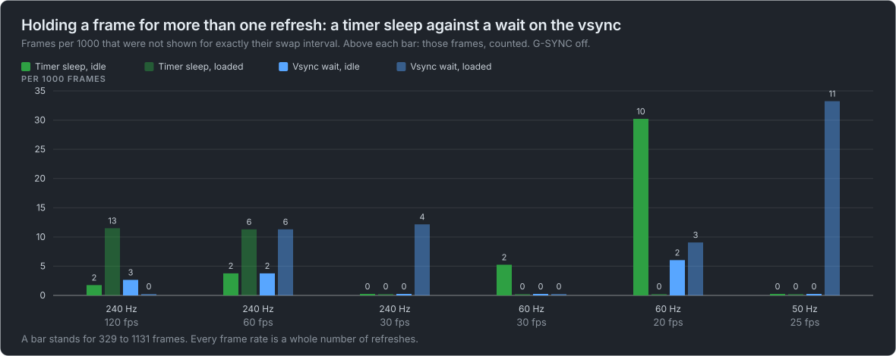
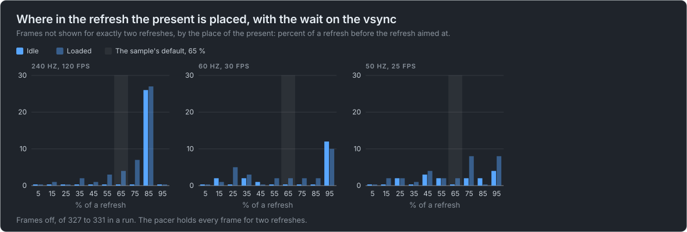

# Windows captures, second session of 2026-10-04

What 354 more runs of the experimental [frame pacer](../sdk/doc/pacer.md) on a real swap chain show: what a Vulkan frame loop
waits on, the scheduled present, the hold methods on one display, the power plan, and a way to measure a variable refresh rate. It
follows [the first session of the day](2026-10-04-windows-hold.md) and corrects parts of it. The findings and both charts are of runs in which
the frame loop applied the pacer's times; the runs in which it did not are in [a section of their own](#not-valid-for-the-pacer-runs-at-a-swap-interval-of-one). The runs are in
[`2026-10-04-windows-session2.zip`](https://github.com/Unarmed1000/mb-framepacing/releases/download/pacer-captures/2026-10-04-windows-session2.zip),
an asset of this repository's `pacer-captures` release; every number, table and chart here is worked out from its frame logs by
`tools/pacer_capture_report.py`, and the row per run it extracts is [`runs.csv`](2026-10-04-windows-session2/runs.csv).

These are the display times a graphics driver reports, on one machine. No capture card recorded the runs: see
[What this capture can not say](#what-this-capture-can-not-say).

## What was run

The Vulkan FramePacing sample of the unofficial [gtec-demo-framework](https://github.com/Unarmed1000/gtec-demo-framework) with the
pacer at `b5b6ab3`, a release build on Windows 11, a NVIDIA GPU (driver 617.14) and a FIFO swap chain with two images, in a
1600x900 window unless a run is named `fullscreen` (a borderless window of the display's size).

- **A session build.** The sample had three options for these probes (a wait for a fence on the acquire, the number of swap
  chain images, and a hold of the frame start) and a measurement of the time between the display's vertical blanks. None of them
  is in the sample as published.
- **The state of the machine was read, not assumed**: the driver's G-SYNC setting, the refresh rate of each display and the power
  plan, before and after every plan. G-SYNC is off unless a folder is named for it.
- **Folder names** are the power plan (`hp` is High performance), the refresh rate of the display the window is on, `single`
  where the second display was switched off, and the plan. Without `single` a second display was on, at 120 Hz unless the name
  says otherwise.
- **How the numbers are made** is as in [the first session](2026-10-04-windows-hold.md#how-the-numbers-were-made): a frame is
  shown for its swap interval when the whole refreshes to the next frame's display time are that interval, a frame is never
  shown when its present is reported complete without a display time, and the first 60 frames and the last 8 of a run are left
  out.
- **The capture tool's own summaries count a little more** (`README.txt` and the `summary.txt` files in the zip): they leave out
  the first 60 frames only, where this also leaves out the last 8, and count every present that was reported without a display
  time. So the loop without the hold has 97 presents never shown with heavy work there and 92 here, and the held frame start 7 never
  shown and 62 shown too long there against 5 and 57 here. The same runs, counted by two rules.

<!-- pacer-capture:runs: generated by tools/pacer_capture_report.py -->

| Folder                                          | Runs | Frames logged |
| ----------------------------------------------- | ---: | ------------: |
| `balanced-240hz-single-phase-sweep`             |   20 |          8000 |
| `balanced-240hz-single-plain-vulkan`            |   30 |         44800 |
| `balanced-60hz-single-plain-vulkan`             |   26 |         17600 |
| `hp-120hz-present-feedback`                     |   12 |         18000 |
| `hp-120hz-present-scheduling`                   |   12 |          5600 |
| `hp-240hz-audit-probe-fixed1-w86`               |    4 |          9600 |
| `hp-240hz-audit-probe-fixed1`                   |    9 |         21600 |
| `hp-240hz-audit-probe`                          |   17 |         40800 |
| `hp-240hz-present-feedback`                     |   12 |         28800 |
| `hp-240hz-present-scheduling`                   |   12 |         24000 |
| `hp-240hz-single-phase-sweep`                   |   20 |          8000 |
| `hp-240hz-single-plain-vulkan`                  |   30 |         44800 |
| `hp-240hz-single-vrr-probe-gsync-on`            |   10 |          9600 |
| `hp-240hz-vrr-probe-gsync-off`                  |   10 |          9600 |
| `hp-50hz-single-phase-sweep`                    |   20 |          8000 |
| `hp-50hz-single-plain-vulkan`                   |   22 |         13700 |
| `hp-50hz-single-present-scheduling`             |   12 |          5600 |
| `hp-60hz-both-displays-60hz-present-scheduling` |    6 |          2800 |
| `hp-60hz-present-scheduling`                    |   12 |          5600 |
| `hp-60hz-single-phase-sweep`                    |   20 |          8000 |
| `hp-60hz-single-plain-vulkan`                   |   26 |         17600 |
| `hp-60hz-single-present-scheduling`             |   12 |          5600 |
| All                                             |  354 |        357700 |

<!-- /pacer-capture:runs -->

## A timer sleep against a wait on the vsync, on one display

The first session's runs at 60 and 50 Hz had a second display at 120 Hz switched on. These are the same plans with one display.

<!-- pacer-capture:hold: generated by tools/pacer_capture_report.py -->

| Display | Frame rate | Timer sleep, idle | Timer sleep, loaded | Vsync wait, idle | Vsync wait, loaded |
| ------- | ---------- | ----------------: | ------------------: | ---------------: | -----------------: |
| 240 Hz  | 120 fps    |         2 of 1131 |          13 of 1131 |        3 of 1129 |          0 of 1131 |
| 240 Hz  | 60 fps     |          2 of 531 |            6 of 531 |         2 of 531 |           6 of 531 |
| 240 Hz  | 30 fps     |          0 of 331 |            0 of 331 |         0 of 331 |           4 of 329 |
| 60 Hz   | 30 fps     |          2 of 381 |            0 of 381 |         0 of 381 |           0 of 381 |
| 60 Hz   | 20 fps     |         10 of 331 |            0 of 331 |         2 of 331 |           3 of 331 |
| 50 Hz   | 25 fps     |          0 of 331 |            0 of 331 |         0 of 331 |          11 of 331 |

<!-- /pacer-capture:hold -->

- **Neither method is clean and neither is better.** A run has from no frame to 13 off, at every refresh rate, idle or loaded.
- **The first session's zeros at 60 and 50 Hz were of that desktop**: on one display the sleep had 10 of 331 frames off at
  20 fps on 60 Hz with an idle machine, and the wait on the vsync 11 of 331 at 25 fps on 50 Hz under load.

How evenly the frames start, from the 1st to the 99th percentile around the median:

<!-- pacer-capture:spread: generated by tools/pacer_capture_report.py -->

| Display | Frame rate | Timer sleep, idle (ms) | Timer sleep, loaded (ms) | Vsync wait, idle (ms) | Vsync wait, loaded (ms) |
| ------- | ---------- | ---------------------: | -----------------------: | --------------------: | ----------------------: |
| 240 Hz  | 120 fps    |        0.000 to +0.002 |          0.000 to +0.008 |      -0.090 to +0.079 |        -0.179 to +0.157 |
| 240 Hz  | 60 fps     |        0.000 to +0.004 |          0.000 to +0.335 |      -0.100 to +0.085 |        -0.074 to +0.369 |
| 240 Hz  | 30 fps     |         0.000 to 0.000 |          0.000 to +0.009 |      -0.092 to +0.096 |        -0.666 to +1.805 |
| 60 Hz   | 30 fps     |        0.000 to +0.002 |          0.000 to +0.002 |      -0.113 to +0.091 |        -0.571 to +0.542 |
| 60 Hz   | 20 fps     |        0.000 to +0.002 |          0.000 to +0.009 |      -0.158 to +0.138 |        -0.640 to +0.660 |
| 50 Hz   | 25 fps     |        0.000 to +0.001 |          0.000 to +0.003 |      -0.139 to +0.096 |        -6.999 to +7.048 |

<!-- /pacer-capture:spread -->

The sleep's frame starts are flat again. The wait on the vsync spreads by 0.1 ms to each side on an idle machine, and by up to
7 ms under load (25 fps on 50 Hz, the run with 11 frames off).

## Where the present is placed, on one display

<!-- pacer-capture:placement: generated by tools/pacer_capture_report.py -->

| Place of the present | 240 Hz, idle | 240 Hz, loaded | 60 Hz, idle | 60 Hz, loaded | 50 Hz, idle | 50 Hz, loaded |
| -------------------- | -----------: | -------------: | ----------: | ------------: | ----------: | ------------: |
| 5 %                  |            0 |              0 |           0 |             0 |           0 |             0 |
| 15 %                 |            0 |              1 |           2 |             1 |           0 |             2 |
| 25 %                 |            0 |              0 |           0 |             5 |           2 |             2 |
| 35 %                 |            0 |              2 |           2 |             3 |           0 |             1 |
| 45 %                 |            0 |              1 |           1 |             0 |           3 |             4 |
| 55 %                 |            0 |              3 |           0 |             2 |           2 |             2 |
| 65 %                 |            0 |              4 |           0 |             2 |           0 |             2 |
| 75 %                 |            0 |              7 |           0 |             2 |           2 |             8 |
| 85 %                 |           26 |             27 |           0 |             2 |           2 |             0 |
| 95 %                 |            0 |              0 |          12 |            10 |           4 |             8 |

<!-- /pacer-capture:placement -->

Frames off, of 327 to 331 in a run, on the High performance power plan. The same sweep at 240 Hz on Balanced:

<!-- pacer-capture:placement-balanced: generated by tools/pacer_capture_report.py -->

| Place of the present | 240 Hz, idle | 240 Hz, loaded |
| -------------------- | -----------: | -------------: |
| 5 %                  |            0 |              1 |
| 15 %                 |            0 |              3 |
| 25 %                 |            0 |              1 |
| 35 %                 |            0 |              5 |
| 45 %                 |            0 |              3 |
| 55 %                 |            0 |              6 |
| 65 %                 |            0 |              3 |
| 75 %                 |            2 |             19 |
| 85 %                 |           13 |              2 |
| 95 %                 |            0 |              0 |

<!-- /pacer-capture:placement-balanced -->

- **At 240 Hz there is one bad place and it moves**: 85 % on High performance (26 and 27 frames off), 75 to 85 % on Balanced. The
  first session, with a second display on, had it at 5 to 45 %. An idle machine is clean everywhere else.
- **At 60 and 50 Hz no place is clean in every run**, and 95 % is the worst at 60 Hz (12 and 10 off). The first session's clean
  sweeps at those rates were of the desktop with the second display.
- **So no place of the present can be called safe from these sweeps.** One round each: where the bad place is at a rate is not
  known better than that.

## The scheduled present

`VK_EXT_present_timing` takes a time for a present. The sample asks for a frame to be shown a swap interval after the one before
(a relative target time) and compares that with the timer sleep, in the same plan.

<!-- pacer-capture:scheduling: generated by tools/pacer_capture_report.py -->

| The window's display               | Asked for         | Frame time, sleep | Frame time, scheduled |                Sleep, idle |            Sleep, loaded |            Scheduled, idle |          Scheduled, loaded |
| ---------------------------------- | ----------------- | ----------------: | --------------------: | -------------------------: | -----------------------: | -------------------------: | -------------------------: |
| 240 Hz, a second display at 120 Hz | work of 130 %     |            8.3 ms |                8.3 ms |                  9 of 2331 |               61 of 2331 |   2 of 2322, 6 never shown |   4 of 2329, 1 never shown |
| 240 Hz, a second display at 120 Hz | 120 fps (8.3 ms)  |            8.3 ms |                8.3 ms | 123 of 2327, 2 never shown |               18 of 2331 |   3 of 2329, 1 never shown |                 11 of 2331 |
| 240 Hz, a second display at 120 Hz | 60 fps (16.7 ms)  |           16.7 ms |               16.7 ms |  29 of 1129, 1 never shown |               14 of 1131 |                 14 of 1131 |                  4 of 1131 |
| 120 Hz, both displays at 120 Hz    | work of 130 %     |           16.7 ms |               16.7 ms |                   2 of 531 |                 5 of 531 |                   0 of 531 |                   0 of 531 |
| 120 Hz, both displays at 120 Hz    | 60 fps (16.7 ms)  |           16.7 ms |               16.7 ms |                   0 of 331 |                 6 of 331 |                   1 of 331 |                   0 of 331 |
| 120 Hz, both displays at 120 Hz    | 30 fps (33.3 ms)  |           33.3 ms |               33.3 ms |                   0 of 331 |                 4 of 331 |                   2 of 331 |                   2 of 331 |
| 60 Hz, a second display at 120 Hz  | work of 130 %     |           33.3 ms |               66.7 ms |                   0 of 531 |                 7 of 531 | 159 of 511, 10 never shown | 165 of 507, 12 never shown |
| 60 Hz, a second display at 120 Hz  | 30 fps (33.3 ms)  |           33.3 ms |               66.7 ms |                   2 of 331 |                 0 of 331 |                 331 of 331 |                 331 of 331 |
| 60 Hz, a second display at 120 Hz  | 20 fps (50.0 ms)  |           50.0 ms |              100.0 ms |                   0 of 331 |                 4 of 331 |                 331 of 331 |                 331 of 331 |
| 60 Hz, both displays at 60 Hz      | work of 130 %     |                   |               33.3 ms |                            |                          |                   1 of 531 |                   7 of 531 |
| 60 Hz, both displays at 60 Hz      | 30 fps (33.3 ms)  |                   |               33.3 ms |                            |                          |                   0 of 331 |                   1 of 331 |
| 60 Hz, both displays at 60 Hz      | 20 fps (50.0 ms)  |                   |               50.0 ms |                            |                          |                   0 of 331 |                   0 of 331 |
| 60 Hz, one display                 | work of 130 %     |           33.3 ms |               33.3 ms |                   0 of 531 |                 2 of 531 |                   0 of 531 |                   1 of 531 |
| 60 Hz, one display                 | 30 fps (33.3 ms)  |           33.3 ms |               33.3 ms |    1 of 329, 1 never shown |                 0 of 331 |                   0 of 331 |                   0 of 331 |
| 60 Hz, one display                 | 20 fps (50.0 ms)  |           50.0 ms |               50.0 ms |                   0 of 331 |                 0 of 331 |                   0 of 331 |                   9 of 331 |
| 50 Hz, one display                 | work of 130 %     |           40.0 ms |               40.0 ms |                   2 of 531 |                 1 of 531 |                   0 of 531 |                   0 of 531 |
| 50 Hz, one display                 | 25 fps (40.0 ms)  |           40.0 ms |               40.0 ms |                   2 of 331 |  3 of 329, 1 never shown |                   0 of 331 |                   1 of 331 |
| 50 Hz, one display                 | 10 fps (100.0 ms) |          100.0 ms |              100.0 ms |   1 of 223, 54 never shown | 0 of 219, 56 never shown |    0 of 0, 332 never shown |  0 of 114, 217 never shown |

<!-- /pacer-capture:scheduling -->

Frames off, of the frames judged, and the time from one frame start to the next (median, idle machine).

- **On a desktop whose displays all have the rate of the window's display, the scheduled present holds a frame right**: at most
  2 frames of a run off at half the refresh rate at 120, 60 and 50 Hz with an idle machine.
- **It is the steadier of the two at 240 Hz**: at 120 fps with an idle machine the sleep had 123 of 2327 frames a refresh early
  or late and the scheduled present 3 of 2329. Under load they are close.
- **With the window on a 60 Hz display next to a 120 Hz one it holds every frame twice as long**: 30 fps asked gives 66.7 ms a
  frame, 20 fps gives 100 ms. The swap chain reports the 120 Hz display's refresh there (below), and the target time is counted
  in it. With both displays at 60 Hz, and with one display, it is right.
- **At 10 fps on 50 Hz something else goes wrong**: with the sleep 54 and 56 presents of a run get no display time, with the
  scheduled present 217 and 332. Not looked into. 20 fps on 60 Hz has none of it.

## Work over a refresh

With work of 130 % of a refresh the rule goes to two refreshes at the same frames as in the first session. Up to that frame the
runs are of the loop that did not hold the frame start ([below](#not-valid-for-the-pacer-runs-at-a-swap-interval-of-one)); from
there on a frame is held for two refreshes and the frames off are valid:

<!-- pacer-capture:work-130: generated by tools/pacer_capture_report.py -->

| Display | Hold        |  Work | Two refreshes from frame | Late frames it takes more than |  Frames off |
| ------- | ----------- | ----: | -----------------------: | -----------------------------: | ----------: |
| 240 Hz  | Timer sleep | 126 % |                       49 |                             48 | 176 of 4660 |
| 240 Hz  | Vsync wait  | 126 % |                       49 |                             48 |  32 of 4659 |
| 60 Hz   | Timer sleep | 133 % |                       13 |                             12 |   3 of 1662 |
| 60 Hz   | Vsync wait  | 133 % |                       13 |                             12 |   8 of 1662 |
| 50 Hz   | Timer sleep | 131 % |                       11 |                             10 |  12 of 1362 |
| 50 Hz   | Vsync wait  | 131 % |                       11 |                             10 |   3 of 1362 |

<!-- /pacer-capture:work-130 -->

The frames off at 240 Hz with the sleep are mostly one run (166 of them, idle machine) in which the sleep landed on the wrong
side of a refresh for a stretch.

## Present feedback as statistics

The pacer at `b5b6ab3` counts the display times it is given and paces the same with them. The same runs with feedback off and on:

<!-- pacer-capture:feedback: generated by tools/pacer_capture_report.py -->

| Display |  Work | Machine | Feedback | Two refreshes from frame | Refreshes lost, by the logs | `LateRefreshes` | `Used` | `Refused` | `NotShown` |
| ------- | ----: | ------- | -------- | -----------------------: | --------------------------: | --------------: | -----: | --------: | ---------: |
| 240 Hz  |  22 % | idle    | off      |                    never |                           4 |                 |        |           |            |
| 240 Hz  |  22 % | idle    | on       |                    never |                           0 |               0 |   2391 |         1 |          4 |
| 240 Hz  |  22 % | loaded  | off      |                    never |                           4 |                 |        |           |            |
| 240 Hz  |  22 % | loaded  | on       |                    never |                          48 |              50 |   2389 |         1 |          6 |
| 240 Hz  |  88 % | idle    | off      |                      241 |                          16 |                 |        |           |            |
| 240 Hz  |  88 % | idle    | on       |                      197 |                          21 |              15 |   2387 |         1 |         10 |
| 240 Hz  |  89 % | loaded  | off      |                      143 |                          74 |                 |        |           |            |
| 240 Hz  |  89 % | loaded  | on       |                      168 |                          51 |              46 |   2393 |         1 |          4 |
| 240 Hz  | 126 % | idle    | off      |                       49 |                          25 |                 |        |           |            |
| 240 Hz  | 126 % | idle    | on       |                       50 |                          17 |              23 |   2387 |         1 |         10 |
| 240 Hz  | 127 % | loaded  | off      |                       49 |                          45 |                 |        |           |            |
| 240 Hz  | 127 % | loaded  | on       |                       50 |                          87 |              91 |   2394 |         1 |          3 |
| 120 Hz  |  25 % | idle    | off      |                    never |                           3 |                 |        |           |            |
| 120 Hz  |  25 % | idle    | on       |                    never |                           3 |               3 |   1491 |         1 |          4 |
| 120 Hz  |  26 % | loaded  | off      |                    never |                           0 |                 |        |           |            |
| 120 Hz  |  26 % | loaded  | on       |                    never |                           1 |               1 |   1490 |         1 |          5 |
| 120 Hz  |  85 % | idle    | off      |                    never |                           6 |                 |        |           |            |
| 120 Hz  |  85 % | idle    | on       |                    never |                           3 |               3 |   1486 |         1 |          9 |
| 120 Hz  |  86 % | loaded  | off      |                    never |                           8 |                 |        |           |            |
| 120 Hz  |  86 % | loaded  | on       |                    never |                           5 |               5 |   1485 |         1 |         10 |
| 120 Hz  | 134 % | idle    | off      |                       25 |                           2 |                 |        |           |            |
| 120 Hz  | 134 % | idle    | on       |                       26 |                           3 |              10 |   1495 |         1 |          2 |
| 120 Hz  | 134 % | loaded  | off      |                       25 |                           8 |                 |        |           |            |
| 120 Hz  | 134 % | loaded  | on       |                       26 |                          17 |              28 |   1497 |         1 |          0 |

<!-- /pacer-capture:feedback -->

- **The rows with work under a refresh are of the loop that did not hold the frame start**
  ([below](#not-valid-for-the-pacer-runs-at-a-swap-interval-of-one)): read them for the counters only, not for what the display
  did.
- **The rule decides the same**: with work of about 130 % it goes to two refreshes at frame 49 and 25 without feedback and one
  frame later with it (the pacer starts again when the sample switches feedback on).
- **`LateRefreshes` is close to the refreshes the logs show lost** (within a few, or equal), which is what the counter is for.
- **One display time is refused per run** (the first, from before the pacer's restart) and none is missing.

## The power plan

The same plans on High performance and on Balanced, fixed frame rates on one display:

<!-- pacer-capture:power: generated by tools/pacer_capture_report.py -->

| Display | Power plan       | Timer sleep, idle | Timer sleep, loaded | Vsync wait, idle | Vsync wait, loaded |
| ------- | ---------------- | ----------------: | ------------------: | ---------------: | -----------------: |
| 240 Hz  | High performance |         4 of 1993 |          19 of 1993 |        5 of 1991 |         10 of 1991 |
| 240 Hz  | Balanced         |         2 of 1993 |           4 of 1993 |        0 of 1993 |         20 of 1993 |
| 60 Hz   | High performance |         12 of 712 |            0 of 712 |         2 of 712 |           3 of 712 |
| 60 Hz   | Balanced         |          2 of 712 |            2 of 712 |         0 of 712 |           3 of 712 |

<!-- /pacer-capture:power -->

No difference that these runs can show: the counts differ as much between two runs on one plan.

## The refresh a swap chain reports

<!-- pacer-capture:refresh: generated by tools/pacer_capture_report.py -->

| The window's display, from the window system | What the swap chain reported | Folders                                                                                                                                                                                                                                                                                                                        |
| -------------------------------------------- | ---------------------------- | ------------------------------------------------------------------------------------------------------------------------------------------------------------------------------------------------------------------------------------------------------------------------------------------------------------------------------ |
| 4.166 ms (240.02 Hz)                         | 4.167 ms (240.01 Hz)         | `balanced-240hz-single-phase-sweep`, `balanced-240hz-single-plain-vulkan`, `hp-240hz-audit-probe-fixed1-w86`, `hp-240hz-audit-probe-fixed1`, `hp-240hz-audit-probe`, `hp-240hz-present-feedback`, `hp-240hz-present-scheduling`, `hp-240hz-single-phase-sweep`, `hp-240hz-single-plain-vulkan`, `hp-240hz-vrr-probe-gsync-off` |
| 8.333 ms (120.00 Hz)                         | 8.334 ms (120.00 Hz)         | `hp-120hz-present-feedback`, `hp-120hz-present-scheduling`                                                                                                                                                                                                                                                                     |
| 16.668 ms (60.00 Hz)                         | 8.334 ms (120.00 Hz)         | `hp-60hz-present-scheduling`                                                                                                                                                                                                                                                                                                   |
| 16.668 ms (60.00 Hz)                         | 16.668 ms (60.00 Hz)         | `balanced-60hz-single-plain-vulkan`, `hp-60hz-both-displays-60hz-present-scheduling`, `hp-60hz-single-phase-sweep`, `hp-60hz-single-plain-vulkan`, `hp-60hz-single-present-scheduling`                                                                                                                                         |
| 20.000 ms (50.00 Hz)                         | 20.000 ms (50.00 Hz)         | `hp-50hz-single-phase-sweep`, `hp-50hz-single-plain-vulkan`, `hp-50hz-single-present-scheduling`                                                                                                                                                                                                                               |

<!-- /pacer-capture:refresh -->

As in the first session, the swap chain reports the refresh of the fastest display of the desktop: 8.333 ms for a window on a
60 Hz display next to a 120 Hz one, and the window's own display's refresh once both are at 60 Hz or the second is off. This is
what makes the scheduled present hold a frame twice as long on the mixed desktop.

## Measuring a variable refresh rate

The session build measures the time between the vertical blanks of the window's display (DXGI's wait for the vertical blank):
the median of the last 64, in refreshes of the display mode, and the share of them more than a tenth off the refresh period.

<!-- pacer-capture:vertical-blank: generated by tools/pacer_capture_report.py -->

| G-SYNC setting               | Run                  | Vertical blanks apart, in refreshes (median) | Vertical blanks off the refresh period | Shown for its swap interval | Swap chain reports saying fixed refresh |
| ---------------------------- | -------------------- | -------------------------------------------: | -------------------------------------: | --------------------------: | --------------------------------------: |
| on for full screen apps only | `displayrate_idle`   |                                        1.000 |                                  0.0 % |                1724 of 1724 |                                  8 of 8 |
| on for full screen apps only | `displayrate_loaded` |                                        1.000 |                                  0.0 % |                1731 of 1731 |                                55 of 55 |
| on for full screen apps only | `fps120_idle`        |                                        2.001 |                                100.0 % |                 786 of 1121 |                                  4 of 4 |
| on for full screen apps only | `fps120_loaded`      |                                        1.000 |                                  0.0 % |                1127 of 1131 |                                21 of 21 |
| on for full screen apps only | `fps80_idle`         |                                        1.000 |                                  0.0 % |                  728 of 731 |                                11 of 11 |
| on for full screen apps only | `fps80_loaded`       |                                        1.000 |                                  0.0 % |                  726 of 731 |                                  9 of 9 |
| on for full screen apps only | `fps60_idle`         |                                        0.999 |                                  0.0 % |                  526 of 529 |                                36 of 36 |
| on for full screen apps only | `fps60_loaded`       |                                        1.000 |                                  3.1 % |                  531 of 531 |                                12 of 12 |
| on for full screen apps only | `fps30_idle`         |                                        1.000 |                                  0.0 % |                  329 of 331 |                                31 of 31 |
| on for full screen apps only | `fps30_loaded`       |                                        1.000 |                                  0.0 % |                  327 of 331 |                                18 of 18 |
| off                          | `displayrate_idle`   |                                        1.000 |                                  0.0 % |                1726 of 1728 |                                  7 of 7 |
| off                          | `displayrate_loaded` |                                        1.000 |                                  0.0 % |                1725 of 1726 |                                  1 of 1 |
| off                          | `fps120_idle`        |                                        1.000 |                                  0.0 % |                1123 of 1131 |                                28 of 28 |
| off                          | `fps120_loaded`      |                                        1.000 |                                  0.0 % |                1121 of 1131 |                                21 of 21 |
| off                          | `fps80_idle`         |                                        1.000 |                                  0.0 % |                  727 of 729 |                                18 of 18 |
| off                          | `fps80_loaded`       |                                        1.000 |                                  0.0 % |                  728 of 731 |                                11 of 11 |
| off                          | `fps60_idle`         |                                        1.000 |                                  0.0 % |                  527 of 531 |                                20 of 20 |
| off                          | `fps60_loaded`       |                                        1.000 |                                  0.0 % |                  531 of 531 |                                  9 of 9 |
| off                          | `fps30_idle`         |                                        1.000 |                                  0.0 % |                  257 of 331 |                                26 of 26 |
| off                          | `fps30_loaded`       |                                        1.000 |                                  0.0 % |                  329 of 331 |                                11 of 11 |

<!-- /pacer-capture:vertical-blank -->

- **With G-SYNC off the vertical blanks are one refresh apart** in every run.
- **With G-SYNC on for full screen apps only, one run of the ten in a window shows it**: at 120 fps the vertical blanks are two
  refreshes apart, every one of them off the period, and a third of the frames are not shown for their swap interval. The capture
  tool's own record of the driver's state, once a second, says the driver had variable refresh enabled for the display in the
  first three runs of the round and in none of the other seven, with the setting unchanged. So the setting alone does not say
  whether a window is shown with a variable refresh rate.
- **At the display's own rate it can not be told from a fixed refresh rate**: the vertical blanks are one refresh apart there
  with it enabled.
- **The swap chain reported a fixed refresh in every read of every run**, also while the driver had variable refresh enabled.

## Not valid for the pacer: runs at a swap interval of one

The first session found frames that were never shown with work close to a refresh at 240 Hz, and the loop starting its frames a
little faster than the display refreshes. The cause is in the sample's loop: it waited for the pacer's `NextFrameStartTime` only
where a frame is held for two refreshes or more, and at a swap interval of one it trusted the present to wait for the display.
These probes change one thing in that loop per run, with the swap interval fixed at one.

**Every run at a swap interval of one in both sessions is of that loop**, except the ten probe runs here that hold the frame
start (named `holdpacer` and `holdvsync`). They are no result of the pacer and no chart is made of them; they are kept as the
record of the fault and of the probes that found it. What they show of frames never shown is what an application gets when it leaves that wait
out. Runs that hold a frame for two refreshes or more are not
affected.

<!-- pacer-capture:loop: generated by tools/pacer_capture_report.py -->

| Shown in    | Work | The loop                                                                        | Never shown | Shown longer | Frame start to frame start | Present to display | Run                                                      |
| ----------- | ---: | ------------------------------------------------------------------------------- | ----------: | -----------: | -------------------------: | -----------------: | -------------------------------------------------------- |
| window      | 22 % | frame start not held                                                            |           0 |    3 of 2331 |            4.01 to 4.33 ms |            15.3 ms | `hp-240hz-audit-probe/w20_base`                          |
| window      | 22 % | frame start not held, waits for a fence on the acquire                          |           4 |    1 of 2323 |            3.92 to 4.39 ms |            12.0 ms | `hp-240hz-audit-probe/w20_acquirewait`                   |
| window      | 22 % | frame start held to `NextFrameStartTime`                                        |           3 |    0 of 2326 |            4.17 to 4.17 ms |             3.1 ms | `hp-240hz-audit-probe/w20_holdpacer`                     |
| window      | 22 % | frame start held to the nearest vertical blank                                  |           4 |    1 of 2325 |            2.82 to 5.50 ms |            12.0 ms | `hp-240hz-audit-probe/w20_holdvsync`                     |
| window      | 22 % | frame start not held, two frames in flight                                      |           3 |    1 of 2325 |            3.99 to 4.35 ms |            19.4 ms | `hp-240hz-audit-probe/w20_flight2`                       |
| window      | 22 % | frame start not held, three swap chain images                                   |          53 |    5 of 2226 |            1.13 to 8.33 ms |            15.2 ms | `hp-240hz-audit-probe/w20_images3`                       |
| window      | 23 % | frame start not held, waits for a fence on the acquire, three swap chain images |           6 |    2 of 2322 |            3.91 to 4.41 ms |            16.1 ms | `hp-240hz-audit-probe/w20_images3_acquirewait`           |
| window      | 95 % | frame start not held                                                            |          92 |   44 of 2147 |            3.83 to 8.41 ms |            10.0 ms | `hp-240hz-audit-probe-fixed1-w86/w94_base`               |
| window      | 92 % | frame start not held, waits for a fence on the acquire                          |           5 |    6 of 2322 |            4.01 to 4.38 ms |            12.0 ms | `hp-240hz-audit-probe-fixed1-w86/w94_acquirewait`        |
| window      | 97 % | frame start held to `NextFrameStartTime`                                        |           5 |   57 of 2321 |            4.17 to 4.68 ms |             9.9 ms | `hp-240hz-audit-probe-fixed1-w86/w94_holdpacer`          |
| window      | 93 % | frame start held to the nearest vertical blank                                  |         156 |  195 of 2023 |            3.90 to 8.62 ms |            11.7 ms | `hp-240hz-audit-probe-fixed1-w86/w94_holdvsync`          |
| full screen | 27 % | frame start not held                                                            |           6 |    1 of 2321 |            3.87 to 4.40 ms |            15.0 ms | `hp-240hz-audit-probe/fullscreen_light`                  |
| full screen | 82 % | frame start not held                                                            |          87 |    3 of 2158 |            3.36 to 8.41 ms |            12.6 ms | `hp-240hz-audit-probe/fullscreen_heavy`                  |
| full screen | 83 % | frame start held to the nearest vertical blank                                  |           1 |    3 of 2329 |            4.09 to 4.25 ms |             8.1 ms | `hp-240hz-audit-probe/fullscreen_heavy_holdvsync`        |
| full screen | 84 % | frame start not held                                                            |         103 |    1 of 2126 |            3.37 to 8.46 ms |            12.4 ms | `hp-240hz-audit-probe-fixed1/fullscreen_heavy`           |
| full screen | 84 % | frame start held to the nearest vertical blank                                  |           2 |    4 of 2327 |            3.99 to 4.32 ms |             8.1 ms | `hp-240hz-audit-probe-fixed1/fullscreen_heavy_holdvsync` |

<!-- /pacer-capture:loop -->

- **Nothing in a Vulkan loop waits for the display by itself here.** The sample acquires an image, waits for the frame before to
  finish on the GPU, draws, submits and presents. Its timing columns have the acquire and the present returning at once in every
  frame. So the wait for the pacer's time is what holds the loop, and this loop did not have it at a swap interval of one.
- **With light work the loop without it still runs at the display's rate**, and a frame reaches the display 15.3 ms after its present: 3.7
  refreshes, more than two swap chain images explain. It climbs there over the first frames of the run (14.1, 16.5, 19.0, 22.1,
  23.5 ms), four presents are not shown, and it settles at 15.3 ms. What the delay is made of is not known.
- **With work close to a refresh the loop runs at the GPU's speed**, a little faster than the display, and frames are dropped: 92
  presents without a display time in the run without the hold.
- **A fence on the acquire that the loop waits for** brings that to 5, with 6 frames shown longer.
- **The frame start held to the pacer's `NextFrameStartTime`** brings it to 5 too, with 57 frames shown longer (its work was the
  highest of the four, 97 % of a refresh). With light work the frames start exactly a refresh apart. A frame reached the
  display after 14.1 ms for the first 68 frames of that run, as without the hold; then three presents were not shown (frames 68,
  72 and 73) and it was 3.1 ms for the remaining 2300 frames. Why it fell is not known, and runs of the same held loop made
  after this session stayed at three refreshes. The sample's swap chain code is being checked for a fault; nothing is concluded
  from these delays until there is more data.
- **The frame start held to the nearest vertical blank** works in a borderless full screen window (1 and 2 presents never shown
  where the loop without a hold had 87 and 103) and is the worst in a window (156). The sample takes the nearest vertical blank and
  flips between two of them when the frame start falls in the middle of a refresh: that is the sample's code, not the method.
- **Two frames in flight and three swap chain images do not help.** Three images made light work worse (53 never shown).

The heavy runs are one run each and their work differs (92 to 97 % of a refresh at the same load setting), so they compare
changes, not exact amounts.

### Work close to a refresh

With work close to a refresh at 240 Hz, every run of this session went to two refreshes:

<!-- pacer-capture:work-90: generated by tools/pacer_capture_report.py -->

| Folder                               | Run                       | Work | Frames in flight | Two refreshes from frame | Never shown | Shown longer |
| ------------------------------------ | ------------------------- | ---: | ---------------: | -----------------------: | ----------: | -----------: |
| `balanced-240hz-single-plain-vulkan` | `w90_flight1_idle`        | 88 % |                1 |                      431 |          21 |   10 of 2290 |
| `balanced-240hz-single-plain-vulkan` | `w90_flight1_loaded`      | 89 % |                1 |                      760 |           6 |    8 of 2319 |
| `balanced-240hz-single-plain-vulkan` | `w90_flight2_idle`        | 88 % |                2 |                      227 |          32 |   12 of 2267 |
| `balanced-240hz-single-plain-vulkan` | `w90_flight2_loaded`      | 89 % |                2 |                      640 |           9 |    9 of 2314 |
| `balanced-240hz-single-plain-vulkan` | `w90_idle`                | 88 % |                1 |                      688 |          40 |   17 of 2251 |
| `balanced-240hz-single-plain-vulkan` | `w90_loaded`              | 89 % |                1 |                      581 |           5 |   18 of 2321 |
| `hp-240hz-present-feedback`          | `w90_feedback_off_idle`   | 88 % |                1 |                      241 |           5 |    7 of 2321 |
| `hp-240hz-present-feedback`          | `w90_feedback_off_loaded` | 89 % |                1 |                      143 |           0 |   22 of 2331 |
| `hp-240hz-present-feedback`          | `w90_feedback_on_idle`    | 88 % |                1 |                      197 |           3 |   10 of 2325 |
| `hp-240hz-present-feedback`          | `w90_feedback_on_loaded`  | 89 % |                1 |                      168 |           3 |   19 of 2325 |
| `hp-240hz-single-plain-vulkan`       | `w90_flight1_idle`        | 88 % |                1 |                      434 |          10 |   15 of 2311 |
| `hp-240hz-single-plain-vulkan`       | `w90_flight1_loaded`      | 89 % |                1 |                      743 |           7 |    5 of 2318 |
| `hp-240hz-single-plain-vulkan`       | `w90_flight2_idle`        | 88 % |                2 |                      263 |          25 |   14 of 2281 |
| `hp-240hz-single-plain-vulkan`       | `w90_flight2_loaded`      | 89 % |                2 |                      627 |           5 |   19 of 2321 |
| `hp-240hz-single-plain-vulkan`       | `w90_idle`                | 88 % |                1 |                      378 |          11 |    6 of 2309 |
| `hp-240hz-single-plain-vulkan`       | `w90_loaded`              | 89 % |                1 |                      588 |           5 |   12 of 2321 |

<!-- /pacer-capture:work-90 -->

In the first session the four such runs with one frame in flight stayed at one refresh, with work of 94 to 96 % of a refresh.
Here the work is 88 to 89 % and all sixteen change, after 143 to 760 frames. So with work near a whole refresh the rule's outcome
is not settled by the work. All of these runs are of the loop that does not hold the frame start; the one adaptive probe run with
the hold (`hp-240hz-audit-probe/w94_holdpacer`) went to two refreshes at frame 150, its twin without it at frame 144.

## What this capture can not say

- **It is not a capture of the display.** The display times are the driver's; no capture card recorded the runs and the tools
  analysed nothing.
- **One machine, one driver, Windows.**
- **Most findings are one run each.** Where two runs of the same settings exist they differ by several frames, so a count here
  is the size of an effect, not its value.
- **Why the bad place of the present moves**, why the sleep lands on the wrong side of a refresh in some runs and not in others,
  and what happens at 10 fps on 50 Hz are not explained.

## Regenerating

With the zip downloaded from the release into `pacer-captures/` (git ignores it there):

    python tools/pacer_capture_report.py pacer-captures/2026-10-04-windows-session2.zip --update-doc
    python tools/pacer_capture_report.py pacer-captures/2026-10-04-windows-session2.zip --check
